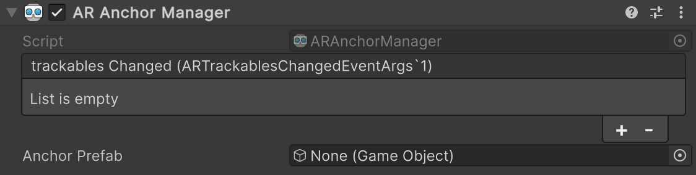

# AR anchor manager

The anchor manager is a type of [trackable manager](trackable-managers.md).



The anchor manager creates `GameObject`s for each anchor. An anchor is a particular point in space that you want the device to track. The device typically performs additional work to update the position and orientation of the anchor throughout its lifetime. Because anchors are generally resource-intensive objects, you should use them sparingly.

## Adding and removing anchors

To add or remove anchors, call [AddAnchor](xref:UnityEngine.XR.ARFoundation.ARAnchorManager.AddAnchor(UnityEngine.Pose)) or [RemoveAnchor](xref:UnityEngine.XR.ARFoundation.ARAnchorManager.RemoveAnchor(UnityEngine.XR.ARFoundation.ARAnchor)) on the [ARAnchorManager](xref:UnityEngine.XR.ARFoundation.ARAnchorManager) component in script. In some scenarios, you can create anchors in other ways, such as loading an AR World Map on ARKit which includes saved anchors.

When you add an anchor, it might take a frame or two before the anchor manager's [anchorsChanged](xref:UnityEngine.XR.ARFoundation.ARAnchorManager.anchorsChanged) event reports it as added. During the time between being added and being reported as added, the anchor will be in a "pending" state. You can query for this with the [ARAnchor.pending](xref:UnityEngine.XR.ARFoundation.ARTrackable`2.pending) property.

Likewise, when you remove an anchor, it might take a frame before `anchorsChanged` reports it as removed. If you remove a pending anchor before it's reported as added, you won't receive any events for it.

You should always remove anchors through the anchor manager. Don't [Destroy](xref:UnityEngine.Object.Destroy(UnityEngine.Object)) an `ARAnchor` unless its manager has also been destroyed.

## Anchoring content

A typical use case for anchors is to place virtual content in the physical world. We recommend creating an [ARAnchor](xref:UnityEngine.XR.ARFoundation.ARAnchor) and then _parenting your content_ to that anchor.

While the [ARAnchorManager](xref:UnityEngine.XR.ARFoundation.ARAnchorManager) has an ["Anchor Prefab"](xref:UnityEngine.XR.ARFoundation.ARAnchorManager.anchorPrefab) field, this is not intended for content. When an anchor is created, either by you or by some other mechanism, such as loading an [ARWorldMap](https://docs.unity3d.com/Packages/com.unity.xr.arkit@4.0/api/UnityEngine.XR.ARKit.ARWorldMap.html) that contained anchors, ARFoundation will create a new [GameObject](xref:GameObjects) to represent it.

If "Anchor Prefab" is `null`, then ARFoundation simply creates a GameObject with an `ARAnchor` component on it. However, if you want _every anchor_ to also include additional components, you can provide a prefab for ARFoundation to instantiate for each anchor. In other words, the purpose of the prefab field is to _extend_ the default behavior of anchors; it is not the recommended way to _place content_ in the world. Instead, you should parent your content to the anchor.

**Examples**:

To parent existing content to an anchor:

[!code-cs[anchor_existing_content](../Tests/CodeSamples/AnchorSamples.cs#anchor_existing_content)]

To instantiate a prefab with your content as a child of an anchor:

[!code-cs[anchor_prefab_content](../Tests/CodeSamples/AnchorSamples.cs#anchor_prefab_content)]

## Attaching anchors

You can also create anchors that are attached to a plane. The [AttachAnchor method](xref:UnityEngine.XR.ARFoundation.ARAnchorManager.AttachAnchor(UnityEngine.XR.ARFoundation.ARPlane,UnityEngine.Pose)) does this:

```csharp
public ARAnchor AttachAnchor(ARPlane plane, Pose pose);
```

Attaching an anchor to a plane affects the anchor update semantics. This type of anchor will only change its position along the normal of the plane to which it is attached, thus maintaining a constant distance from the plane.
