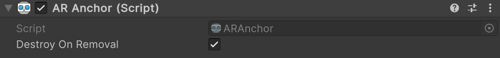

# AR Anchor component

The [ARAnchor](xref:UnityEngine.XR.ARFoundation.ARAnchor) component is a type of [trackable](xref:arfoundation-managers#trackables-and-trackable-managers) that contains the data associated with an anchor.

 *AR Anchor component*

| Property | Description |
| :------- | :---------- |
| **Destroy On Removal** | If `true`, this component's GameObject is destroyed when this trackable is removed. |

## Anchor life cycle

As trackables, AR anchors have a life cycle that consists of three phases: added, updated, and removed. Your app can respond to [Anchor life cycle events](xref:arfoundation-anchors-aranchormanager#anchor-life-cycle-events) during an AR session if you subscribe to the AR Anchor Manager component's `trackablesChanged` event.

### Added

Unlike most other trackable types, anchors aren't automatically detected in the environment. You must [Create an anchor](xref:arfoundation-anchors-aranchormanager#create-an-anchor) for an anchor to be added.

#### Pending

When you create an anchor, it might take a frame before the AR Anchor Manager's [trackablesChanged](xref:UnityEngine.XR.ARFoundation.ARTrackableManager`5.trackablesChanged*) event reports the `ARAnchor` as added. In the time between being added and being reported as added via `trackablesChanged`, the anchor is in a pending state. Use the [pending](xref:UnityEngine.XR.ARFoundation.ARTrackable`2.pending) property to determine if an anchor is pending.

### Updated

Each subsequent frame after an anchor is added, the AR Anchor Manager might update that anchor's pose to keep it aligned with the platform's representation of that anchor. These updates are automatically applied to the anchor's `Transform` component.

> [!NOTE]
> You can't move an anchor after you create it. Its `Transform` is controlled by the AR Anchor Manager component while it is tracked by the AR platform.

#### Tracking state

When an anchor leaves the device camera's field of view, the AR Anchor Manager will likely set the anchor's [trackingState](xref:UnityEngine.XR.ARFoundation.ARTrackable`2.trackingState) to **Limited** instead of removing the anchor. A value of **Limited** indicates that the AR Anchor Manager is aware of an anchor but can't currently track its position or rotation.

If your app responds to [Anchor life cycle events](xref:arfoundation-anchors-aranchormanager#anchor-life-cycle-events), you should check the `trackingState` value of all updated anchors if you wish to handle the changed tracking state.

### Removed

You can remove anchors manually, and AR platforms can also automatically remove anchors if they become invalid, such as if the user walks to a different location while your app is running. To remove an anchor yourself, refer to [Remove an anchor](xref:arfoundation-anchors-aranchormanager#remove-an-anchor).
