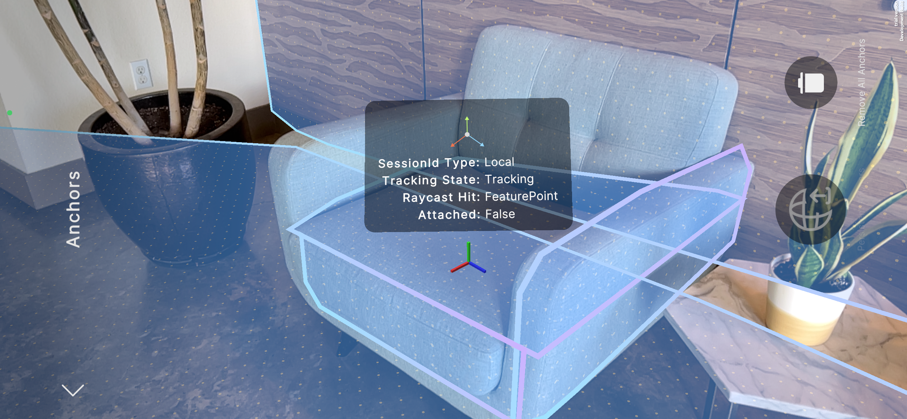

# Introduction to anchors

An anchor is a tracked [Pose](xref:UnityEngine.Pose) (position and rotation) that allows you to place mixed reality content at known coordinates in the physical world. Without anchors, GameObjects in your scene can move uncontrollably when the AR session's tracking state changes.

You can create anchors at any time during an AR session, then use them by parenting your content GameObjects to the anchor GameObjects.

 *The [Anchors sample scene](https://github.com/Unity-Technologies/arfoundation-samples#anchors) shows you how to place anchors on planes*

## The need for anchors

In Unity XR apps, the [XR Origin component](xref:arfoundation-device-tracking#xr-origin-component) defines a translation function between coordinates in Unity world space and coordinates in your AR platform's session space. Without the ability to translate AR data from one coordinate system to another, there would be no way to make mixed reality content appear at specific positions in the physical environment.

In an ideal AR [Session state](xref:arfoundation-session#session-state) of `SessionTracking`, the translation function between session space and Unity world space is stable. However, AR platforms can lose tracking during the middle of a session due to factors such as rapid device movement, poor lighting conditions, or an environment with too few distinguishing features.

When tracking is lost, the session state may transition to `SessionInitializing`. Then when tracking is reestablished, the AR platform may choose to define a new translation function between coordinate systems. At that moment, if any GameObjects in your scene aren't parented to a [trackable](xref:arfoundation-managers#trackables-and-trackable-managers), they will suddenly move to a random location, because the mapping between Unity world space and session space has changed.

This is the purpose of anchors: to ensure that your GameObjects can stay at desired coordinates in the physical environment regardless of changes to the AR session's tracking state. AR platforms automatically update the poses of anchors over time to ensure that they remain in a consistent position even if tracking is lost and recovered again.

## Common uses of anchors

Any time you want to place a GameObject relative to the physical environment, you should always parent that GameObject to a trackable. If there is no trackable near the pose where you want to place a GameObject, the best practice is to create an anchor at the desired pose, then parent your GameObject to that anchor. However, if there are one or more trackables at the pose you wish to track, such as a plane on the surface of a table, you could either create an anchor or parent your GameObject to one of the pre-existing trackables depending on your app's needs.

The following sections describe typical interactions between anchors and other trackable types to help guide your implementation decisions, as well as performance considerations that apply to all apps that use anchors.

> [!TIP]
> The following sections contain general guidance, and are not a substitute for testing your app on your target devices. You should always validate your implementation decisions by testing on your target devices before you release your app.

### Performance considerations

Anchor tracking is a fairly expensive task on most AR platforms. While anchors are often required to align mixed reality content with the physical environment, too many anchors can drag down your app's framerate.

Therefore, consider the following when working with anchors:

1. Avoid creating multiple anchors within a couple meters of each other. Consider whether you can build a single GameObject hierarchy using a nearby anchor instead.
2. Remove anchors when you are no longer using them.
3. If you enable another AR feature to help calculate the desired pose for an anchor, consider whether you can disable that feature once the anchor is successfully created.

### Attach anchors to planes

On most AR platforms (notably excluding Meta Quest), planes are dynamically detected at runtime. This means that a plane's position, rotation, center, extents, and boundary points may change over time as the AR platform learns more about your physical environment. This circumstance makes planes inherently unstable parents for mixed reality content while plane detection is enabled.

When choosing how to implement a plane-based experience, consider whether your app needs plane detection to be enabled throughout the AR experience. If your experience is contained in a single static area, you could direct the user to scan their environment at the beginning of the experience, then disable plane detection once the scan is complete by disabling the [AR Plane Manager component](xref:arfoundation-plane-arplanemanager). With plane detection disabled, you can safely parent your content to the plane directly, optimizing system resources both by disabling plane detection and by not creating an anchor.

If you wish to anchor content to a position on a plane's surface while plane detection is still enabled, check whether your target platforms support [trackable attachments](xref:arfoundation-anchors-platform-support#optional-features-support-table). For best results, attach an anchor to a plane's surface if supported.

### Anchors and tracked images

When choosing how to implement an image-based experience, consider whether you expect your mixed reality content to remain visible if the tracked image leaves the camera frame. Image tracking is a great way to track an image while the image is in frame, but image tracking quality can degrade when the image is no longer visible to the device camera. If your content is still visible while parented to an image that isn't tracking successfully, this can cause your content's position and rotation to change undesirably.

To keep mixed reality content better fixed in place when images are no longer in frame, consider parenting your content to an anchor. You should generally expect better tracking quality from an anchor than an image that is out of frame.

The following instructions explain how to use image tracking to determine the best position to place an anchor:

1. [Set up a scene](xref:arfoundation-scene-setup) with an [AR Anchor Manager component](xref:arfoundation-anchors-aranchormanager) and an [AR Image Tracking Manager component](xref:arfoundation-image-tracking).
2. Subscribe to the AR Image Tracking Manager's `trackablesChanged` event.
3. When the AR Image Tracking Manager invokes `trackablesChanged`, get the `Transform` component of any newly added `ARTrackedImage`.
4. [Create an anchor](xref:arfoundation-anchors-aranchormanager#create-an-anchor) at the tracked image's position and rotation.
5. If your app no longer requires image tracking, disable the AR Image Tracking Manager to save system resources.

### Raycast against point clouds

You can use the [AR Raycast Manager component](xref:arfoundation-raycasts) to raycast against feature points in a point cloud, but individual feature points aren't represented in Unity as GameObjects with Transform components. Therefore, to anchor a GameObject at the pose of a feature point, create an anchor at the pose returned to you in the [ARRaycastHit](xref:UnityEngine.XR.ARFoundation.ARRaycastHit).
