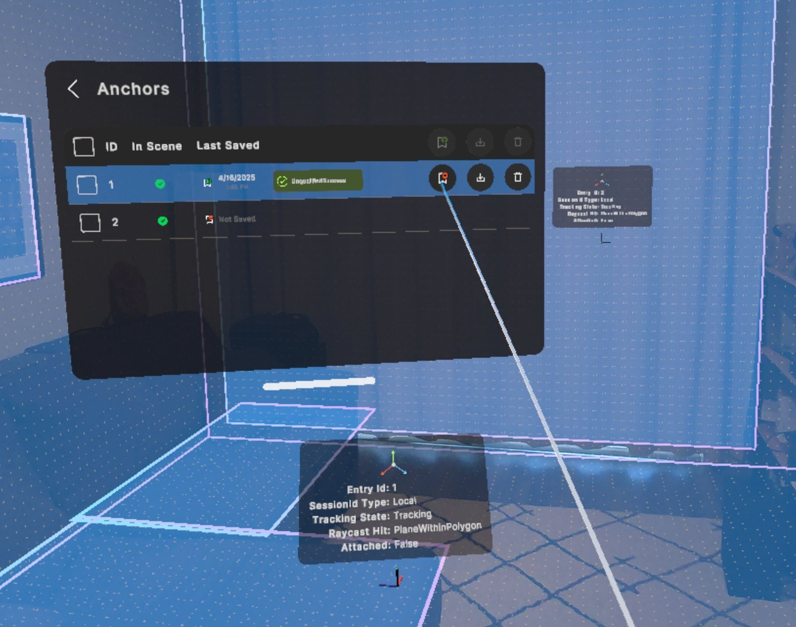

# Persistent anchors

AR Foundation 6 introduces an API for persistent anchors that enables you to save anchors in an AR session and load them in subsequent AR sessions. You can use this API to persist the state of your app across multiple sessions in the same physical space. The following sections explain how to use the persistent anchors API.

 *The [Anchors sample scene](https://github.com/Unity-Technologies/arfoundation-samples#anchors) shows you how to use the persistent anchor API on supported devices*

> [!IMPORTANT]
> The AR Foundation persistent anchor API is a wrapper for persistent anchor APIs on multiple platforms. Due to the limitations of all supported platforms, you can't save an anchor on one platform and load it on another platform. Refer to the provider plug-in documentation for your target platforms to understand any additional platform-specific details.

## Check support

The AR Foundation persistent anchor API consists of five optional features of the anchor subsystem:

* **Save anchor**
* **Load anchor**
* **Erase anchor**
* **Get saved anchor IDs**
* **Async cancellation**

Refer to the [Optional features support table](xref:arfoundation-anchors-platform-support#optional-features-support-table) to learn which provider plug-ins support these features, and how to query for this information in C# scripts. The following sections explain each optional feature in more detail, including example code.

<a id="save-anchor"/>

## Save anchor

The save operation takes an anchor as input, saves that anchor to persistent storage, and returns a persistent anchor GUID that you can use later to load or erase the anchor.

> [!NOTE]
> Some AR platforms may save anchors to the device's local disk, while others may save them to a cloud storage location associated with your app. Refer to the provider plug-in documentation for your target platforms to understand the implementation details of how anchors are saved.

To save an anchor, use [ARAnchorManager.TrySaveAnchorAsync](xref:UnityEngine.XR.ARFoundation.ARAnchorManager.TrySaveAnchorAsync(UnityEngine.XR.ARFoundation.ARAnchor,CancellationToken)) as shown in the following code example:

[!code-cs[TrySaveAnchorAsync](../../../Tests/Runtime/CodeSamples/ARAnchorManagerSamples.cs#TrySaveAnchorAsync)]

> [!IMPORTANT]
> Keep track of the persistent anchor GUIDs returned to you by `TrySaveAnchorAsync`. Not all platforms support the ability to get your saved persistent anchor GUIDs if you lose them.

## Batch save anchors

You can save a batch of anchors with [ARAnchorManager.TrySaveAnchorsAsync](xref:UnityEngine.XR.ARFoundation.ARAnchorManager.TrySaveAnchorsAsync(IEnumerable{UnityEngine.XR.ARFoundation.ARAnchor},List{UnityEngine.XR.ARFoundation.ARSaveOrLoadAnchorResult},CancellationToken)) as shown in the following code example:

[!code-cs[TrySaveAnchorsAsync](../../../Tests/Runtime/CodeSamples/ARAnchorManagerSamples.cs#TrySaveAnchorsAsync)]

> [!IMPORTANT]
> Keep track of the persistent anchor GUIDs that are populated in `saveAnchorResults.savedAnchorGuid`. Not all platforms support the ability to get your saved persistent anchor GUIDs if you lose them.
[The AR Foundation Samples GitHub repository](https://github.com/Unity-Technologies/arfoundation-samples/blob/main/Assets/Scripts/Runtime/SaveAndLoadAnchorIdsToFile.cs) contains example code that you can use to save your persistent anchor GUIDs to Unity's [Application.persistentDataPath](xref:UnityEngine.Application.persistentDataPath), allowing you to quit your app and then load or erase your saved anchors in subsequent sessions. Any files created by your app and saved to `Application.persistentDataPath` will be lost if your app is uninstalled.

By default, batch save anchors sequentially calls `ARAnchorManager.TrySaveAnchorAsync` on the list of anchors passed in. Platforms can override this behavior with custom implementations for batch save anchors. Refer to your platform's documentation to understand platform specific implementation details.

## Load anchor

The load operation takes a persistent anchor GUID returned by [Save anchor](#save-anchor) as input, retrieves the associated anchor from persistent storage, and returns a newly created anchor. On the AR Anchor Manager component's next Update step, that anchor will be reported as added.

To load an anchor, use [ARAnchorManager.TryLoadAnchorAsync](xref:UnityEngine.XR.ARFoundation.ARAnchorManager.TryLoadAnchorAsync(UnityEngine.XR.ARSubsystems.SerializableGuid,CancellationToken)) as shown in the following code example:

[!code-cs[TryLoadAnchorAsync](../../../Tests/Runtime/CodeSamples/ARAnchorManagerSamples.cs#TryLoadAnchorAsync)]

## Batch load anchors

You can load a batch of anchors with [ARAnchorManager.TryLoadAnchorsAsync](xref:UnityEngine.XR.ARFoundation.ARAnchorManager.TryLoadAnchorsAsync(IEnumerable{UnityEngine.XR.ARSubsystems.SerializableGuid},List{UnityEngine.XR.ARFoundation.ARSaveOrLoadAnchorResult},Action{Unity.XR.CoreUtils.Collections.ReadOnlyListSpan{UnityEngine.XR.ARFoundation.ARSaveOrLoadAnchorResult}},CancellationToken)) as shown in the following code example:

[!code-cs[TryLoadAnchorsAsync](../../../Tests/Runtime/CodeSamples/ARAnchorManagerSamples.cs#TryLoadAnchorsAsync)]

The order in which anchors are loaded isn't guaranteed to match the order they were requested in. You can find the associated persistent anchor GUID of an anchor with `LoadAnchorResult.savedAnchorGuid`.

By default, `ARAnchorManager.TryLoadAnchorsAsync` sequentially calls `ARAnchorManager.TryLoadAnchorAsync` on the list of saved persistent anchor GUIDs. Platforms can override this behavior with custom implementations for batch load anchors. Refer to your platform's documentation to understand platform specific implementation details.

### Incremental load results

`ARAnchorManager.TryLoadAnchorsAsync` accepts a callback that will be invoked each time a subset of requested anchors is loaded. This enables you to work with anchors as soon as they become available without waiting for the entire load request to complete. You should use the incremental results callback to ensure you're notified when an anchor has loaded before [ARAnchorManager.trackablesChanged](xref:UnityEngine.XR.ARFoundation.ARTrackableManager`5.trackablesChanged) is raised. The final result from a batch load request isn't guaranteed to complete before `ARAnchorManager.trackablesChanged`. To ignore the incremental results, pass `null` for the callback.

By default, an incremental result is returned for each anchor as it's loaded. Platforms may override the default behavior and load groups of anchors incrementally allowing them to load some anchors immediately and some anchors more slowly, still guaranteeing to pass through the incremental results callback before `ARAnchorManager.trackablesChanged`. Refer to your platform's documentation to understand platform specific implementation details.

The incremental results callback passes a [ReadOnlyListSpan\<ARSaveOrLoadAnchorResult\>](xref:Unity.XR.CoreUtils.Collections.ReadOnlyListSpan`1) when invoked that provides a read-only slice of the `List<ARSaveOrLoadAnchorResult>` output list passed into `ARAnchorManager.TryLoadAnchorsAsync`.

When a request is made to load a batch of anchors, some anchors can fail to load. However, results reported during the incremental results callback will always have a success [XRResultStatus](xref:UnityEngine.XR.ARSubsystems.XRResultStatus). Only the final results stored in the `List<ARSaveOrLoadAnchorResult>` output list after the load request completes can contain a result with an error [StatusCode](xref:UnityEngine.XR.ARSubsystems.XRResultStatus.statusCode). Therefore, when working with the final results, you should check the `resultStatus` of each result before using the anchor with [resultStatus.IsSuccess()](xref:UnityEngine.XR.ARSubsystems.XRResultStatus.IsSuccess) or [resultStatus.IsError()](xref:UnityEngine.XR.ARSubsystems.XRResultStatus.IsError).

## Erase anchor

The erase operation takes a persistent anchor GUID returned by [Save anchor](#save-anchor) as input, erases that anchor from persistent storage, and returns a status indicating if the operation was successful.

> [!NOTE]
> The save and erase operations only modify the persistent storage associated with an anchor, not the tracking state of the anchor. For instance, if you create an anchor, save it, then immediately erase it, the persistent storage associated with the anchor will be erased, but the anchor itself will not be removed from the scene.

To erase an anchor, use [ARAnchorManager.TryEraseAnchorAsync](xref:UnityEngine.XR.ARFoundation.ARAnchorManager.TryEraseAnchorAsync(UnityEngine.XR.ARSubsystems.SerializableGuid,CancellationToken)) as shown in the following code example:

[!code-cs[TryEraseAnchorAsync](../../../Tests/Runtime/CodeSamples/ARAnchorManagerSamples.cs#TryEraseAnchorAsync)]

## Batch erase anchors

You can erase a batch of anchors with [ARAnchorManager.TryEraseAnchorsAsync](xref:UnityEngine.XR.ARFoundation.ARAnchorManager.TryEraseAnchorsAsync(IEnumerable{UnityEngine.XR.ARSubsystems.SerializableGuid},List{UnityEngine.XR.ARSubsystems.XREraseAnchorResult},CancellationToken)) as shown in the following code example:

[!code-cs[TryEraseAnchorsAsync](../../../Tests/Runtime/CodeSamples/ARAnchorManagerSamples.cs#TryEraseAnchorsAsync)]

By default, batch erase anchors sequentially calls `ARAnchorManager.TryEraseAnchorAsync` on the list of saved persistent anchor GUIDs.  Platforms can override this behavior with custom implementations for batch erase anchors. Refer to your platform's documentation to understand platform specific implementation details.

## Get saved anchor IDs

Some platforms support the ability to get a list of your currently saved anchors. If your app has successfully kept track of its state across usages of save anchor and erase anchor, you have no reason to use this API. However, if you lose track of your currently saved anchors for any reason, this API is a useful way to recover them, allowing you to subsequently load or erase your saved anchors.

The following example code demonstrates how to get saved anchor IDs:

[!code-cs[TryGetSavedAnchorIdsAsync](../../../Tests/Runtime/CodeSamples/ARAnchorManagerSamples.cs#TryGetSavedAnchorIdsAsync)]

## Async cancellation

AR Foundation's persistent anchors API is entirely asynchronous. If your target platform supports the ability to cancel async operations in progress, you can use the [CancellationToken](https://learn.microsoft.com/en-us/dotnet/api/system.threading.cancellationtoken?view=net-8.0) input parameter of the other persistent anchor methods. Otherwise, this input parameter is ignored on platforms that do not support cancellation.

The following example code demonstrates how to cancel an async operation:

[!code-cs[AsyncCancellation](../../../Tests/Runtime/CodeSamples/ARAnchorManagerSamples.cs#AsyncCancellation)]
