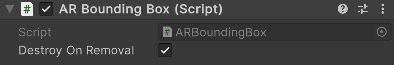

# AR Bounding Box component

The [ARBoundingBox](xref:UnityEngine.XR.ARFoundation.ARBoundingBox) component is a type of [trackable](xref:arfoundation-managers#trackables-and-trackable-managers) that contains the data associated with a 3D bounding box.

 *AR Bounding Box component*

| Property | Description |
| :------- | :---------- |
| **Destroy On Removal** | If `true`, this component's GameObject is destroyed when this trackable is removed. |

## Bounding box life cycle

As trackables, AR bounding boxes have a life cycle that consists of three phases: added, updated, and removed. Your app can [Respond to detected 3D bounding boxes](xref:arfoundation-bounding-box-arboundingboxmanager#respond-to-detected-boundingboxes) during your AR session by subscribing to the AR Bounding Box Manager component's `trackablesChanged` event.

### Added

When a 3D bounding box is first detected, the bounding box manager creates a new GameObject with an AR Bounding Box component attached, then invokes the `trackablesChanged` event, passing you a reference to the new AR Bounding Box component via the [added](xref:UnityEngine.XR.ARFoundation.ARTrackablesChangedEventArgs`1.added) property.

### Updated

Each subsequent frame after a 3D bounding box is added, the bounding box manager might update that bounding box's information.

#### Tracking state

When a bounding box leaves the device camera's field of view, the bounding box manager might set its [trackingState](xref:UnityEngine.XR.ARFoundation.ARTrackable`2.trackingState) to **Limited** instead of removing it. A value of **Limited** indicates that the bounding box manager is aware of a bounding box but cannot currently track its position.

If your app responds to bounding box life cycle events, you should check each bounding box's `trackingState` value whenever the bounding box is updated.

### Removed

When a bounding box is removed, this may not indicate that a surface is no longer present in the environment, but rather that the AR platform's understanding of the environment has changed in a way that invalidates that bounding box.

> [!IMPORTANT]
> Do not call `Destroy` on any AR Bounding Box component or its GameObject. AR bounding boxes are managed by the AR Bounding Box Manager component, and destroying them yourself can result in errors. Consider disabling the GameObject or not rendering the bounding box mesh instead.
