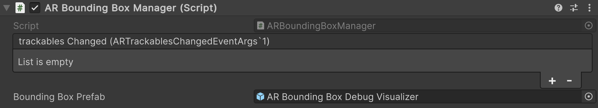

# AR Bounding Box Manager component

The [ARBoundingBoxManager](xref:UnityEngine.XR.ARFoundation.ARBoundingBoxManager) component is a type of [trackable manager](xref:arfoundation-managers#trackables-and-trackable-managers) that detects and tracks 3D bounding boxes in the physical environment. As a trackable manager, it creates GameObjects in your scene for each detected 3D bounding box.

 *AR Bounding Box Manager component*

| Property | Description |
| :------- | :---------- |
| **trackablesChanged** | Invoked when trackables have changed (been added, updated, or removed). |
| **Bounding Box Prefab** | If not `null`, this prefab is instantiated for each detected 3D bounding box. If the prefab does not contain an [AR Bounding Box component](xref:arfoundation-bounding-box-arboundingbox), `ARBoundingBoxManager` will add one. |

## Getting started

Add an AR Bounding Box Manager component to your XR Origin GameObject to enable bounding box tracking in your app. If your scene does not contain an XR Origin GameObject, first follow the [Scene setup](xref:arfoundation-scene-setup) instructions.

Whenever your app doesn't need bounding box detection functionality, disable the AR Bounding Box Manager component to improve app performance. If the user's device does not [support](xref:arfoundation-bounding-box-platform-support) bounding box detection, the AR Bounding Box Manager component will disable itself during `OnEnable`.

## Respond to detected bounding boxes

While enabled, the AR Bounding Box Manager component will get changes reported by the [XRBoundingBoxSubsystem](xref:UnityEngine.XR.ARSubsystems.XRBoundingBoxSubsystem) every frame. If any bounding boxes were added, updated, or removed, the [trackablesChanged](xref:UnityEngine.XR.ARFoundation.ARTrackableManager`5.trackablesChanged) event is invoked with the relevant information.

You can subscribe to `trackablesChanged` using either the Inspector window or C# scripting.

### Use the Inspector

1. Create a public method on a `MonoBehaviour` or `ScriptableObject` with a single parameter of type [ARTrackablesChangedEventArgs\<ARBoundingBox\>](xref:UnityEngine.XR.ARFoundation.ARTrackablesChangedEventArgs`1), as shown in the example code below:

[!code-cs[BoundingBoxesChanged](../../../Tests/CodeSamples/ARTrackableManagerSamples.cs#BoundingBoxesChanged)]

2. Select your XR Origin GameObject, then click the **Add (+)** button on the AR Bounding Box Manager component's **trackablesChanged** property.

3. Using the Object picker (⊙), select either a GameObject that contains an instance of your component or an instance of your ScriptableObject, whichever is applicable.

 *Subscribe to the trackablesChanged event*

4. In the dropdown, select your class name and the name of your method. The method name appears in the **Dynamic** section of the methods list.

### Use C# scripting

1. Create a public method with a single parameter of type [ARTrackablesChangedEventArgs\<ARBoundingBox\>](xref:UnityEngine.XR.ARFoundation.ARTrackablesChangedEventArgs`1) as shown in step 1a above.

2. Use the example code below to subscribe to the `trackablesChanged` event:

[!code-cs[BoundingBoxSubscribe](../../../Tests/CodeSamples/ARTrackableManagerSamples.cs#BoundingBoxSubscribe)]

### Visualize bounding boxes in the scene

By default, the AR Bounding Box Manager does not render a textured mesh in the scene when 3D bounding boxes are detected. To enable bounding box visualization, set a prefab as the AR Bounding Box Manager's **Bounding Box Prefab**.

The [AR Foundation Samples](https://github.com/Unity-Technologies/arfoundation-samples) GitHub repository contains a prefab that you could use to get started:

| Prefab | Description |
| :----- | :---------- |
| [AR Bounding Box Debug Visualizer](https://github.com/Unity-Technologies/arfoundation-samples/blob/main/Assets/Prefabs/AR%20BoundingBox%20Debug%20Visualizer.prefab) | Visualize bounding box meshes with a solid color, and optionally visualize additional information such as the bounding box's [trackableId](xref:UnityEngine.XR.ARFoundation.ARTrackable`2.trackableId), [trackingState](xref:UnityEngine.XR.ARFoundation.ARTrackable`2.trackingState), [classifications](xref:UnityEngine.XR.ARFoundation.ARBoundingBox.classifications), and orientation. You can configure the visualization options via the **Inspector**. |

#### Custom bounding box visualizers

You can also create your own custom bounding box visualizer for use in your bounding box prefab. Some common ways to visualize a bounding box in your scene include using a [MeshFilter](https://docs.unity3d.com/Manual/class-MeshFilter.html) and [MeshRenderer](https://docs.unity3d.com/Manual/class-MeshRenderer.html), or [MeshCollider](https://docs.unity3d.com/Manual/class-MeshCollider.html).
