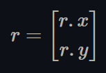
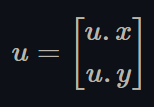
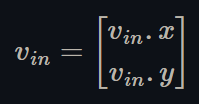
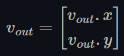
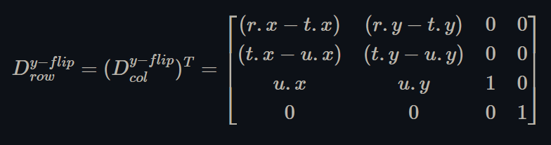

# Display matrix format and derivation

The display matrix maps the CPU side image to be rendered onto the device's screen, i.e. it maps the CPU side image texture coordinates onto the device's screen coordinates. It is row-major and includes a y-axis flip of the CPU side image texture coordinates (as the image would be upside down when rendered without that y-axis flip). The display matrix is defined as:

 *Figure 1 - a row major display matrix that flips the y-axis*

The 2D vector "r" corresponds to the right basis vector of the CPU side image coordinates, i.e. the vector that represents the horizontal axis of the image's texture coordinates,

 *Figure 2 - The right basis vector of the image's texture coordinates*

The 2D vector "u" corresponds to the up basis vector of the CPU side image coordinates, i.e. the vector that represents the vertical axis of the image's texture coordinates,

 *Figure 3 - The up basis vector of the image's texture coordinates*

The 2D vector "t" corresponds to the offset, or translation, of the above basis vectors, i.e. the location of the origin of the image's texture coordinates,

 *Figure 4 - the location of the origin of the image's texture coordinates*

Since it is not always obvious what a display matrix is, nor how it is formatted, its derivation is described below if more clarification is needed.

## Derive the display matrix

A column-major display matrix that does not flip the y-axis can be defined as:

 *Figure 5 - a column major display matrix*

where "r," "u," and "t" are defined as above in Figures 2, 3, and 4. It is a standard rotation-scale-translation matrix.

### 1. Use a column major display matrix

Let the following 2D vector be the input texture coordinates of the corresponding vertex shaders, i.e. the texture coordinates of the CPU side image:

 *Figure 6 - the texture coordinates of the CPU side image*

Let the following 2D vector be the output texture coordinates of the corresponding vertex shaders, i.e. the device screen coordinates:

 *Figure 7 - the output device's screen coordinates*

To flip the y-axis and find the output texture coordinates with a column-major display matrix, Dcol, the corresponding vertex shaders would have to do:

 *Figure 8 - use a column major display matrix to transform y-flipped image texture coordinates to screen coordinates*

### 2. Move the y-axis flip into the display matrix

Multiply out the equation from Figure 8 and rearrange the terms, then find the new display matrix such that:

 *Figure 9 - use a column major display matrix that flips the y-axis to convert image texture coordinates to screen coordinates*

This new matrix is defined as:

 *Figure 10 - a column major display matrix that flips the y-axis*

### 3. Make the display matrix row major

Take the transpose of both sides of the equation from Figure 9, then rewrite the equation to use the transpose of the display matrix from step 2 above:

 *Figure 11 - rewrite the equation in Figure 9 to use a row major display matrix that flips the y-axis*

Therefore, as expressed in Figure 1, the correct, row-major display matrix that flips the y-axis is defined as:

 *Figure 12 - our result, a row major display matrix that flips the y-axis*
