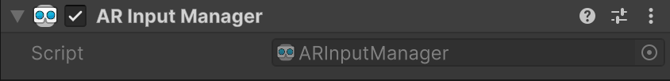

# AR Input Manager

Understand the AR Input Manager component.

The [AR Input Manager](xref:UnityEngine.XR.ARFoundation.ARInputManager) component manages the lifetime of the [XRInputSubsystem](xref:UnityEngine.XR.XRInputSubsystem). When you add an AR Input Manager to a GameObject in your scene, you can access device pose information.

> [!NOTE]
> AR Foundation requires the AR Input Manager component for AR to function correctly. Without the AR Input Manager component, [XROrigin](xref:Unity.XR.CoreUtils.XROrigin) can't acquire a world-space pose for the device.

## Access the default AR Input Manager

When you [add an AR Session](xref:arfoundation-session-arsession#add-session) GameObject to your scene using the **Create** menu, your **AR Session** GameObject automatically contains an AR Input Manager component. To view the default AR Input Manager, select the **AR Session** in the **Hierarchy** window to open it in the **Inspector**. You can access the **AR Input Manager** in the **Inspector**, as shown in the following image:

 *AR Input Manager component.*

If your `AR Session` component doesn't already contain an **AR Input Manager**, you can add one by clicking the **Add Component** button in the **Inspector** window, and selecting **AR Input Manager**.

## Manage the scene hierarchy

Optionally, you can move the AR Input Manager component anywhere in your scene hierarchy.

[!include]

## Additional resources

* [XR input options](xref:um-xr-input-overview) (Unity manual)
