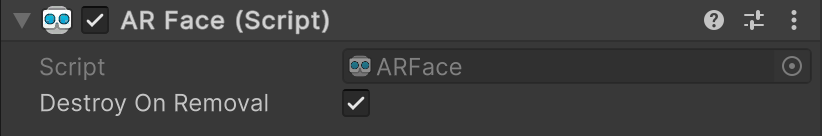

# AR Face component

The [ARFace](xref:UnityEngine.XR.ARFoundation.ARFace) component is a type of [trackable](xref:arfoundation-managers#trackables-and-trackable-managers) that contains the data associated with a detected human face. The [ARFaceManager](xref:UnityEngine.XR.ARFoundation.ARFaceManager) generates an AR Face when an AR device detects a human face in the environment.

 *AR Face component*

| Property | Description |
| :------- | :---------- |
| **Destroy On Removal** | If `true`, this component's GameObject is destroyed when this trackable is removed. |

## Face life cycle

As trackables, AR faces have a life cycle that consists of three phases: added, updated, and removed. Your app can [Respond to detected faces](xref:arfoundation-face-tracking-face-manager#respond-to-detected-faces) during your AR session by subscribing to the AR Face Manager component's [trackablesChanged](xref:UnityEngine.XR.ARFoundation.ARTrackableManager`5.trackablesChanged) event.

### Added

When a human face is first detected, the AR Face Manager creates a new GameObject with an AR Face component attached. The AR Face Manager then invokes the `trackablesChanged` event. This event passes you a reference to the new AR Face component via the [added](xref:UnityEngine.XR.ARFoundation.ARTrackablesChangedEventArgs`1.added) property.

### Updated

There are two events invoked in each frame where a face is updated, as described in the following table:

| Event | Description |
| :---- | :---------- |
| [ARFace.updated](xref:UnityEngine.XR.ARFoundation.ARFace.updated) | Invoked when the face is updated. If face meshes are supported, there will be updated vertices, normals, indices, and uvs. Allows you to subscribe to updates of individual faces separately. |
| [ARFaceManager.trackablesChanged](xref:UnityEngine.XR.ARFoundation.ARTrackableManager`5.trackablesChanged) | This method contains a list of all changed faces in the frame. |

#### Tracking state

When a face leaves the device camera's field of view, the AR Face Manager might set its [trackingState](xref:UnityEngine.XR.ARFoundation.ARTrackable`2.trackingState) to **Limited** instead of removing it. A value of **Limited** indicates that the AR Face Manager is aware of a face but can't currently track its position.

If your app responds to face life cycle events, you should check each face's `trackingState` value whenever the face is updated.

### Removed

When a face is no longer detected, the AR Face Manager might remove it. Removed faces can no longer be updated. If a removed face's **Destroy On Removal** property is set to `true`, the AR Face Manager will destroy it immediately after invoking the `trackablesChanged` event.

> [!IMPORTANT]
> Do not call `Destroy` on any AR Face component or its GameObject. AR faces are managed by the AR Face Manager component, and destroying them yourself can result in errors. Consider disabling the GameObject or not rendering the face mesh instead.

## Visualize faces in your scene

An `AR Face` is represented by a mesh that consists of [vertices](xref:UnityEngine.XR.ARSubsystems.XRFaceMesh.vertices), [normals](xref:UnityEngine.XR.ARSubsystems.XRFaceMesh.normals), [indices](xref:UnityEngine.XR.ARSubsystems.XRFaceMesh.indices), and [uvs](xref:UnityEngine.XR.ARSubsystems.XRFaceMesh.uvs) (texture coordinates). The availability of these features depends on the features supported by your chosen platform. Refer to [Face tracking platform support](xref:arfoundation-face-tracking-platform-support) to understand the features each face tracking provider supports.

You can add the [ARFaceMeshVisualizer](xref:UnityEngine.XR.ARFoundation.ARFaceMeshVisualizer) to your face prefab to generate a 3D representation of detected human faces.

The [AR Foundation Samples](https://github.com/Unity-Technologies/arfoundation-samples) GitHub repository contains prefabs that you can use to get started, outlined in the following table.

| Prefab | Description |
| :----- | :---------- |
| [Face Mesh Visualizer](https://github.com/Unity-Technologies/arfoundation-samples/blob/main/Assets/Prefabs/FaceMeshPrefab.prefab) | Visualize the generated face mesh for a detected face. |

#### Custom face visualizers

You can also create your own custom face visualizer for use in your face prefab. A common way to visualize a face in your scene is to use a [MeshFilter](https://docs.unity3d.com/Manual/class-MeshFilter.html) and [MeshRenderer](https://docs.unity3d.com/Manual/class-MeshRenderer.html). If your custom visualizer uses one or more of these components, you can add an [ARFaceMeshVisualizer](xref:UnityEngine.XR.ARFoundation.ARFaceMeshVisualizer) component to your face prefab to automatically set up the face mesh data.