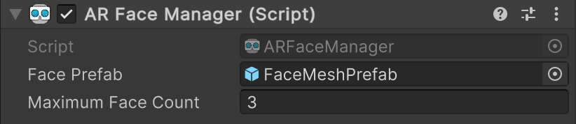
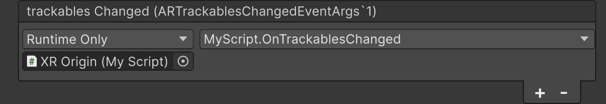

# AR Face Manager component

The [ARFaceManager](xref:UnityEngine.XR.ARFoundation.ARFaceManager) component is a type of [trackable manager](xref:arfoundation-managers#trackables-and-trackable-managers) that detects and tracks human faces in the physical environment. As a trackable manager, the AR Face Manager creates GameObjects in your scene for each detected face.

 *AR Face Manager component*

| Property               | Description |
| :--------------------- | :---------- |
| **trackables Changed** | Invoked when trackables have changed (been added, updated, or removed). |
| **Face Prefab**        | If not `null`, this prefab is instantiated for each detected face. If the prefab does not contain an [AR Face component](xref:arfoundation-face-tracking-arface), `ARFaceManager` will add one. |
| **Maximum Face Count** | The maximum number of faces to track simultaneously. |

## Get started

Add an AR Face Manager component to your XR Origin GameObject to enable face tracking in your app. If your scene doesn't contain an XR Origin GameObject, first follow the [Scene setup](xref:arfoundation-scene-setup) instructions.

Whenever your app doesn't need face tracking functionality, disable the AR Face Manager component to disable face tracking, which can improve app performance. If the user's device doesn't [support](xref:arfoundation-face-tracking-platform-support) face tracking, the AR Face Manager component will disable itself during `OnEnable`.

## Respond to detected faces

While enabled, the AR Face Manager component will get changes reported by the [XRFaceSubsystem](xref:UnityEngine.XR.ARSubsystems.XRFaceSubsystem) every frame. If any faces were added, updated, or removed, the [trackablesChanged](xref:UnityEngine.XR.ARFoundation.ARTrackableManager`5.trackablesChanged) event is invoked with the relevant information.

When a face is detected, a GameObject is instantiated with an attached `ARFace` component, which contains data about the detected face. Refer to [AR Face component](xref:arfoundation-face-tracking-arface) to learn more about the trackable life cycle.

You can subscribe to `trackablesChanged` in one of two ways:

1. **Use the Inspector**

    a. Create a public method on a `MonoBehavior` or `ScriptableObject` with a single parameter of type [ARTrackablesChangedEventArgs\<ARFace\>](xref:UnityEngine.XR.ARFoundation.ARTrackablesChangedEventArgs`1), as shown in the following example code:

    [!code-cs[FacesChanged](../../../Tests/Runtime/CodeSamples/ARTrackableManagerSamples.cs#FacesChanged)]

    b. Select your XR Origin GameObject, then click the **Add (+)** button on the AR Face Manger component's **trackablesChanged** property.

    c. Using the Object picker (⊙), select either a GameObject that contains an instance of your component or an instance of your ScriptableObject, whichever is applicable.

     *Subscribe to the trackablesChanged event*

    d. In the dropdown, select your class name and the name of your method. The method name appears in the **Dynamic** section of the methods list.

2. **Use C# scripting**

    a. Create a public method with a single parameter of type [ARTrackablesChangedEventArgs\<Face\>](xref:UnityEngine.XR.ARFoundation.ARTrackablesChangedEventArgs`1) as shown in step 1a.

    b. Use the following example code to subscribe to the `trackablesChanged` event:

    [!code-cs[FacesSubscribe](../../../Tests/Runtime/CodeSamples/ARTrackableManagerSamples.cs#FaceSubscribe)]

