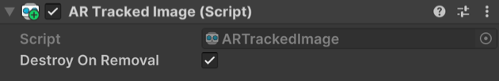

# AR Tracked Image component

Understand the AR Tracked Image component and how to interpret lifecycle events.

The [ARTrackedImage](xref:UnityEngine.XR.ARFoundation.ARTrackedImage) component is a type of [trackable](xref:arfoundation-managers#trackables-and-trackable-managers) that contains the data associated with a detected 2D image. The [ARTrackedImageManager](xref:UnityEngine.XR.ARFoundation.ARTrackedImageManager) creates an `ARTrackedImage` when the device detects a 2D image from the [Reference image library](xref:arfoundation-image-tracking-reference-images) in the environment.

## Component reference

 *AR Tracked Image component.*

| Property | Description |
| :------- | :---------- |
| **Destroy On Removal** | If `true`, this component's GameObject is destroyed when this trackable is removed. |

<a id="tracked-image-lifecycle"/>

## Tracked image lifecycle

As trackables, AR tracked images have a lifecycle that consists of three phases: added, updated, and removed. Your app can [Respond to detected images](xref:arfoundation-image-tracking-manager#respond-to-detected-images) during your AR session by subscribing to the AR Tracked Image Manager component's [trackablesChanged](xref:UnityEngine.XR.ARFoundation.ARTrackableManager`5.trackablesChanged) event.

### Added

When a 2D image is first detected in the environment, the AR Tracked Image Manager creates a new GameObject with an AR Tracked Image component attached. The tracked image manager then invokes its `trackablesChanged` event. This event passes you a reference to the new Tracked Image component via the [added](xref:UnityEngine.XR.ARFoundation.ARTrackablesChangedEventArgs`1.added) property.

### Updated

The [ARTrackedImageManager.trackablesChanged](xref:UnityEngine.XR.ARFoundation.ARTrackableManager`5.trackablesChanged) method is invoked in each frame where a tracked image is updated. This method contains a list of all changed images in the frame.

<a id="tracking-state"/>

#### Tracking state

If your app responds to image lifecycle events, you should check each image's `trackingState` value whenever the image is updated.

There are three possible tracking states for an `ARTrackedImage`:

| TrackingState                                                     | Description                   |
|:---------------:                                                  |:-------------                 |
| [None](xref:UnityEngine.XR.ARSubsystems.TrackingState.None)       | The image is not being tracked. Note that this may be the initial state when the image is first detected. |
| [Limited](xref:UnityEngine.XR.ARSubsystems.TrackingState.Limited) | The image is being tracked, but not as effectively. The situations in which an image is considered `Limited` instead of `Tracking` depend on the underlying AR framework. Examples that could cause `Limited` tracking include:  <ul><li>Obscuring the image so that it is not visible to the camera.</li><li>The image is not tracked as a moving image. This can happen, for example, if the `maxNumberOfMovingImages` is exceeded.</li></ul>
| [Tracking](xref:UnityEngine.XR.ARSubsystems.TrackingState.Tracking) | The underlying AR SDK reports that it is actively tracking the image. |

When an image leaves the device camera's field of view, the AR Tracked Image Manager might set its [trackingState](xref:UnityEngine.XR.ARFoundation.ARTrackable`2.trackingState) to **Limited** instead of removing it. A value of **Limited** indicates that the AR Tracked Image Manager is aware of an image but can't currently track its position.

#### Determine when an image is visible

There is no API to determine the visibility of an image. Generally, if the tracking state is [Tracking](xref:UnityEngine.XR.ARSubsystems.TrackingState.Tracking), it likely changes to `Limited` when the image isn't visible. However, there are other situations in which the tracking state can be in states other than `Tracked`.

If this information is important to your application, considering comparing the `ARTrackedImage`'s transform with the camera's view frustum.

### Removed

When an image is no longer detected, the AR Tracked Image Manager might remove it. Removed images can no longer be updated. If a removed image's **Destroy On Removal** property is set to `true`, the AR Tracked Image Manager will destroy it immediately after invoking the `trackablesChanged` event.

> [!IMPORTANT]
> Do not call `Destroy` on any AR Tracked Image component or its GameObject. AR images are managed by the AR Tracked Image Manager component, and destroying them yourself can result in errors. Consider disabling the GameObject instead.
