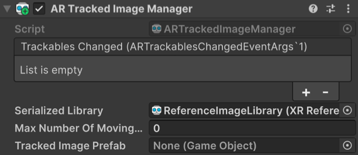

# AR Tracked Image Manager component

Understand how to enable and use image tracking in your project with AR Tracked Image Manager.

The [ARTrackedImageManager](xref:UnityEngine.XR.ARFoundation.ARTrackedImageManager) component is a type of [Trackable manager](xref:arfoundation-managers#trackables-and-trackable-managers) that performs 2D image tracking. As a trackable manager, it creates GameObjects for each detected image in the environment.

## Component reference

 *AR Tracked Image Manager component.*

| **Property** | **Description** |
| :-------- | :-------------- |
| **Trackables Changed** | Invoked when trackables have changed (been added, updated, or removed). |
| **Serialized Library** | The library of images which will be detected and/or tracked in the physical environment. |
| **Max Number Of Moving Images** | Maximum number of moving images. |
| **Tracked Image Prefab** | If not `null`, this prefab is instantiated for each detected image. |

## Enable image tracking

To enable image tracking in your app, add an **AR Tracked Image Manager** component to your XR Origin GameObject. If your scene doesn't contain an XR Origin GameObject, first follow the [Scene setup](xref:arfoundation-scene-setup) instructions.

Whenever your app doesn't need image tracking functionality, disable the AR Tracked Image Manager component to disable image tracking, which can improve app performance. If the user's device doesn't [support](xref:arfoundation-image-tracking-platform-support) image tracking, the AR Tracked Image Manager component will disable itself during `OnEnable`.

## Set the reference image library

To detect images in the environment, you must instruct the manager to look for a set of reference images compiled into a [reference image library](xref:arfoundation-image-tracking-reference-images). AR Foundation only detects images in this library.

To set your reference image library with the AR Tracked Image Manager component:
1. View the **AR Tracked Image Manager** component in the **Inspector** window.
2. Click the **Serialized Library** picker (⊙).
3. Select your reference image library from the `Assets` folder.

<a id="set-reference-library-runtime"/>

### Set a reference image library at runtime

The AR Tracked Image Manager component's reference image library must be non-null when the component is enabled, but you can switch between multiple different libraries at runtime. This is particularly desirable when working with many reference images, as platform limitations may prevent you from storing them all in one library.

> [!TIP]
> Apple recommends that each reference image library on ARKit use [100 or fewer images](https://developer.apple.com/design/human-interface-guidelines/augmented-reality#Reacting-to-real-world-objects), while Google requires reference image libraries contain [1000 or fewer images](https://developers.google.com/ar/develop/augmented-images#moving-images).

In the Editor, you can change the AR Tracked Image Manager's reference image library using the component's **Serialized Library** field.

You can also set the reference image library via script:

[!code-cs[trackedimage_setlibrary](../../../Tests/Runtime/CodeSamples/TrackedImageSamples.cs#trackedimage_setlibrary)]

## Set maximum number of moving images

Some providers can track moving images. Tracking moving images requires more CPU resources. You can specify the number of moving images to track simultaneously with the AR Tracked Image Manager **Max Number Of Moving Images** property.

Refer to the [Optional features support table](xref:arfoundation-image-tracking-platform-support#optional-features) to check whether your target platform(s) support moving images.

## Tracked Image Prefab

The AR Tracked Image Manager component has a [Tracked Image Prefab](xref:UnityEngine.XR.ARFoundation.ARTrackedImageManager.trackedImagePrefab) property. However, this isn't intended for content. When an image is detected, AR Foundation creates a new GameObject to represent it.

If **Tracked Image Prefab** is `null`, AR Foundation creates a GameObject with an [ARTrackedImage](xref:UnityEngine.XR.ARFoundation.ARTrackedImage) component on it. However, if you want every tracked image to also include additional components, you can provide a prefab for AR Foundation to instantiate for each detected image. The purpose of the prefab field is to extend the default behavior of tracked images. It is not the recommended way to place content in the world.

To [Instantiate](xref:UnityEngine.Object.Instantiate(UnityEngine.Object)) content at the pose of the detected image and have its pose updated automatically, you should parent your content to the `ARTrackedImage`.

This prefab is instantiated whenever an image from the reference image library is detected. The manager ensures the instantiated `GameObject` includes an `ARTrackedImage` component. You can get the reference image that was used to detect the `ARTrackedImage` with the `ARTrackedImage.referenceImage` property.

## Respond to detected images

Subscribe to the `ARTrackedImageManager`'s [trackablesChanged](xref:UnityEngine.XR.ARFoundation.ARTrackableManager`5.trackablesChanged) event to be notified whenever an image is added (first detected), updated, or removed, as shown in the following code sample:

[!code-cs[trackedimage_subscribe_to_events](../../../Tests/Runtime/CodeSamples/TrackedImageSamples.cs#trackedimage_subscribe_to_events)]

> [!NOTE]
> An AR platform might not remove a tracked image when the image is no longer visible in the device camera frame. Instead, the platform might set the image's `trackingState` to `Limited`. Refer to [Tracking state](xref:arfoundation-image-tracking-artrackedimage#tracking-state) to learn how to handle this case.

## Create an AR Tracked Image Manager at runtime

When you add a component to an active GameObject at runtime, Unity immediately invokes the component's `OnEnable` method. However, the `ARTrackedImageManager` requires a non-null reference image library to be successfully enabled. If the reference image library is null when the `ARTrackedImageManager` is enabled, the manager automatically disables itself.

To add an `ARTrackedImageManager` at runtime, set its reference image library and then re-enable it as shown in the following code sample:

[!code-cs[trackedimage_addmanager_to_gameobject](../../../Tests/Runtime/CodeSamples/TrackedImageSamples.cs#trackedimage_addmanager_to_gameobject)]

[!include]
