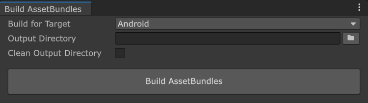

# Use reference image libraries with AssetBundles

Understand how to package a reference image library into an AssetBundle.

To include a reference image library in an [AssetBundle](https://docs.unity3d.com/Manual/AssetBundlesIntro.html), AR Foundation requires that you first call [ARBuildProcessor.PreprocessBuild](xref:UnityEditor.XR.ARSubsystems.ARBuildProcessor.PreprocessBuild*) before you build AssetBundles. Platform-specific data is attached to `XRReferenceImageLibrary` assets during this preprocessor step.

Refer to the following sample code to understand how to build AssetBundles that contain reference image libraries:

[!code-cs[export_assetbundles_function](../../../Tests/Editor/CodeSamples/AssetBundlesSamples.cs#export_assetbundles_function)]

## Build AssetBundles window

Alternatively, you can use the **Build AssetBundles** window, located at **Assets** > **AR Foundation** > **Build AssetBundles**, to export your AssetBundles to the chosen directory.

 *Build AssetBundles window.*

The following table describes the fields in the **Build AssetBundles window**:

| Element | Description |
| :--- | :--- |
| **Build for Target** | Specifies the target platform for the AssetBundles. |
| **Output Directory** | The directory in which to save the built AssetBundles. You can either type this into the text field or click the folder icon to open a file picker. |
| **Clean Output Directory** | If enabled, all files in the output directory will be deleted before the AssetBundles are built. |
| **Build AssetBundles** | Build the AssetBundles to the chosen directory. |
