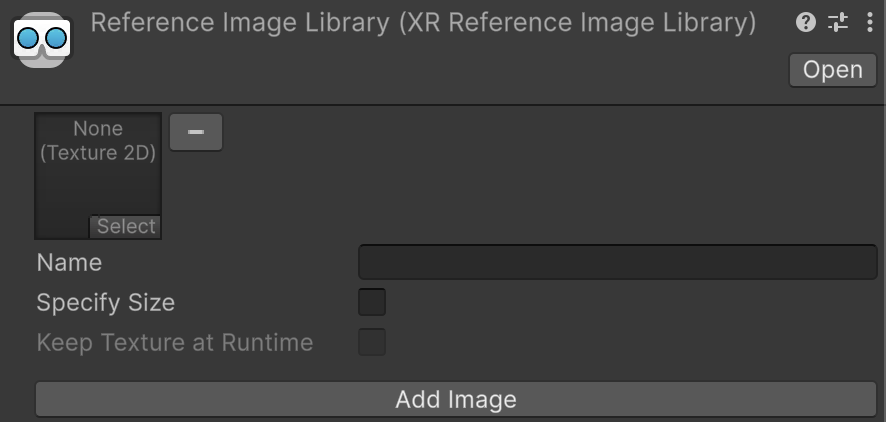

# Configure a reference image library

Follow this workflow to configure your reference image libraries for AR Foundation image tracking.

If this is your first exposure to reference image libraries, first refer to [Introduction to image tracking](xref:arfoundation-image-tracking-introduction).

## Create a reference image library

To create a new **Reference Image Library**:

1. In the top menu, go to **Assets** > **Create** > **XR** > **Reference Image Library**.

This will create a Reference Image Library asset in your project (`ReferenceImageLibrary.asset`). You can now add images to this library.

## Add images to your reference image library

To add an image to a reference image library, you must first add the image as an asset in your project. To do this, go to **Assets** > **Import New Asset** and select the relevant images from your file explorer.

After you have added your images to the `Assets` folder, follow these steps to add them to your reference image library:

1. Open the **Reference Image Library** asset in the **Inspector** window.
2. Select the **Add Image** button to add an image to the library.
3. In the image preview box, press **Select** to open the image explorer.
4. Select the relevant image from the drop down. (Repeat this for each image you want to add.)

 *Reference Image Library.*

## Configure reference image settings

After you have added images to your library, you can configure the following settings in the **Inspector** window:

| Property | Description |
| :---- | :---- |
| **Texture2D asset** | A Texture2D asset created from the reference image file. Refer to [Importing Textures](https://docs.unity3d.com/Manual/ImportingTextures.html) for more information about creating Texture2D assets from image files. |
| **Name** | A string name that is available at runtime. This name isn't used by the subsystem, but it can be useful to identify which reference image has been detected. There is no check for duplicate name conflicts. |
| **Specify Size** | If enabled, you can specify the size of the image in meters as it appears in the physical environment. Refer to [Optional feature support](xref:arfoundation-image-tracking-platform-support#optional-feature-platform-support) to determine whether this property is mandatory to be set. If you set this property, the dimensions must be greater than zero. Editing one dimension (for example, width) causes the other dimension (height) to change automatically based on the image's aspect ratio. |
| **Keep Texture at Runtime** | If enabled, `XRReferenceImage.texture` contains a reference to the source texture. This can be useful if you need access to the source texture at runtime. By default, this is unchecked to reduce the built Player size. When unchecked, `XRReferenceImage.texture` is null. |
