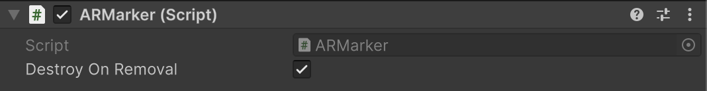

# AR Marker component

Understand how to configure and use the AR Marker component.

The [ARMarker](xref:UnityEngine.XR.ARFoundation.ARMarker) component is a type of [trackable](xref:arfoundation-managers#trackables-and-trackable-managers) that contains the data associated with a marker detected in the physical environment.

 *AR Marker component inspector*

| Property | Description |
| :------- | :---------- |
| **Destroy On Removal** | If `true`, this component's GameObject is destroyed when this trackable is removed. |

## Marker properties

The AR Marker component provides several high-level properties for easy access:

### Pose

The center position and rotation of the marker in world space. The `Pose` is oriented so that its local positive Y-axis (up) points directly away from the front face of the marker, perpendicular to its surface.

### Size

The physical size (width and height) of the marker in meters. The width corresponds to the markers local X-axis. The height corresponds to the markers local Z-axis.

### Marker type

The type of the marker, such as `QRCode` or `ArUco`. Refer to [Marker types](xref:arfoundation-markers-introduction#marker-types) for more information on the different supported marker types and how they compare to each other.

<a id="marker-id"/>

### Marker ID

The numerical identifier that is visually encoded within a fiducial marker, like `ArUco` and `AprilTag`. Unlike a QR code, which typically encodes a string or binary data, a fiducial marker's primary purpose is to present a unique, machine-readable number.

The marker ID is part of the marker's physical design and is constant. For example, an AprilTag with the number `42` encoded on it will always have a `markerId` of `42`, no matter where it is in the world or how many times it is detected.

Refer to the following table to understand the difference between a marker's `markerId` and its `trackableId` (which it inherits from [ARTrackable](xref:UnityEngine.XR.ARFoundation.ARTrackable)).

| **Property** | **markerId** | **trackableId** |
| :------- | :--------- | :------------ |
| **Source** | Decoded from the marker's visual pattern. | A unique handle assigned by the tracking system at runtime. |
| **Uniqueness** | Identifies the type of marker. Multiple physical markers can share the same `markerId`. | Identifies a specific instance of a tracked object in the current session. Always unique. |
| **Purpose** | Provides application-level meaning (For example, `This is robot #42`). | Used internally by AR Foundation to manage and update a specific trackable. |

### Encoded data

Some marker types can encode data directly within their visual pattern (sometimes called a payload). This encoded data can contain information such as a URL, product identifier, or custom binary data.  The `QRCode` and `MicroQRCode` marker types use encoded data.

Fiducial markers don't contain encoded data. Their visual pattern represents a single [marker ID](#marker-id). Examples of fiducial markers include `ArUco` and `AprilTag`.

You can access a marker's encoded data with the [dataBuffer](xref:UnityEngine.XR.ARSubsystems.XRMarker.dataBuffer) property. The buffer acts as a descriptor that tells you what kind of data is available, and doesn't contain the raw data. Refer to [Get the marker's encoded data](#get-the-markers-encoded-data) to learn how to get the encoded data in a marker.

## Get the marker's encoded data

Some marker types, such as QR codes, can encode data within the marker. The ARMarker component provides convenience methods like [TryGetStringData](xref:UnityEngine.XR.ARFoundation.ARMarker.TryGetStringData) and [TryGetBytesData](xref:UnityEngine.XR.ARFoundation.ARMarker.TryGetBytesData) to access encoded data.

These methods are wrappers that forward the call to the `ARMarkerManager`, which handles the underlying logic.

The following code example shows how to get encoded data from an AR Marker directly:

[!code-cs[GetMarkerDataFromMarker](../../../Tests/Runtime/CodeSamples/ARMarkerSamples.cs#GetMarkerDataFromMarker)]

For a complete guide on retrieving encoded data through the AR Marker Manager, including important performance considerations, refer to [Get the marker's encoded data](xref:arfoundation-markers-armarkermanager#get-marker-encoded-data).
