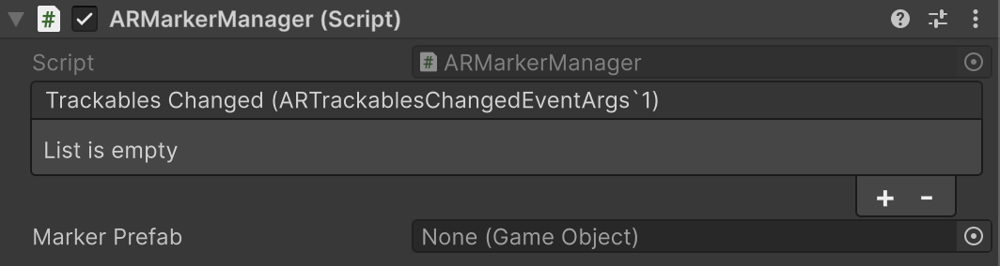

# AR Marker Manager component

Understand how to configure and use the AR Marker Manager component

The [ARMarkerManager](xref:UnityEngine.XR.ARFoundation.ARMarkerManager) is a [trackable manager](xref:arfoundation-managers#trackables-and-trackable-managers) that enables you to detect and track AR markers in your app. Add the `ARMarkerManager` component to your XR Origin GameObject to enable marker tracking.

An AR marker is a known visual pattern in the physical environment, such as a QR code or an ArUco tag, that a device can recognize and track. This manager detects these markers and creates GameObjects with [ARMarker](xref:arfoundation-markers-armarker) components to represent them.

 *AR Marker Manager component inspector*

| Property | Description |
| :------- | :---------- |
| **Trackables Changed** | Invoked when markers have changed (been added, updated, or removed). |
| **Marker Prefab** | If not `null`, this prefab is instantiated for each detected AR marker. If the prefab does not contain an [AR Marker component](xref:arfoundation-markers-armarker), `ARMarkerManager` will add one. |

## Use markers in your project

The primary way to use markers is to subscribe to the `ARMarkerManager.trackablesChanged` event. This event is invoked whenever markers are added, updated, or removed, and it provides lists of all the markers that have changed since the last frame.

The following code example shows how to subscribe to this event to respond to detected markers:

[!code-cs[SubscribeToMarkerChanges](../../../Tests/Runtime/CodeSamples/ARMarkerSamples.cs#SubscribeToMarkerChanges)]

Once you have a reference to an `ARMarker` from the added or updated lists, you can query its properties (such as `markerId` or `size`) or retrieve its encoded data if the marker type supports it.

## Get the marker's encoded data

Some markers support encoded data that can be decoded with [TryGetStringData](xref:UnityEngine.XR.ARFoundation.ARMarkerManager.TryGetStringData(UnityEngine.XR.ARFoundation.ARMarker)) and [TryGetBytesData](xref:UnityEngine.XR.ARFoundation.ARMarkerManager.TryGetBytesData(UnityEngine.XR.ARFoundation.ARMarker)) for the respective data types. To learn more about which markers support encoded data refer to [Marker types](xref:arfoundation-markers-introduction#marker-types).

The primary advantage of markers like QR codes is their ability to encode data into the marker. To access this data, you first need a reference to the [ARMarker](xref:UnityEngine.XR.ARFoundation.ARMarker), which you can get when the `ARMarkerManager.trackablesChanged` event is invoked.

Check the [ARMarker.dataBuffer.bufferType](xref:UnityEngine.XR.ARSubsystems.XRSpatialBuffer.bufferType) to determine what kind of data the marker contains, and then call the appropriate method to retrieve it as shown in the following code example:

[!code-cs[GetMarkerDataFromManager](../../../Tests/Runtime/CodeSamples/ARMarkerSamples.cs#GetMarkerDataFromManager)]

## Performance considerations

Retrieving marker's encoded data can have performance implications due to memory allocations. For performance critical applications, it is important to understand how to minimize this overhead. `TryGetStringData` and `TryGetBytesData` allocate new managed memory (`string` and `byte[]` respectively) on every successful call. In performance critical applications, especially those that retrieve markers' encoded data frequently, this can lead to garbage collection pressure and impact performance.

For the best performance, you should retrieve the encoded data as a `NativeArray<byte>` by calling the subsystem level API directly. This approach works for all data types and avoids the managed heap allocation.

The following code example shows how to get the raw encoded data into a `NativeArray` using a temporary allocator, which results in no garbage collection:

[!code-cs[GetNativeArrayBytesData](../../../Tests/Runtime/CodeSamples/ARMarkerSamples.cs#GetNativeArrayBytesData)]

Once you have the data in a `NativeArray<byte>`, the next step depends on the data type.

### Processing binary data

If the `bufferType` is `Uint8`, the `NativeArray<byte>` you retrieved contains the raw binary data. You can now process this data directly without any further conversions or allocations.

### Processing string data (UTF-8)

If the `bufferType` is `String`, the `NativeArray<byte>` contains the UTF-8 encoded string data. While you could convert this to a C# string, doing so would cause a new allocation and defeat the purpose of the efficient retrieval.

The key to performance is to avoid creating the managed string object altogether by processing the raw UTF-8 bytes.

## Additional resources

* [Markers samples](xref:arfoundation-markers-samples)
