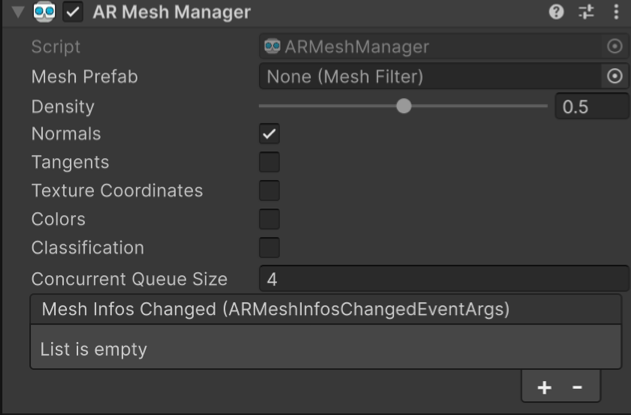

# AR Mesh Manager component

Learn about the AR Mesh Manager component.

The AR Mesh Manager enables and configures meshing functionality on [supported platforms](xref:arfoundation-meshing-platform-support).

## Get started

To use meshing with AR Foundation, add the [AR Mesh Manager](xref:arfoundation-meshing-manager) component to a child GameObject of your scene's XR Origin. If your scene doesn't contain an XR Origin GameObject, first follow the [Scene setup](xref:arfoundation-scene-setup) instructions.

## Configure meshing properties

Use the [AR Mesh Manager](xref:arfoundation-meshing-manager) to configure meshing properties in your project.

To access the AR Mesh Manager properties, select the GameObject that contains your AR Mesh Manager from the **Hierarchy** window and view it in the **Inspector**.

 *AR Mesh Manager component in the Inspector.*

### Component reference

The AR Mesh Manager enables you to configure the following options:

| **Property** | **Description** |
| :---------- | :-------------- |
| [Mesh Prefab](xref:UnityEngine.XR.ARFoundation.ARMeshManager.meshPrefab) | The prefab that's instantiated for each scanned mesh. Refer to [Set the mesh prefab](xref:arfoundation-meshing-prefab) for more information. |
| [Density](xref:UnityEngine.XR.ARFoundation.ARMeshManager.density) | Specifies the amount of tessellation to perform on the generated mesh. |
| [Normals](xref:UnityEngine.XR.ARFoundation.ARMeshManager.normals) |  If enabled, a normal is requested for each vertex. |
| [Tangents](xref:UnityEngine.XR.ARFoundation.ARMeshManager.tangents) | If enabled, a tangent is requested for each vertex. |
| [Texture Coordinates](xref:UnityEngine.XR.ARFoundation.ARMeshManager.textureCoordinates)  | If enabled, a texture coordinate is requested for each vertex. |
| [Colors](xref:UnityEngine.XR.ARFoundation.ARMeshManager.colors) |  If enabled, a color value is requested for each vertex. |
| [Concurrent Queue Size](xref:UnityEngine.XR.ARFoundation.ARMeshManager.concurrentQueueSize) | Specifies the number of meshes to process concurrently. |
| [Classification](xref:UnityEngine.XR.ARFoundation.ARMeshManager.submeshClassificationEnabled) (requires Unity 6.4 or newer) | If enabled, classifications are made available for mesh subcomponents. Refer to [Mesh classification](xref:arfoundation-meshing-classification) for more information about the mesh classification feature. |
| [Mesh Infos Changed (ARMeshInfosChangedEventArgs)](xref:UnityEngine.XR.ARFoundation.ARMeshManager.meshInfosChanged) | Invoked when meshes have changed (been added, updated, or removed). |

> [!NOTE]
> Not all properties are available on all platforms. Refer to [Meshing platform support](xref:arfoundation-meshing-platform-support) to learn more.

### Mesh prefab

You must set the mesh prefab as outlined in [Set the mesh prefab](xref:arfoundation-meshing-prefab#set-prefab).

### Density

The [density](xref:UnityEngine.XR.ARFoundation.ARMeshManager.density) property, in the range `0` to `1`, specifies the amount of tessellation to perform on the generated mesh. A value of `0` results in the least amount tessellation, whereas a value of `1` produces the most tessellation.

### Normals

When the device is constructing the mesh geometry, it might calculate the vertex normals for the mesh. If you don't need the mesh vertex normals, disable [normals](xref:UnityEngine.XR.ARFoundation.ARMeshManager.normals) to save on memory and CPU time.

### Tangents

When the device is constructing the mesh geometry, it might calculate the vertex tangents for the mesh. If you don't need the mesh vertex tangents, disable [tangents](xref:UnityEngine.XR.ARFoundation.ARMeshManager.tangents) to save on memory and CPU time.

### Texture coordinates

When the device is constructing the mesh geometry, it might calculate the vertex texture coordinates for the mesh. If you don't need the mesh vertex texture coordinates, disable [textureCoordinates](xref:UnityEngine.XR.ARFoundation.ARMeshManager.textureCoordinates) to save on memory and CPU time.

### Colors

When the device is constructing the mesh geometry, it might calculate the vertex colors for the mesh. If you don't need the mesh vertex colors, disable [colors](xref:UnityEngine.XR.ARFoundation.ARMeshManager.colors) to save on memory and CPU time.

### Concurrent queue size

To avoid blocking the main thread, the tasks of converting the device mesh into a Unity mesh and creating the physics collision mesh (if the [meshPrefab](xref:UnityEngine.XR.ARFoundation.ARMeshManager.meshPrefab)'s GameObject contains a [MeshCollider](xref:UnityEngine.MeshCollider) component) are moved into a job queue processed on a background thread. [concurrentQueueSize](xref:UnityEngine.XR.ARFoundation.ARMeshManager.concurrentQueueSize) specifies the number of meshes to be processed concurrently.

### Mesh classification

In AR Foundation 6.4 and newer, you can enable mesh classification on supported platforms. To learn more, refer to [Mesh classification](xref:arfoundation-meshing-classification).

