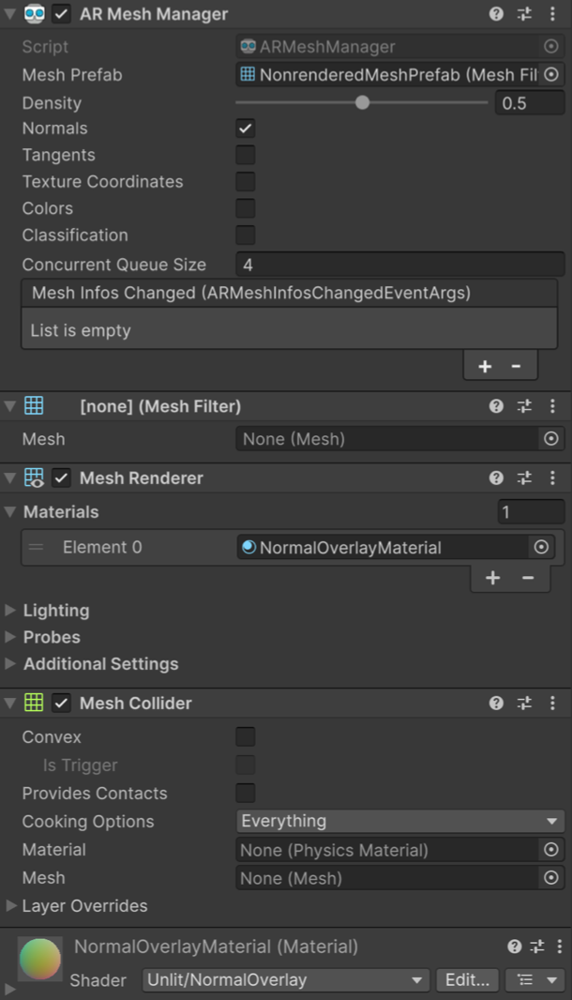

# Configure the mesh prefab and meshing components

Understand how to set the mesh prefab and configure other meshing components.

Once you have added the [AR Mesh Manager](xref:arfoundation-meshing-manager) to your scene, you must set the mesh prefab. You can also add [Additional meshing components](#additional-components) depending on the intended mesh behavior in your project.

## Set the mesh prefab

You must set the [meshPrefab](xref:UnityEngine.XR.ARFoundation.ARMeshManager.meshPrefab) to a prefab that is instantiated for each scanned mesh. The [meshPrefab](xref:UnityEngine.XR.ARFoundation.ARMeshManager.meshPrefab) must contain at least a [MeshFilter](xref:UnityEngine.MeshFilter) component.

## Additional meshing components

If you want to render the scanned meshes, you need to add a [MeshRenderer](xref:UnityEngine.MeshRenderer) component, and a [Material](xref:UnityEngine.Material) component to the [meshPrefab](xref:UnityEngine.XR.ARFoundation.ARMeshManager.meshPrefab)'s GameObject.

If you want to include virtual content that interacts physically with the real-world scanned meshes, you must add a [MeshCollider](xref:UnityEngine.MeshCollider) component to the [meshPrefab](xref:UnityEngine.XR.ARFoundation.ARMeshManager.meshPrefab)'s GameObject.

The following image demonstrates a mesh prefab configured with the required [MeshFilter](xref:UnityEngine.MeshFilter) component, an optional [MeshCollider](xref:UnityEngine.MeshCollider) component to allow for physics interactions, and optional [MeshRenderer](xref:UnityEngine.MeshRenderer) and [Material](xref:UnityEngine.Material) components to render the mesh.

## Additional resources

* [AR Mesh Manager](xref:arfoundation-meshing-manager)
