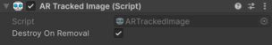

# AR Tracked Object component

Understand the AR Tracked Object component and how to interpret lifecycle events.

The [ARTrackedObject](xref:UnityEngine.XR.ARFoundation.ARTrackedObject) component is a type of [trackable](xref:arfoundation-managers#trackables-and-trackable-managers) that contains the data associated with a detected 3D object. The [ARTrackedObjectManager](xref:UnityEngine.XR.ARFoundation.ARTrackedObjectManager) creates an `ARTrackedObject` when the device detects a 3D object from the [Reference object library](xref:arfoundation-object-tracking-reference-objects) in the environment.

## Component reference

 *AR Tracked Object component.*

The Tracked Object provides the following options:

| Property | Description |
| :------- | :---------- |
| **Destroy On Removal** | If `true`, this component's GameObject is destroyed when this trackable is removed. |

## Tracked object lifecycle

As trackables, AR tracked objects have a lifecycle that consists of three phases: added, updated, and removed. Your app can respond to detected objects during your AR session by subscribing to the AR Tracked Object Manager component's [trackablesChanged](xref:UnityEngine.XR.ARFoundation.ARTrackableManager`5.trackablesChanged) event.

### Added

When a 3D object is first detected in the environment, the AR Tracked Object Manager creates a new GameObject with an AR Tracked Object component attached. The AR Tracked Object Manager then invokes its `trackablesChanged` event. This event passes you a reference to the new Tracked Object component via the [added](xref:UnityEngine.XR.ARFoundation.ARTrackablesChangedEventArgs`1.added) property.

### Updated

The [ARTrackedObjectManager.trackablesChanged](xref:UnityEngine.XR.ARFoundation.ARTrackableManager`5.trackablesChanged) event is raised in each frame where a tracked object is updated. The event arguments contain a list of all changed objects in the frame.

#### Tracking state

If your app responds to object lifecycle events, you should check each object's `trackingState` value whenever the object is updated.

There are three possible tracking states for an `ARTrackedObject`:

| TrackingState                                                     | Description                   |
|:---------------:                                                  |:-------------                 |
| [None](xref:UnityEngine.XR.ARSubsystems.TrackingState.None)       | The object is not being tracked. Note that this might be the initial state when the object is first detected. |
| [Limited](xref:UnityEngine.XR.ARSubsystems.TrackingState.Limited) | The object is being tracked, but not as effectively. The situations in which an object is considered `Limited` instead of `Tracking` depend on the underlying AR framework. Examples that could cause `Limited` tracking include:  <ul><li>Obscuring the object so that it is not visible to the camera.</li></ul>
| [Tracking](xref:UnityEngine.XR.ARSubsystems.TrackingState.Tracking) | The underlying AR SDK reports that it is actively tracking the object. |

When an object leaves the device camera's field of view, the AR Tracked Object Manager might set its [trackingState](xref:UnityEngine.XR.ARFoundation.ARTrackable`2.trackingState) to **Limited** instead of removing it. A value of **Limited** indicates that the AR Tracked Object Manager is aware of an object but can't currently track its position.

### Removed

When an object is no longer detected, the AR Tracked Object Manager might remove it. Removed objects can no longer be updated. If a removed object's **Destroy On Removal** property is set to `true`, the AR Tracked Object Manager will destroy it immediately after invoking the `trackablesChanged` event.

> [!IMPORTANT]
> Do not call `Destroy` on any AR Tracked Object component or its GameObject. AR objects are managed by the AR Tracked Object Manager component, and destroying them yourself can result in errors. Consider disabling the GameObject instead.
