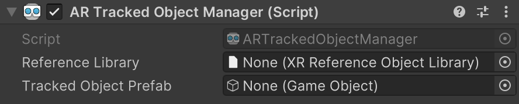

# AR Tracked Object Manager component

Understand how to enable and use object tracking in your project with the AR Tracked Object Manager.

The [ARTrackedObjectManager](xref:UnityEngine.XR.ARFoundation.ARTrackedObjectManager) component is a type of [trackable manager](xref:arfoundation-managers#trackables-and-trackable-managers).

The tracked object manager creates a GameObject for each object detected in the environment.

## Prerequisites

Before your app can detect an object, you must scan the object to create a reference object. You can then add the reference object to the tracked object manager's reference object library. Refer to [Configure a reference object library](xref:arfoundation-object-tracking-reference-objects) to learn more.

## Component reference

 *AR Tracked Object Manager component.*

The Tracked Object Manager provides the following options:

| **Property** | **Description** |
| :-------- | :-------------- |
| **Trackables Changed** | Invoked when trackables have changed (been added, updated, or removed). |
| **Reference Library** | The library of objects which will be detected and/or tracked in the environment. To learn more about reference object libraries, refer to [Configure a reference object library](xref:arfoundation-object-tracking-reference-objects). |
| **Tracked Object Prefab** | If not null, instantiates this prefab for each detected object. |

## Enable object tracking

To enable object tracking in your app, add an **AR Tracked Object Manager** component to your XR Origin GameObject. If your scene doesn't contain an XR Origin GameObject, first follow the [Scene setup](xref:arfoundation-scene-setup) instructions.

Whenever your app doesn't need object tracking functionality, disable the AR Tracked Object Manager component to disable object tracking, which can improve app performance. If the user's device doesn't [support](xref:arfoundation-object-tracking-platform-support) object tracking, the AR Tracked Object Manager component will disable itself during `OnEnable`.

## Set the reference object library

To detect objects in the environment, you must instruct the manager to look for a set of reference objects compiled into a [reference object library](xref:arfoundation-object-tracking-reference-objects). AR Foundation only detects objects in this library.

To set your reference object library with the AR Tracked Object Manager component:

1. View the **AR Tracked Object Manager** component in the **Inspector** window.
2. Click the **Reference Library** picker (⊙).
3. Select your reference object library from the `Assets` folder.

## Create a manager at runtime

When you add a component to an active GameObject at runtime, Unity immediately invokes the component's `OnEnable` method. However, the `ARTrackedObjectManager` requires a non-null reference object library. If the reference object library is null when the [ARTrackedObjectManager](xref:UnityEngine.XR.ARFoundation.ARTrackedObjectManager) is enabled, it automatically disables itself.

To add an [ARTrackedObjectManager](xref:UnityEngine.XR.ARFoundation.ARTrackedObjectManager) at runtime, set its reference object library and then re-enable it:

[!code-cs[RuntimeAddTrackedObjectManager](../../../Tests/Runtime/CodeSamples/ObjectTrackingSamples.cs#RuntimeAddTrackedObjectManager)]

## Tracked object prefab

The Tracked Object Manager instantiates the tracked object whenever your app detects an object from the reference object library. The manager ensures the instantiated GameObject includes an `ARTrackedObject` component. You can get the reference object that your app used to detect the `ARTrackedObject` with the `ARTrackedObject.referenceObject` property.

## Additional resources

* [Object tracking samples](xref:arfoundation-samples-object-tracking)
* [AR Tracked Object component](xref:arfoundation-object-tracking-artrackedobject)
