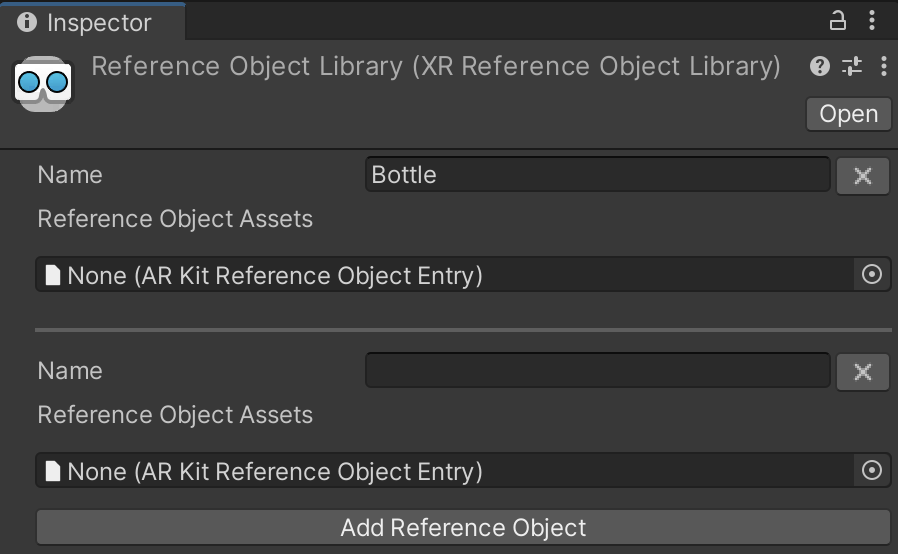

# Configure a reference object library

Follow this workflow to configure your reference object library for AR Foundation object tracking.

To track objects in the environment, you must configure a library of reference objects:

|**Term**|**Description**|
|--------|---------------|
|**Reference object**|A reference object is an object that you have previously scanned and stored in a reference object library. The object tracking subsystem detects and tracks instances of the object in the environment.|
|**Reference object library**|A reference object library is an asset containing a collection of reference objects.|

## Scan your reference objects

Before your app can detect an object in the physical environment, you must scan it to create a reference object. You can then add the reference object to the tracked object manager's reference object library.

The AR Foundation Samples app provides example objects that you can use to get started. For more information, refer to [Object tracking samples](xref:arfoundation-samples-object-tracking).

> [!NOTE]
> [Scanning and Detecting 3D Objects](https://developer.apple.com/documentation/arkit/scanning_and_detecting_3d_objects) (Apple Developer documentation) provides an app you can download that you can use to produce a scan of an object (iOS devices only). This is a third-party application, and Unity is not involved in its development.

## Create a reference object library

In a typical object tracking workflow, you create a reference object library in the Unity Editor, then populate the library with reference objects.

You must add a provider-specific entry for each provider plug-in your project that supports object tracking.

To create a new **Reference Object Library**:

1. In the top menu, go to **Assets** > **Create** > **XR** > **Reference Object Library**.

This creates a new `ReferenceObjectLibrary` asset in your project. You can now add objects to this library.

## Add objects to your reference object library

To add a reference object to the library, select the `ReferenceObjectLibrary` asset you created to open the **Inspector**, then click **Add Reference Object**.

 *A reference object library*

Each reference object has a **Name**, followed by a list of provider-specific entries, which the provider requires for object detection to work on device. In the previous example, each object has one entry for the ARKit provider.

The asset format for a reference object entry depends on the provider implementation. The [Apple ARKit XR Plug-in](xref:arkit-object-tracking) uses the `.arobject` format defined by Apple. Refer to [Scanning and Detecting 3D Objects](https://developer.apple.com/documentation/arkit/scanning_and_detecting_3d_objects) (Apple Developer documentation) for more information.

## Use a reference object library at runtime

The simplest way to use a reference object library is to save its reference to the tracked object manager's **Reference Library** field via the **Inspector**. However, you can also create and use a new reference object library at runtime as shown in the following example:

[!code-cs[RuntimeCreateReferenceObjectLibrary](../../../Tests/Runtime/CodeSamples/ObjectTrackingSamples.cs#RuntimeCreateReferenceObjectLibrary)]

If your project uses the object tracking subsystem without an [ARTrackedObjectManager](xref:UnityEngine.XR.ARFoundation.ARTrackedObjectManager), you can also set the reference object library directly via the subsystem's `library` property. In this case, make sure to assign the reference library to the subsystem's `library` property before you start the subsystem.

### Add a reference object at runtime

To add a new reference object to a reference object library at runtime, follow the steps shown in the following example:

[!code-cs[RuntimeAddReferenceObject](../../../Tests/Runtime/CodeSamples/ObjectTrackingSamples.cs#RuntimeAddReferenceObject)]

## Additional resources

* [AR Tracked Object Manager component](xref:arfoundation-object-tracking-manager)
