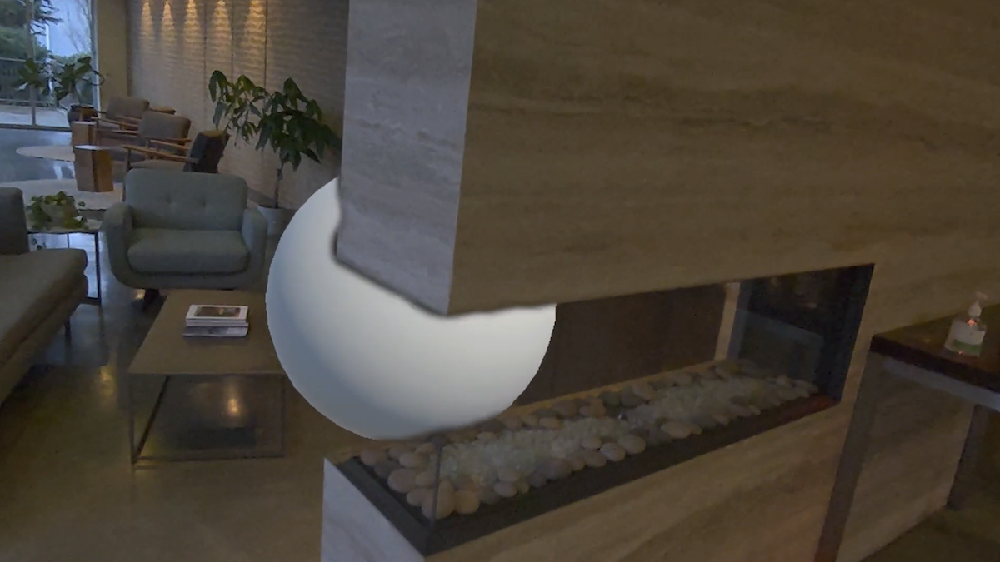
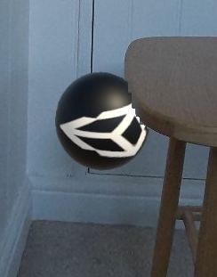
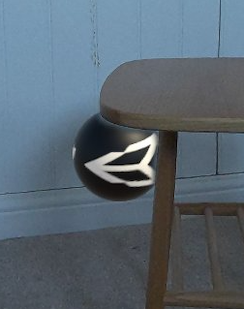

# Introduction to occlusion

Understand what occlusion is and the types of occlusion AR Foundation provides.

Occlusion allows mixed reality content in your app to appear hidden or partially obscured behind objects in the physical environment. Without occlusion, geometry in your scene will always render on top of physical objects in the AR background, regardless of their difference in depth.

Use occlusion functionality to produce compelling and immersive mixed reality applications, with realistic interaction between virtual and physical objects.

 *A virtual sphere is partially occluded by a physical wall.*

## Types of occlusion

AR Foundation provides support for hard and soft occlusion as outlined in the following sections.

### Hard occlusion

Hard occlusion is the simplest form of occlusion. Hard occlusion is cheaper to compute but results in poorer visual fidelity where occluded content has a jagged edge.

 *Hard occlusion can result in a jagged edge.*

### Soft occlusion

Soft occlusion results in a smooth gradient to give occluded content a smooth edge. Soft occlusion results in better visual fidelity, but is more resource-intensive on the GPU.

 *Soft occlusion results in a smoother edge.*

You should test your app on your target platform(s) to understand whether your app has sufficient resources to render soft occlusion. Refer to [Configure occlusion in your project](xref:arfoundation-occlusion-workflow) to learn more about how to configure the occlusion settings in your app.

## Occlusion samples

The AR Foundation Samples app provides [occlusion samples](xref:arfoundation-samples-occlusion) to help you get started with occlusion features.

## Additional resources

* [Occlusion platform support](xref:arfoundation-occlusion-platform-support)
* [Configure occlusion in your project](xref:arfoundation-occlusion-workflow)

[!include]
