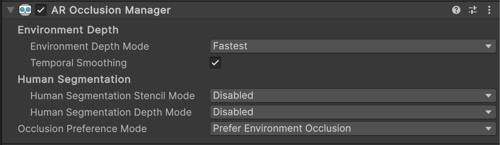

# AR Occlusion Manager component

The [AROcclusionManager](xref:UnityEngine.XR.ARFoundation.AROcclusionManager) component allows mixed reality content in your app to appear hidden or partially obscured behind objects in the physical environment. Without occlusion, geometry in your scene will always render on top of physical objects in the AR background, regardless of their difference in depth.

More specifically, the AR Occlusion Manager acquires per-frame images from the AR platform containing depth or stencil data that shaders can use to implement the occlusion effect. Incorporating depth images into the rendering process allows shaders to sample both the depth of your Unity scene and the depth of the physical environment, and render the pixels that are closer to the camera.

 *AR Occlusion Manager component.*

## Add required components to your scene

To enable occlusion, add the `AROcclusionManager` to your [Camera](xref:arfoundation-camera) as outlined in [Managers](xref:arfoundation-managers).

For ARKit, ARCore, or XR Simulation, you must also add the [AR Camera Background component](xref:arfoundation-camera-components#ar-camera-background-component) to your camera. On [OpenXR platforms](https://docs.unity3d.com/Packages/com.unity.xr.openxr@1.13/manual/index.html#runtimes) such as Meta Quest, you must add the [AR Shader Occlusion](xref:arfoundation-shader-occlusion) component to your camera. If both `ARShaderOcclusion` and `ARCameraBackground` are attached to your camera, occlusion functionality is controlled by `ARShaderOcclusion`.

> [!WARNING]
> AR Shader Occlusion is not yet compatible with ARCore or ARKit. If you are building an app that targets both HMDs and mobile devices, consider either creating separate scenes or adding the AR Shader Occlusion component at runtime on HMD platforms.

## AR Occlusion Manager properties

The following table describes the properties of the AR Occlusion Manager component:

| Property | Description |
| :------- | :---------- |
| **Environment Depth Mode** | The mode for generating the environment depth texture. There are four options: <ul><li><strong>Disabled:</strong> No environment depth texture produced.</li><li><strong>Fastest:</strong> Minimal rendering quality. Minimal frame computation.</li><li><strong>Medium:</strong> Medium rendering quality. Medium frame computation.</li><li><strong>Best:</strong> Best rendering quality. Increased frame computation.</li></ul> |
| **Temporal Smoothing** | Whether temporal smoothing should be applied to the environment depth image, if supported on the chosen platform. Temporal smoothing reduces noise to provide smoother images and more consistent occlusion. |
| **Human Segmentation Stencil Mode** | The mode for generating human segmentation stencil texture: <ul><li><strong>Disabled:</strong> No human stencil texture produced.</li><li><strong>Fastest:</strong> Minimal rendering quality. Minimal frame computation.</li><li><strong>Medium:</strong> Medium rendering quality. Medium frame computation.</li><li><strong>Best:</strong> Best rendering quality. Increased frame computation.</li></ul> |
| **Human Segmentation Depth Mode** | The mode for generating human segmentation depth texture: <ul><li><strong>Disabled:</strong> No human stencil texture produced.</li><li><strong>Fastest:</strong> Minimal rendering quality. Minimal frame computation.</li><li><strong>Best:</strong> Best rendering quality. Increased frame computation.</li></ul> |
| **Occlusion Preference Mode** | If both environment texture and human stencil & depth textures are available, this mode specifies which should be used for occlusion. There are three options: <ul><li><strong>Prefer Environment Occlusion </li><li><strong>Prefer Human Occlusion</li><li><strong>No Occlusion</strong></li></ul> |

> [!NOTE]
> Use **Occlusion Preference Mode** to choose the type of depth image to use on ARKit. Human stencil depth images are only supported on ARKit. Environment and depth images are never simultaneously enabled. 
> ARCore only supports **Disabled** and **Fastest** modes for **Environment Depth Mode**. Using the other modes would not further improve depth texture quality or increase frame computation.

## Types of depth images

The types of depth images supported are:

| Type of depth image | Description |
| :------- | :---------- |
| **Environment Depth** | Distance from the device to any part of the environment in the camera field of view. |
| **Human Depth** | Distance from the device to any part of a human recognized within the camera field of view. |
| **Human Stencil** | Value designating, for each pixel, whether that pixel contains a recognized human. |

[!include]
