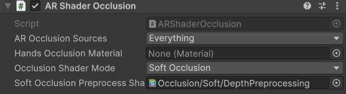

# AR Shader Occlusion component

Understand the AR Shader Occlusion component.

The [ARShaderOcclusion](xref:UnityEngine.XR.ARFoundation.ARShaderOcclusion) component sets global shader properties each frame based on data it receives from the [AR Occlusion Manager](xref:arfoundation-occlusion-manager) component. Your customizable occlusion shaders can read the global shader properties and use them to achieve an occlusion effect.

> [!IMPORTANT]
> With AR Shader Occlusion, you must apply a special occlusion shader to all occludable Materials in your project. Refer to [occlusion shaders](#occlusion-shaders) for more information, including how to use Unity-provided shaders.

Refer to the following sections to learn more about the AR Shader Occlusion and how to use it to enable occlusion in your project.

## Component reference

 *AR Shader Occlusion component.*

You can configure the following properties with the AR Shader Occlusion component:

| Property | Description |
| :---- | :---- |
| **AR Occlusion Sources** | Select the flag for making an occlusion source mask. The occlusion source mask indicates the part of the scene that occludes virtual content based on depth information. The available options are:<ul><li><strong>Environment Depth:</strong> Use depth data provided by the runtime.</li><li><strong>Hand Mesh:</strong> Construct and use hand meshes to occlude in passthrough rendering.</li><li><strong>Everything:</strong> Use environment depth data and hand mesh data as occlusion sources.</li><li><strong>None:</strong> No occlusion sources selected.</li></ul> |
| **Hands Occlusion Material** | A material to use on hands when you enable **Hands Occlusion** in **AR Occlusion Sources**. This property is currently only supported on Android XR. |
| **Occlusion Shader Mode** | The shader keywords to enable: **Hard Occlusion**, **Soft Occlusion**, or **None**. This option is only available if you select **Everything** or **Environment Depth** in **AR Occlusion Sources**. |
| **Soft Occlusion Preprocess Shader** | The preprocessing shader to use for soft occlusion. This option is only available when you enable **Soft Occlusion** in the **Occlusion Shader Mode**. |

## Scene setup

The AR Shader Occlusion component is currently only supported for Meta Quest and Android XR devices. To set up a scene for either of these platforms that includes occlusion, add the AR Shader Occlusion and AR Occlusion Manager components to your XR Origin's Main Camera GameObject as outlined in [Configure occlusion in your project](xref:arfoundation-occlusion-workflow).

## Occlusion shaders

The AR Foundation Samples app provides [sample shaders and shader graphs](https://github.com/Unity-Technologies/arfoundation-samples/tree/main/Assets/Shaders/Occlusion) (GitHub) that you can use with the AR Shader Occlusion component in your project. Only Materials that use an occlusion shader can be occluded — the AR Shader Occlusion component has no effect on other Materials.

You can further customize these shaders to meet your project's needs. For information about writing shaders, refer to [Writing shaders](xref:um-shader-writing) (Unity Manual).

### Soft occlusion preprocess shader

If you set the AR Shader Occlusion component's **Occlusion Shader Mode** to **Soft Occlusion**, you are prompted to provide a preprocess shader, which by default is set to AR Foundation's **Occlusion/Soft/DepthPreprocessing** shader. This is the only supported preprocess shader, but if you are an advanced shader developer, you could create your own modified version.

## Change occlusion mode at runtime

You can swap between hard and soft occlusion at runtime, for example to compare the effects of hard and soft occlusion on the same scene.

If you plan to change AR Shader Occlusion's **Occlusion Shader Mode** at runtime, Unity recommends that you initially set the value to **Soft Occlusion**, ensuring that the soft occlusion preprocess shader is included in the build.

To instead start with **Hard Occlusion** and switch to soft occlusion at runtime, you must use another method to ensure that the soft occlusion preprocess shader is included in your build. One way to do this would be to add the **Occlusion/Soft/DepthPreprocessing** shader to your project's preloaded assets (**Project Settings** > **Player** > **Android** > **Optimization** > **Preloaded assets**).

## Additional resources

* [Occlusion samples](xref:arfoundation-samples-occlusion)
* [Configure occlusion in your project](xref:arfoundation-occlusion-workflow)

[!include]
