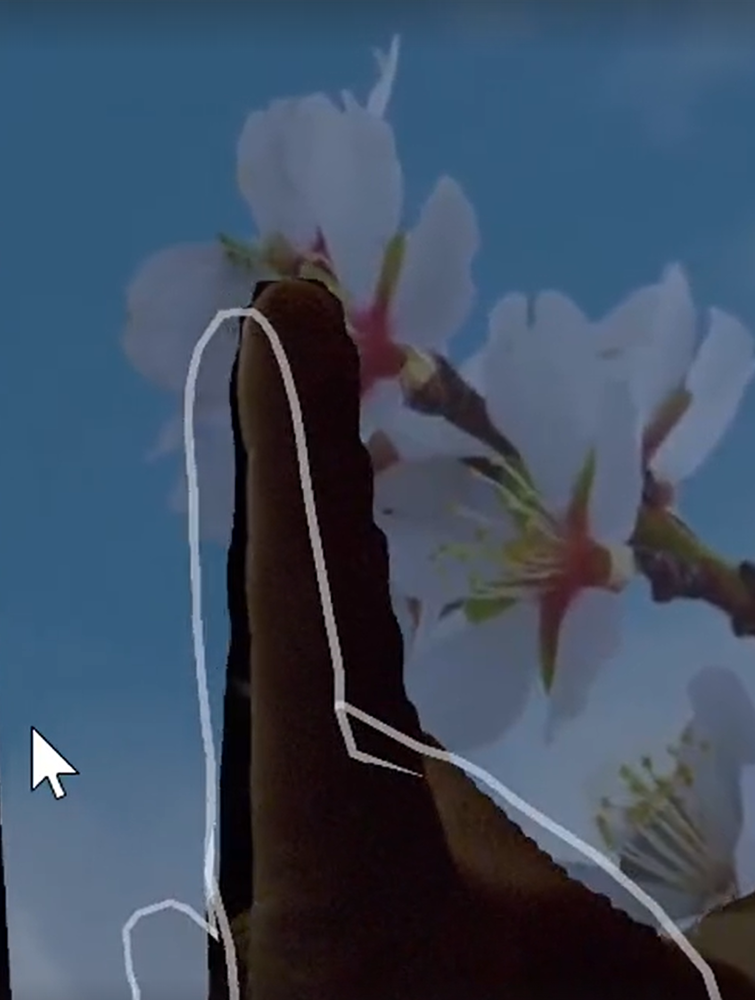

# AR Shader Occlusion component

The [ARShaderOcclusion](xref:UnityEngine.XR.ARFoundation.ARShaderOcclusion) component sets depth render texture information directly to global shader memory, instead of working through the [AR Camera Background component](xref:arfoundation-camera-components#ar-camera-background-component). With shader occlusion, you're able to customize occlusion functionality by writing your own shaders. You can use the occlusion and confidence textures to apply techniques such as custom edge smoothing and visual effects.

The AR Shader Occlusion component subscribes to [AROcclusionManager.frameReceived](xref:UnityEngine.XR.ARFoundation.AROcclusionManager.frameReceived) to receive depth textures, then uses [Shader.SetGlobalTexture](xref:UnityEngine.Shader.SetGlobalTexture(System.Int32,UnityEngine.Texture)) to make occlusion textures globally available for use in shaders.

 *AR Shader Occlusion component.*

## Add the AR Shader Occlusion component to your scene

To enable shader occlusion, add the `ARShaderOcclusion` and [AROcclusionManager](xref:UnityEngine.XR.ARFoundation.AROcclusionManager) to your [Camera](xref:arfoundation-camera) as outlined in [Managers](xref:arfoundation-managers).

## Shader occlusion samples

 *HMD occlusion shader example image.*

For general information on writing shaders, consult the [Writing shaders](https://docs.unity3d.com/Manual/shader-writing.html) page in the Unity manual.

The AR Foundation Samples app provides an example of how to use HMD occlusion with shaders in the [HMD Occlusion](https://github.com/Unity-Technologies/arfoundation-samples/blob/main/Assets/Scenes/Occlusion/HMDOcclusion/HMDOcclusion.unity) sample scene.
