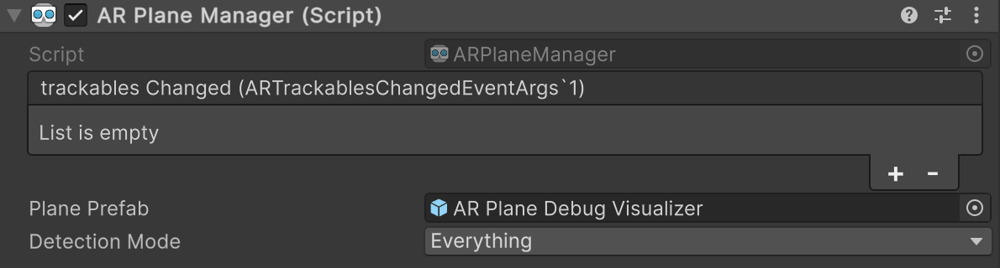

# AR Plane Manager component

The [ARPlaneManager](xref:UnityEngine.XR.ARFoundation.ARPlaneManager) component is a type of [trackable manager](xref:arfoundation-managers#trackables-and-trackable-managers) that detects and tracks flat surfaces in the physical environment. As a trackable manager, it creates GameObjects in your scene for each detected plane.

 *AR Plane Manager component*

| Property | Description |
| :------- | :---------- |
| **trackablesChanged** | Invoked when trackables have changed (been added, updated, or removed). |
| **Plane Prefab** | If not `null`, this prefab is instantiated for each detected plane. If the prefab does not contain an [AR Plane component](xref:arfoundation-plane-arplane), `ARPlaneManager` will add one. |
| **Detection Mode** | The types of planes to detect. There are four options: <ul><li><strong>Nothing:</strong> No planes can be detected.</li><li><strong>Everything:</strong> Planes of any alignment can be detected.</li><li><strong>Horizontal:</strong> Horizontally aligned planes can be detected.</li><li><strong>Vertical:</strong> Vertically aligned planes can be detected</li><li><strong>NotAxisAligned:</strong> Planes that are not axis-aligned can be detected.</li></ul> |

## Getting started

Add an AR Plane Manager component to your XR Origin GameObject to enable plane detection in your app. If your scene does not contain an XR Origin GameObject, first follow the [Scene setup](xref:arfoundation-scene-setup) instructions.

Whenever your app doesn't need plane detection functionality, disable the AR Plane Manager component to disable plane detection, which can improve app performance. If the user's device does not [support](xref:arfoundation-plane-platform-support) plane detection, the AR Plane Manager component will disable itself during `OnEnable`.

### Respond to detected planes

While enabled, the AR Plane Manager component will get changes reported by the [XRPlaneSubsystem](xref:UnityEngine.XR.ARSubsystems.XRPlaneSubsystem) every frame. If any planes were added, updated, or removed, the [trackablesChanged](xref:UnityEngine.XR.ARFoundation.ARTrackableManager`5.trackablesChanged) event is invoked with the relevant information.

You can subscribe to `trackablesChanged` in one of two ways:

1. **Use the Inspector**

    a. Create a public method on a `MonoBehavior` or `ScriptableObject` with a single parameter of type [ARTrackablesChangedEventArgs\<ARPlane\>](xref:UnityEngine.XR.ARFoundation.ARTrackablesChangedEventArgs`1), as shown in the example code below:

    [!code-cs[PlanesChanged](../../../Tests/CodeSamples/ARTrackableManagerSamples.cs#PlanesChanged)]

    b. Select your XR Origin GameObject, then Click the **Add (+)** button on the AR Plane Manger component's **trackablesChanged** property.

    c. Using the Object picker (⊙), select either a GameObject that contains an instance of your component or an instance of your ScriptableObject, whichever is applicable.

     *Subscribe to the trackablesChanged event*

    d. In the dropdown, select your class name and the name of your method. The method name appears in the **Dynamic** section of the methods list.

2. **Use C# scripting**

    a. Create a public method with a single parameter of type [ARTrackablesChangedEventArgs\<ARPlane\>](xref:UnityEngine.XR.ARFoundation.ARTrackablesChangedEventArgs`1) as shown in step 1a above.

    b. Use the example code below to subscribe to the `trackablesChanged` event:

    [!code-cs[PlanesSubscribe](../../../Tests/CodeSamples/ARTrackableManagerSamples.cs#PlanesSubscribe)]

### Visualize planes in the scene

By default, the AR Plane Manager does not render a textured mesh in the scene when planes are detected. To enable plane visualization, set a prefab as the AR Plane Manager's **Plane Prefab**.

The [AR Foundation Samples](https://github.com/Unity-Technologies/arfoundation-samples) GitHub repository contains a prefab that you could use to get started:

| Prefab | Description |
| :----- | :---------- |
| [AR Plane Debug Visualizer](https://github.com/Unity-Technologies/arfoundation-samples/blob/main/Assets/Prefabs/AR%20Plane%20Debug%20Visualizer.prefab) | Visualize plane meshes with a solid color, and optionally visualize additional information such as the plane's [trackableId](xref:UnityEngine.XR.ARFoundation.ARTrackable`2.trackableId), [trackingState](xref:UnityEngine.XR.ARFoundation.ARTrackable`2.trackingState), [classifications](xref:UnityEngine.XR.ARFoundation.ARPlane.classifications), and normal vector. You can configure the visualization options via the Inspector. |

#### Custom plane visualizers

You can also create your own custom plane visualizer for use in your plane prefab. Some common ways to visualize a plane in your scene include using a [MeshFilter](https://docs.unity3d.com/Manual/class-MeshFilter.html) and [MeshRenderer](https://docs.unity3d.com/Manual/class-MeshRenderer.html), [LineRenderer](https://docs.unity3d.com/Manual/class-LineRenderer.html), or [MeshCollider](https://docs.unity3d.com/Manual/class-MeshCollider.html). If your custom visualizer uses one or more of these components, you can add an [ARPlaneMeshVisualizer](xref:UnityEngine.XR.ARFoundation.ARPlaneMeshVisualizer) component to your plane prefab to automatically set up the plane mesh data.

If your custom plane visualizer uses other components to render the plane in the scene, you should subscribe to [ARPlane.boundaryChanged](xref:UnityEngine.XR.ARFoundation.ARPlane.boundaryChanged) to receive updates when the plane boundary changes.
