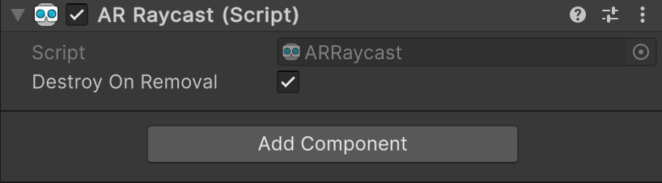

# AR Raycast component

The [ARRaycast](xref:UnityEngine.XR.ARFoundation.ARRaycast) component is a type of [trackable](xref:arfoundation-managers#trackables-and-trackable-managers) that contains the data associated with a [tracked ray cast](xref:arfoundation-raycasts-tracked). Tracked ray casts continuously project a ray from a two-dimensional pixel position on the screen (a screen point).

 *AR Raycast component*

| Property | Description |
| :------- | :---------- |
| **Destroy On Removal** | If `true`, this component's GameObject is destroyed when this trackable is removed. |

## Raycast lifecycle

As trackables, AR ray casts have a lifecycle that consists of three phases: added, updated, and removed. Your app can respond to [Raycast lifecycle events](xref:arfoundation-raycasts-tracked#raycast-life-cycle-events) during an AR session if you subscribe to the AR Raycast Manager component's `trackablesChanged` event.

### Added

When you [create a tracked ray cast](xref:arfoundation-raycasts-tracked#add-a-tracked-ray-cast), it has the `added` phase.

### Updated

Each subsequent frame after a tracked ray cast is added, the AR Raycast Manager might update that ray cast's information. There are two events invoked in each frame for which a tracked ray cast is updated, as described in the following table:

| Event | Description |
| :---- | :---------- |
| [ARRaycast.updated](xref:UnityEngine.XR.ARFoundation.ARRaycast.updated) | Invoked whenever this raycast is updated. The event is fired during this MonoBehaviour's Update callback. This event is not invoked if this component is disabled, although it might continue to receive positional updates. |
| [ARRaycastManager.trackablesChanged](xref:UnityEngine.XR.ARFoundation.ARTrackableManager`5.trackablesChanged) | This method contains a list of all changed ray casts in the frame. |

#### Tracking state

A [trackingState](xref:UnityEngine.XR.ARFoundation.ARTrackable`2.trackingState) value of **Limited** indicates that a tracked ray cast is not tracking normally, and its `distance` may be less accurately estimated than when the ray cast is in the **Tracking** state.

### Removed

You can remove tracked ray casts manually with the [RemoveRaycast](xref:UnityEngine.XR.ARFoundation.ARRaycastManager.RemoveRaycast(UnityEngine.XR.ARFoundation.ARRaycast)) method. Refer to [Remove a ray cast](xref:arfoundation-raycasts-tracked#remove-a-ray-cast) to understand how to remove a ray cast manually.
