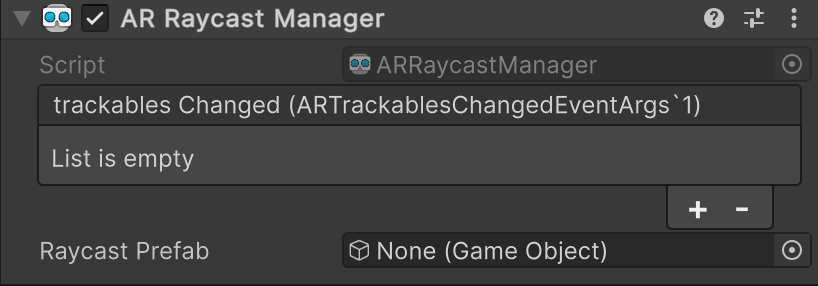

# AR Raycast Manager component

The [ARRaycastManager](xref:UnityEngine.XR.ARFoundation.ARRaycastManager) is a type of [trackable manager](xref:arfoundation-managers#trackables-and-trackable-managers) that performs ray casts in your app.

 *AR Raycast Manager component*

| Property              | Description                                                             |
| :-------------------- | :---------------------------------------------------------------------- |
| **trackablesChanged** | Invoked when trackables have changed (been added, updated, or removed). |
| **Raycast Prefab**    | If not `null`, this prefab is instantiated for each ray cast.           |

## Get started

Add an AR Raycast Manager component to your XR Origin GameObject to enable ray casting in your app. If you don't have an XR Origin GameObject in your scene, first follow the [Scene setup](xref:arfoundation-scene-setup) instructions.

Whenever your app doesn't need ray casting functionality, disable the AR Raycast Manager component to disable ray casting, which can improve app performance. If the user's device does not [support](xref:arfoundation-raycasts-platform-support) ray casting, the AR Raycast Manager component disables itself during `OnEnable`.

## Types of ray cast method

There are two types of ray casts you can perform in your mixed reality project, if [supported](xref:arfoundation-raycasts-platform-support) by your chosen platform. Refer to the following pages to understand and use each type of ray casting method:

| Type                                                   | Description                                                           |
| :----------------------------------------------------- | :-------------------------------------------------------------------- |
| [Single ray casts](xref:arfoundation-raycasts-single)   | Ray casts that occur once.                                         |
| [Tracked ray casts](xref:arfoundation-raycasts-tracked) | Ray casts that continue to update for the entire AR session, or until cancelled. |

## Sample scene with ray casts

The [Simple AR scene](https://github.com/Unity-Technologies/arfoundation-samples/blob/main/Assets/Scenes/SimpleAR/SimpleAR.unity) in the [AR Foundation Samples](https://github.com/Unity-Technologies/arfoundation-samples/tree/main) GitHub repository provides an example scene using ray casting functionality against planes. You can use the configurations in this sample scene to get started with ray casting in your project.
