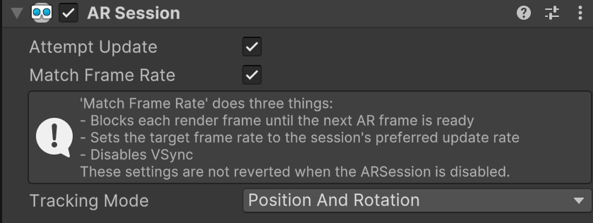
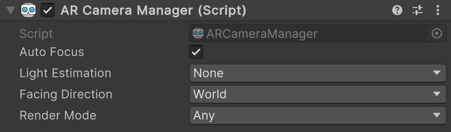

# About AR Foundation

AR Foundation allows you to work with augmented reality platforms in a multi-platform way within Unity. This package presents an interface for Unity developers to use, but doesn't implement any AR features itself. To use AR Foundation on a target device, you also need a separate provider plug-in package for the target platform. Unity officially supports the following provider plug-ins:

* [Google ARCore XR Plug-in](https://docs.unity3d.com/Packages/com.unity.xr.arcore@5.0/manual/index.html) on Android
* [Apple ARKit XR Plug-in](https://docs.unity3d.com/Packages/com.unity.xr.arkit@5.0/manual/index.html) on iOS
* [OpenXR Plug-in](https://docs.unity3d.com/Packages/com.unity.xr.openxr@1.2/manual/index.html) on HoloLens

AR Foundation is a set of `MonoBehaviour`s and APIs for dealing with devices that support the following concepts:

- Device tracking: track the device's position and orientation in physical space.
- Plane detection: detect horizontal and vertical surfaces.
- Point clouds, also known as feature points.
- Anchor: an arbitrary position and orientation that the device tracks.
- Light estimation: estimates for average color temperature and brightness in physical space.
- Environment probe: a means for generating a cube map to represent a particular area of the physical environment.
- Face tracking: detect and track human faces.
- 2D image tracking: detect and track 2D images.
- 3D object tracking: detect 3D objects.
- Meshing: generate triangle meshes that correspond to the physical space.
- Body tracking: 2D and 3D representations of humans recognized in physical space.
- Colaborative participants: track the position and orientation of other devices in a shared AR experience.
- Human segmentation: determines a stencil texture and depth map of humans detected in the camera image.
- Raycast: queries physical surroundings for detected planes and feature points.
- Pass-through video: optimized rendering of mobile camera image onto touch screen as the background for AR content.
- Session management: manipulation of the platform-level configuration automatically when AR Features are enable or disabled.
- Occlusion: allows for occlusion of virtual content by detected environmental depth (environment occlusion) or by detected human depth (human occlusion).

## Platform support

AR Foundation does not implement any AR features itself but, instead, defines a multi-platform API that allows you to work with functionality common to multiple platforms.

### Feature support per platform

You can refer to this table to understand which parts of AR Foundation are relevant on specific platforms:

|                                |ARCore|ARKit| OpenXR |
|--------------------------------|:----:|:---:|:------:|
|Device tracking                 |  ✓   |  ✓  |   ✓    |
|Plane tracking                  |  ✓   |  ✓  |        |
|Point clouds                    |  ✓   |  ✓  |        |
|Anchors                         |  ✓   |  ✓  |   ✓    |
|Light estimation                |  ✓   |  ✓  |        |
|Environment probes              |  ✓   |  ✓  |        |
|Face tracking                   |  ✓   |  ✓  |        |
|2D Image tracking               |  ✓   |  ✓  |        |
|3D Object tracking              |      |  ✓  |        |
|Meshing                         |      |  ✓  |   ✓    |
|2D & 3D body tracking           |      |  ✓  |        |
|Collaborative participants      |      |  ✓  |        |
|Human segmentation              |      |  ✓  |        |
|Raycast                         |  ✓   |  ✓  |        |
|Pass-through video              |  ✓   |  ✓  |        |
|Session management              |  ✓   |  ✓  |   ✓    |
|Occlusion                       |  ✓   |  ✓  |        |

**Note:** To use ARCore cloud anchors, download and install Google's [ARCore Extensions for Unity's AR Foundation](https://developers.google.com/ar/develop/unity-arf).

### Supported platform packages

The following platform packages and later implement the AR Foundation features indicated above:

|Package Name               |Version             |
|:---                       |:---                |
|Google ARCore XR Plug-in   |   5.0              |
|Apple ARKit XR Plug-in     |   5.0              |
|OpenXR Plug-in             |   1.2              |

# Installing AR Foundation

To install this package, follow the instructions in the [Package Manager documentation](https://docs.unity3d.com/Packages/com.unity.package-manager-ui@latest/index.html).

# Provider plug-in setup

A *provider plug-in* is a separate package containing AR Foundation feature implementations for a given platform. To use AR Foundation, you must also install at least one provider plug-in, either from the Package Manager or **Project Settings > XR Plug-in Management** as shown below.

<br/>*XR Plug-in Management*

# Glossary

| **Term** | **Description** |
|-|-|
| **Tracking** | The AR device's ability to determine its relative position and orientation in the physical world. If the environment is too dark, for example, the device might "lose tracking", which means it can no longer accurately report its position. |
| **Trackable** | A real-world feature, such as a planar surface, that the AR device detects and/or tracks. |
| **Feature Point** | A specific point in a point cloud. An AR device uses the device’s camera and image analysis to track specific points in the world, and uses these points to build a map of its environment. These are usually high-frequency elements, such as a knot in a wood-grain surface.|

# Using AR Foundation

## Samples

For a project containing sample scenes which demonstrate the features of AR Foundation, see the [AR Foundation Samples](https://github.com/Unity-Technologies/arfoundation-samples) GitHub repository. Scenes in the AR Foundation Samples project are ready to build to device. To set up a new AR-enabled scene from scratch, follow the steps below.

## Scene setup

To create an AR experience using AR Foundation, there are two necessary GameObjects to have in your scene: an **AR Session** and an **XR Origin**. To create an AR Session or an XR Origin, right-click in the Hierarchy window, and select one of the following options from the context menu.
* **XR** &gt; **AR Session**
* **XR** &gt; **XR Origin (Mobile AR)**

<br/>*Create AR Session and XR Origin*

After adding both an AR Session and XR Origin to the scene, the Hierarchy window will look like the one below, with GameObjects named "AR Session" and "XR Origin". XR Origin has a child GameObject named "Camera Offset", and Camera Offset has a child GameObject named "Main Camera".

<br/>*Scene graph containing AR Session and XR Origin*

This is the default scene setup, but you can rename or reparent the GameObjects according to your project needs. These GameObjects and their components play an important role in an AR Foundation project, and are explained in more detail below.

### AR Session

The [ARSession](xref:UnityEngine.XR.ARFoundation.ARSession) component controls the lifecycle of an AR experience by enabling or disabling AR on the target platform.

<br/>*AR Session component*

When you disable the AR Session component, the system no longer tracks features in its environment. Then if you enable it at a later time, the system attempts to recover and maintain previously-detected features.

If you set **Attempt Update** to **true**, the device tries to install AR software if possible. Support for this feature is platform-dependent.

> [!NOTE]
> Multiple AR Session components in the same scene can conflict with each other, therefore Unity recommends that you add at most one AR Session component to a scene.

#### Checking for device support

Some platforms might support a limited subset of devices. On these platforms, your application needs to be able to detect support for AR Foundation so it can provide an alternative experience when AR is not supported.

[ARSession](xref:UnityEngine.XR.ARFoundation.ARSession) has a static coroutine that you can use to determine whether AR is supported at runtime, as shown below.

```csharp
public class MyComponent {
    [SerializeField] ARSession m_Session;

    IEnumerator Start() {
        if ((ARSession.state == ARSessionState.None) ||
            (ARSession.state == ARSessionState.CheckingAvailability))
        {
            yield return ARSession.CheckAvailability();
        }

        if (ARSession.state == ARSessionState.Unsupported)
        {
            // Start some fallback experience for unsupported devices
        }
        else
        {
            // Start the AR session
            m_Session.enabled = true;
        }
    }
}
```

#### Session state

To determine the current state of the session (for example, whether the device is supported, if AR software is being installed, and whether the session is working), use `ARSession.state`. You can also subscribe to the `ARSession.stateChanged` event to receive a callback when the session state changes.

|`ARSessionState`|**Description**|
|-|-|
|`None`|The AR System has not been initialized and availability is unknown.|
|`Unsupported`|The current device doesn't support AR.|
|`CheckingAvailability`|The system is checking the availability of AR on the current device.|
|`NeedsInstall`|The current device supports AR, but AR support requires additional software to be installed.|
|`Installing`|AR software is being installed.|
|`Ready`|AR is supported and ready.|
|`SessionInitialized`|An AR session is initializing (that is, starting up). This usually means AR is working, but hasn't gathered enough information about the environment.|
|`SessionTracking`|An AR session is running and is tracking (that is, the device is able to determine its position and orientation in the world).|

### XR Origin

The [XROrigin](xref:Unity.XR.CoreUtils.XROrigin) component transforms trackable features, such as planar surfaces and feature points, into their final position, rotation, and scale in a scene.

<br/>*XR Origin component*

Unity recommends that you always create a new [XROrigin](xref:Unity.XR.CoreUtils.XROrigin) following the steps in the [scene setup](xref:arfoundation-manual#scene-setup) section above. When created this way, the [XROrigin](xref:Unity.XR.CoreUtils.XROrigin) component is added to a new GameObject named "XR Origin". We refer to this GameObject as the XR Origin.

#### Session space vs world space

The [XROrigin](xref:Unity.XR.CoreUtils.XROrigin) component transforms trackables from an AR device's "session space", which is an unscaled space relative to the beginning of the AR session, into Unity world space. For example, session space (0, 0, 0) refers to the position at which the AR session was created, and corresponds to the position of the XR Origin in Unity world space.

This concept is similar to the difference between "model" or "local" space and world space when working with other Assets in Unity. For instance, if you import a house asset from a DCC tool, the door's position is relative to the modeler's origin. This is commonly called "model space" or "local space". When Unity instantiates it, it also has a world space relative to Unity's origin.

#### GameObject hierarchy

Note that the XR Origin is created with two child GameObjects named "Camera Offset" and "Main Camera". Each of these GameObjects and their Transforms are significant.

When your application runs on device, the position and rotation of the XR Origin reflect the initial position and rotation of the user's device at application start time. The XR Origin does not move during an AR session, but the [TrackedPoseDriver](https://docs.unity3d.com/Packages/com.unity.inputsystem@1.4/api/UnityEngine.InputSystem.XR.TrackedPoseDriver.html) component on its Main Camera GameObject will automatically update the Main Camera's position and rotation to match those of the AR device as it moves through the physical environment.

The [XROrigin](xref:Unity.XR.CoreUtils.XROrigin) component uses the Camera Offset GameObject to apply the **Camera Y Offset** value when its **Tracking Origin Mode** is set to **Device**. You can apply additional camera offsets by inserting another GameObject between XR Origin and Camera Offset.

At runtime, the [XROrigin](xref:Unity.XR.CoreUtils.XROrigin) component creates another child GameObject named "Trackables". When any [managers](xref:arfoundation-trackable-managers) detect and add new trackables to a scene, they will instantiate them as children of the Trackables GameObject. As child GameObjects, instantiated trackables and their positions, rotations, and scales are defined relative to the XR Origin.

#### Scale

[XROrigin](xref:Unity.XR.CoreUtils.XROrigin) also allows you to scale virtual content. To apply scale to the XR Origin, set the scale of its Transform component using either the Inspector or the [transform](xref:UnityEngine.Component.transform) property. This has the effect of scaling all the data coming from the device, including the Main Camera's position and any detected trackables. Larger values make AR content appear smaller, and vice versa. For example, a scale of 10 would make your content appear 10 times smaller, while 0.1 would make your content appear 10 times larger.

#### Device targets

[XROrigin](xref:Unity.XR.CoreUtils.XROrigin) is a shared class between AR Foundation and the [XR Interaction Toolkit](https://docs.unity3d.com/Packages/com.unity.xr.interaction.toolkit@2.1/manual/index.html) package. XR Interaction Toolkit is an optional additional package that can used to build AR experiences with Unity.

The default [XROrigin](xref:Unity.XR.CoreUtils.XROrigin) in AR Foundation is pre-configured for mobile AR experiences; however, if you wish to target AR HMD's with handheld controller inputs, you can [install XR Interaction Toolkit](https://docs.unity3d.com/Packages/com.unity.xr.interaction.toolkit@2.1/manual/installation.html) for additional [XROrigin](xref:Unity.XR.CoreUtils.XROrigin) configurations. For more information on [XROrigin](xref:Unity.XR.CoreUtils.XROrigin) configurations, see the full [XR Origin component documentation](https://docs.unity3d.com/Packages/com.unity.xr.core-utils@2.1/manual/xr-origin.html).

### AR Camera Manager

The [ARCameraManager](xref:UnityEngine.XR.ARFoundation.ARCameraManager) component enables features for the AR Camera, including the management of the device camera textures and properties that set the light estimation modes. By default, there is an AR Camera Manager component on the Main Camera GameObject, a child of the XR Origin.

<br/>*AR Camera Manager component*

| **Setting** | **Function** |
|-|-|
| **Auto Focus** | Enables or disables the hardware camera's automatic focus mode. When disabled, the focus is fixed and doesn't change automatically. _Note:_ Availability of *Auto Focus* depends on camera hardware so this preference might be ignored at runtime. |
| **Light Estimation** | Estimates lighting properties of the environment. There are five options: <ul><li><b>Ambient Intensity:</b> Estimates the overall average brightness</li><li><b>Ambient Color:</b> Estimates the overall average color</li><li><b>Ambient Spherical Harmonics:</b> Estimates the [spherical harmonics](https://en.wikipedia.org/wiki/Spherical_harmonic_lighting) describing the scene. Spherical harmonics are used to produce more realistic lighting calculations.</li><li><b>Main Light Direction:</b> Estimates the direction of the primary light source. The direction points away from the light (so that it matches the light's direction).</li><li><b>Main Light Intensity:</b> Estimates the brightness of the primary light source.</li></ul>While you can request any of these simultaneously, support for each of these varies greatly among devices. Some platforms may not be able to be simultaneously provide all options, or it may depend on other features (for example, camera facing direction). |
| **Facing Direction** | Controls which camera is used for pass through video. This can be World or User. On handheld mobile devices like phones and tablets, World refers to the rear camera and User refers to the front-facing (that is, "selfie") camera. |

### AR Camera Background

The [ARCameraBackground](xref:UnityEngine.XR.ARFoundation.ARCameraBackground) component renders video feed from the device camera as the background of the scene at runtime. By default, there is an AR Camera Background component on the Main Camera GameObject, a child of the XR Origin.

> [!NOTE]
> Without an AR Camera Background component, you cannot display video from the device camera as the background for your AR content. 

<br/>*AR Camera Background component*

If you set **Use Custom Material** to **true**, the [ARCameraBackground](xref:UnityEngine.XR.ARFoundation.ARCameraBackground) component uses the Custom Material you specify for background rendering. The Custom Material property is optional, and typically you don't need to set it. Each provider plug-in package contains its own shaders for background rendering.

If you have multiple XR Origins (for example, to selectively render different content at different scales), you should use separate Cameras for each XR Origin and a separate, single Camera for the [ARCameraBackground](xref:UnityEngine.XR.ARFoundation.ARCameraBackground).

#### Configuring ARCameraBackground with the Universal Render Pipeline (URP)

To use [ARCameraBackground](xref:UnityEngine.XR.ARFoundation.ARCameraBackground) with URP, you must enable the **AR Background Renderer Feature**. See [this additional documentation to configure an AR Foundation project with a URP](xref:arfoundation-ar-camera-background-with-scriptable-render-pipeline).

#### Automatic occlusion

Some devices offer depth information about the real world. For instance, with a feature known as person occlusion, iOS devices with the A12 Bionic chip (and newer) provide depth information for humans detected in the AR Camera frame. Newer Android phones and iOS devices equipped with a LiDAR scanner can provide an environment depth image where each pixel contains a depth estimate between the device and physical surroundings.

Adding the [AROcclusionManager](xref:UnityEngine.XR.ARFoundation.AROcclusionManager) component to the Camera with the [ARCameraBackground](xref:UnityEngine.XR.ARFoundation.ARCameraBackground) component automatically enables the background rendering pass to incorporate any available depth information when rendering the depth buffer. This allows for rendered geometry to be occluded by detected geometry from the real world. For example, in the case of iOS devices that support person occlusion, detected humans occlude rendered content that exists behind them.

#### Copying the Camera Texture to a Render Texture when accessing the camera image on the GPU

Camera Textures are likely [external Textures](https://docs.unity3d.com/ScriptReference/Texture2D.CreateExternalTexture.html) and might not last beyond a frame boundary. It can be useful to copy the Camera image to a [Render Texture](https://docs.unity3d.com/Manual/class-RenderTexture.html) to persist it or process it further. The following code sets up a [command buffer](https://docs.unity3d.com/ScriptReference/Rendering.CommandBuffer.html) that will [clear the render target](https://docs.unity3d.com/ScriptReference/Rendering.CommandBuffer.ClearRenderTarget.html) and then perform a GPU copy or ["blit"](https://docs.unity3d.com/ScriptReference/Rendering.CommandBuffer.Blit.html) to a Render Texture of your choice immediately:

```csharp
var commandBuffer = new CommandBuffer();
commandBuffer.name = "AR Camera Background Blit Pass";
var texture = !m_ArCameraBackground.material.HasProperty("_MainTex") ? null : m_ArCameraBackground.material.GetTexture("_MainTex");
Graphics.SetRenderTarget(renderTexture.colorBuffer, renderTexture.depthBuffer);
commandBuffer.ClearRenderTarget(true, false, Color.clear);
commandBuffer.Blit(texture, BuiltinRenderTextureType.CurrentActive, m_ArCameraBackground.material);
Graphics.ExecuteCommandBuffer(commandBuffer);
```

Note: [Graphics.SetRenderTarget](https://docs.unity3d.com/ScriptReference/Graphics.SetRenderTarget.html) will overwrite the current render target after executing the command buffer.

#### Accessing the Camera Image on the CPU

See documentation on [camera images](cpu-camera-image.md).

### AR Input Manager

The [ARInputManager](xref:UnityEngine.XR.ARFoundation.ARInputManager) component enables world tracking. By default, an [ARInputManager](xref:UnityEngine.XR.ARFoundation.ARInputManager) component is included on the AR Session GameObject.

> [!NOTE]
> Without the AR Input Manager component, [XROrigin](xref:Unity.XR.CoreUtils.XROrigin) can't acquire a world-space pose for the device. The AR Input Manager component is required for AR to function properly.

<br/>*AR Input Manager component*

You can move the AR Input Manager component anywhere in your scene hierarchy, but you shouldn't have more than one per scene.

# Requirements

This version of AR Foundation is compatible with the following versions of the Unity Editor:

* 2021.2
* 2021.3
* 2022.1
* 2022.2

[!include[](snippets/apple-arkit-trademark.md)]
