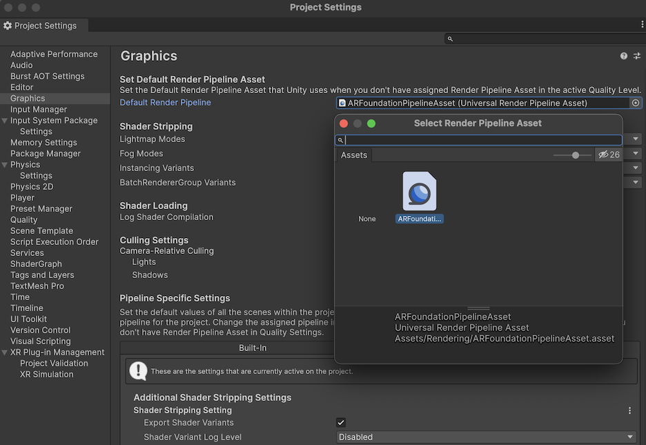

# Universal Render Pipeline

AR Foundation supports the Universal Render Pipeline (URP) versions 7.0.0 or later. See the URP [Getting started](https://docs.unity3d.com/Packages/com.unity.render-pipelines.universal@latest?subfolder=/manual/InstallingAndConfiguringURP.html) page for more details on switching to URP.

> [!NOTE]
>  You can use either URP or the Built-in Render Pipeline with AR Foundation, but you should decide which render pipeline to use in your project before you start development.

# Configure URP for AR Foundation

## Create a Universal Render Pipeline Asset

> [!NOTE]
> The steps for URP setup aren't specific to AR Foundation and are included to indicate how to convert an AR Foundation project with the Built-In Render Pipeline into a URP AR Foundation project. If you created your project from the [URP Project Template](https://docs.unity3d.com/Packages/com.unity.render-pipelines.universal@latest?subfolder=/manual/creating-a-new-project-with-urp.html) or you already have a `UniversalRenderPipelineAsset` and `Universal Renderer` in your project, skip ahead to [Configure your Universal Render Pipeline Asset](#configure-your-universal-render-pipeline-asset).

To create a `UniversalRenderPipelineAsset` and its corresponding `Universal Renderer`:

1. In the project's `Assets` folder, create a new folder named `Rendering`.
2. In the `Rendering` folder, create a Universal Renderer asset for URP:
    Right-click anywhere in the folder and select **Create** &gt; **Rendering** &gt; **Universal Render Pipeline** &gt; **URP Asset (with Universal Renderer)** from the context menu.
    This creates two assets:
    * A [UniversalRenderPipelineAsset](https://docs.unity3d.com/Packages/com.unity.render-pipelines.universal@latest?subfolder=/manual/universalrp-asset.html)
    * A [UniversalRender](https://docs.unity3d.com/Packages/com.unity.render-pipelines.universal@latest?subfolder=/manual/urp-universal-renderer.html)

## Configure your Universal Render Pipeline Asset

> [!NOTE]
> URP provides a pipeline conversion tool that builds a series of assets and pipelines to mimic the Built-in Render Pipeline. If you wish to use this tool you must either do it before assigning the `ARBackgroundRenderFeature` to a renderer or make sure you go back and set the proper `UniversalRenderPipelineAsset` as your project's Render Pipeline Asset.

To configure your `UniversalRenderPipelineAsset` to work with AR Foundation:

1. Locate your `Universal Renderer` asset. If you created your project from the [URP Project Template](https://docs.unity3d.com/Packages/com.unity.render-pipelines.universal@latest?subfolder=/manual/creating-a-new-project-with-urp.html) or used the pipeline conversion tool, multiple URP/Renderer assets were created for you in the `Settings` folder in your project's `Assets` folder. Follow the next step for each Renderer asset.

2. Select your `Universal Renderer` asset. In its **Inspector**, add an `ARBackgroundRendererFeature` to the list of Renderer Features. To use [XR Simulation](xref:arfoundation-simulation-overview) to test your application, set the **Depth Priming Mode** of your Renderer (located under the **Rendering** header)  to `Disabled`.
   

> [!NOTE]
> If you created your project from the [URP Project Template](https://docs.unity3d.com/Packages/com.unity.render-pipelines.universal@latest?subfolder=/manual/creating-a-new-project-with-urp.html) or used the pipeline conversion tool, your project has already been set up to switch between pipeline assets by configuring the Quality settings of your project. If you used these tools, the next step is optional.

3. Access the **Graphics** settings (menu: **Edit** &gt; **Project Settings**, then select **Graphics**), and select the `UniversalRenderPipelineAsset` in the **Default Render Pipeline** field. This URP asset will be used when you don't already have a pipeline asset assigned for the project's active Quality Level.
   
