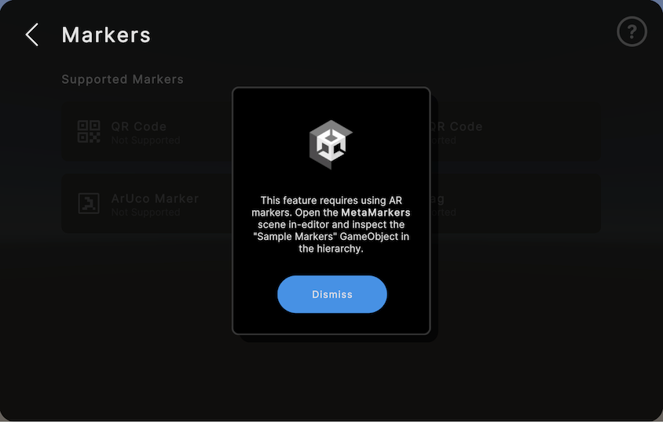
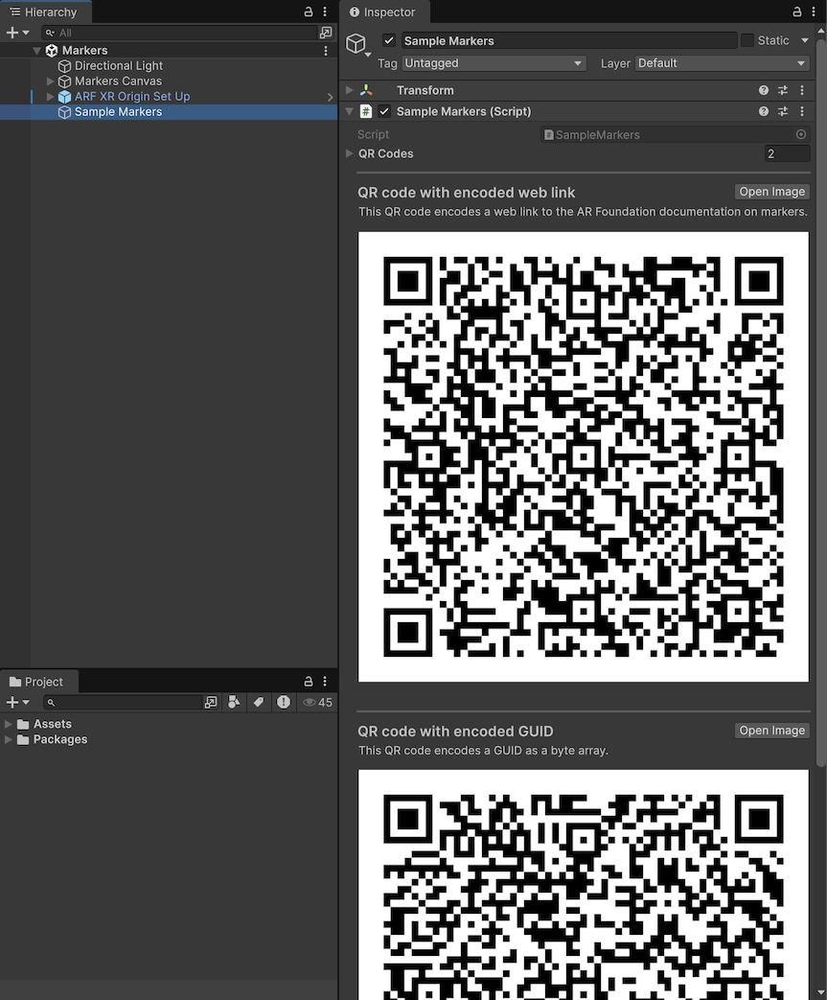
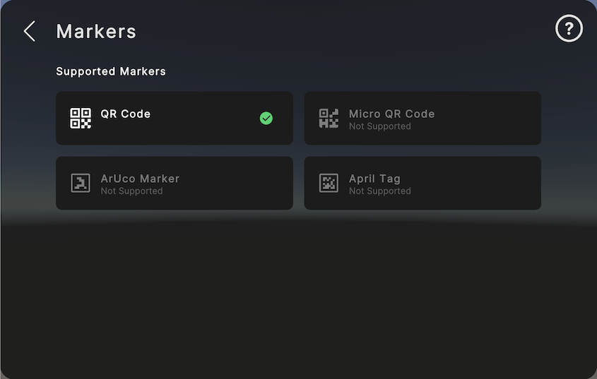
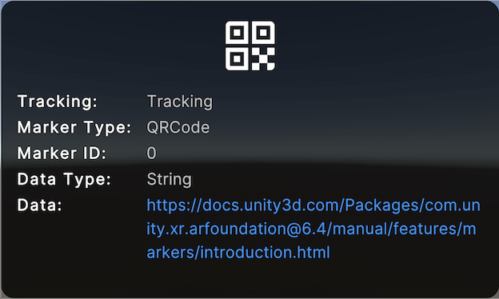

# Markers samples

The `Markers` sample demonstrates AR Foundation [Markers](xref:arfoundation-markers) functionality. You can open this sample in Unity from the `Assets/Scenes/Markers` folder.

> [!TIP]
> You can check which platforms support AR Foundation [Markers](xref:arfoundation-markers) features by checking the [Markers platform support](xref:arfoundation-markers-platform-support) page.

## Markers scene

When you first open the markers scene, the scene displays the menu window and a coaching card. The coaching card explains that the scene requires markers to look at to use this scene. Refer to [Access sample markers](#access-sample-markers) to learn more.

 *Markers sample scene coaching card.*

You can dismiss the coaching card with the **Dismiss** button. Once you have dismissed the coaching card, you can access it again by clicking the question mark button in the top right of the menu window.

### Access sample markers

The samples app provides some sample markers. To access these sample markers:

1. View the **Markers** scene in the **Hierarchy** window.
1. Select the **Sample Markers** GameObject to open it in the **Inspector** window.
     *Markers sample scene sample markers.*
1. In the **Inspector**, you can access two QR codes, which you can use to test the markers sample scene:
    * **QR code with encoded web link**: a QR code that encodes a web link to the AR Foundation marker's documentation as a `string`.
    * **QR code with encoded GUID** encodes a GUID as a `byte[]`.

### Test markers

After you have built the sample project to your device, enter the markers sample scene. When the menu with the coaching card appears, dismiss the coaching card and confirm that at least one marker type is supported.

Look at a marker to detect it. For each detected marker, the samples app instantiates a marker visualizer to display relevant data about the marker. If your devices supports QR codes and is configured for detecting QR codes, you can use the provided sample markers as outlined in [Access sample markers](#access-sample-markers).

 *Marker's sample scene enabled marker detection.*

### Troubleshooting

If no marker types are supported, check that your platform [supports markers](xref:arfoundation-markers-platform-support) or [Check for support at runtime](xref:arfoundation-markers-platform-support#check-for-support-at-runtime) which markers your specific device supports.

## Marker visualizer

The AR Foundation package provides a marker debug visualizer prefab that you can use in your project to get started with visualizing detected markers.

To configure the marker visualizer:

1. Import the marker debug visualizer from the **Package Manager** window as outlined in [AR Foundation package samples](xref:arfoundation-package-samples).
1. View your [AR Marker Manager](xref:arfoundation-markers-armarkermanager) in the **Inspector** window. In the **Marker Prefab** field, select the `AR Marker Debug Visualizer`.

The AR Foundation Samples project uses the marker debug visualizer and will instantiate it when a marker is detected.

 *AR Marker Debug Visualizer.*

| Prefab | Description |
| :----- | :---------- |
| **AR Marker Debug Visualizer** | Visualize markers with a Transform gizmo, line renderer indicating the markers size, and optionally visualize additional information such as the marker's [trackableId](xref:UnityEngine.XR.ARFoundation.ARTrackable`2.trackableId), [trackingState](xref:UnityEngine.XR.ARFoundation.ARTrackable`2.trackingState), [markerId](xref:UnityEngine.XR.ARFoundation.ARMarker.markerId), [encode data type](xref:UnityEngine.XR.ARSubsystems.XRSpatialBufferType), and any encoded data. |

## Additional resources

* [AR Foundation package samples](xref:arfoundation-package-samples)
