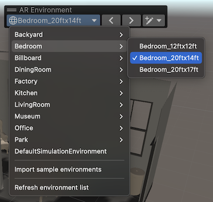
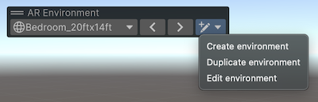

# Simulation

AR Foundation can simulate an AR device, allowing the testing of AR enabled scenes in the Editor. In play mode you can navigate around a variety of simulated environments detecting planes, tracked images, etc. as if you are using a real device.  You can also create your own environments to use in the simulation.

The following AR Foundation features are supported:

|                           |   |
|---------------------------|:-:|
|Device tracking            | ✓ |
|Plane tracking             | ✓ |
|Point clouds               | ✓ |
|Anchors                    |   |
|Light estimation           |   |
|Environment probes         |   |
|Face tracking              |   |
|2D Image tracking          | ✓ |
|3D Object tracking         |   |
|Meshing                    | ✓ |
|2D & 3D body tracking      |   |
|Collaborative participants |   |
|Human segmentation         |   |
|Raycast                    | ✓ |
|Pass-through video         |   |
|Session management         | ✓ |
|Occlusion                  |   |

## Enable simulation

Go to **Project Settings > XR Plug-in Management > Windows, Mac, Linux** and enable **XR Simulation**.  When you enter the **Play Mode** in the editor with a scene that contains an `ARSession`, a simulated environment is loaded.  Click the right mouse button in the **Game** view to look around and press the W, A, S, and D keys to navigate around the environment.

As you navigate around the environment, AR Foundation discovers features of the simulated environment as if you were navigating around a real space. However, there are a few differences compared to using a real device:

* **Planes:** Planes are only discovered on axis aligned surfaces.
* **Meshes:** Meshes are all discovered immediately on entering play mode.
* **Tracked images:** Any tagged image in the simulation environment can be tracked regardless of what images are in your reference library.  This allows testing without having to modify either your reference image library or the environment.

# Simulation environments and the AR Environment View

Simulation environments are prefabs that contain geometry and some additional components to control the simulation behavior.  Use the **Window > XR > AR Foundation > AR Environment View** menu to open an AR Environment View that lets you select and edit environments (An AR Environment View is a Scene View with the **AR Environment** overlay enabled).

 AR Environment overlay.

Any prefab in your Assets with a `SimulationEnvironment` component on the root GameObject is considered to be a simulation environment and will appear in the menu in the **AR Environment** overlay.  This list is cached and can be updated by clicking **Refresh environment list** from the menu.

Select an environment by choosing it from the menu or using the left & right arrow buttons next to the menu to cycle through all the environments.  The selected environment is visible in any scene view with the **AR Environment** overlay active.

## Install simulation environments

AR Foundation provides a set of ready-made environments as examples of locations where you may wish to test AR experiences, such as in the home, workplace and other settings.  To use these they need to be installed to your Unity project.  From the menu in the **AR Environment** overlay click **Install sample environments** to add the XR Simulation Environments package to your project and import the package sample.  This will open the Unity Package import window, which imports the sample environments to `UnityXRContent/ARFoundation/SimulationEnvironments` in your project.  If your project is already using the latest version of the XR Simulation Environments package, then you will see **Import sample environments** in the overlay menu instead.  Clicking this will simply import the package sample.

## Create and edit simulated environment prefabs

You can create a new simulation environment prefab or duplicate an existing one. Both are done from the environment creation button on the *AR Environment* overlay.

 Environment creation button in the AR Environment view.

Choosing *Create Environment* prompts you to save a new prefab with a minimal environment: a floor, a wall, and a tracked image.  *Duplicate Environment* will prompt you to save a copy of the current environment that you can then edit as a prefab.

An environment prefab can contain pretty much anything as long as the prefab root has a `SimulationEnvironment` component.

## Components of a simulated environment

Any geometry in the environment prefab is automatically used to discover planes, meshes and point clouds.  Geometry does not need to have collider components.  Some additional components can be used to add features to the environment:

### Tracked images

A tracked image in a simulation environment is a game object with a `SimulatedTrackedImage` component attached.  The transform should be orientated so that its y-azis (the green arrow) is pointing out.  You can place textured geometry under this game object to visualize the image in the environment; if you use a quad you will need to rotate it 90 degrees on the x-axis to match the orientation.

It will match a specific image in your reference library only if the `Image` field of the component references the same `Texture2D` asset that the library references.  But for convenience, any simulated image can be tracked regardless of what images are in your reference library, but if they are not in the library the the `referenceImage` property of the given `ARTrackedImage` will have a zero Guid and no texture reference.

### Meshes

Simulated environments can provide a snapshot of mesh data, which is generated by combining meshes from Mesh Filters in the environment. The `Simulated Mesh Classification` component marks an object and its children with a classification type. For each unique classification type specified in the environment, the simulation generates one or more meshes from objects marked with that classification. The simulation also provides meshes without a classification type from objects that do not have a `Simulated Mesh Classification` component in their parent hierarchy.

Continuous discovery of meshes is not yet supported.

### X-Ray shaders

Enclosed environments such as rooms can be rendered using "X-ray" shaders which clip exterior walls making the interior visible in the AR Environment view.  You can see this in action in the sample environments.

 Bedroom environment with x-ray shader.

To enable this use the **Simulation > Room X-Ray** shader on your exterior walls, ceiling and floor.  Add a game object to your environment and attach a `XRayRegion` component (in the sample environments this is the "ClippingRegion" object).  The parameters on `XRayRegion` control the x-ray rendering:

* **Floor Height**:
* **Ceiling Height**:
* **Clip Offset**:
* **View Bounds**:

### Simulation environment settings

The `SimulationEnvironment` component on the root game object of the prefab controls how the environment behaves.  This includes the initial camera pose when entering simulation, the bounds that camera movement is limited to and the default view that is shown in the AR Environment view.

 The `SimulationEnvironment` settings.

## Test your simulation environment

After exiting the prefab editing mode your environment will be selected in the *AR Environment* overlay.  Entering **Play Mode** will let you test your new environment.

# Simulation settings

Various settings that control how simulation works are found under **Project Settings > XR Plug-in Management > XR Simulation**:

* **Environment Layer**: Simulation requires a dedicated layer to render the environment separate from your scene content.  That layer is specified here, and by default is layer 30.
* **Environment Scan Parameters**: Simulation discovers surfaces by raycasting against the meshes in the environment.  These settings control that process.
  * **Minimum Rescan Time**:
  * **Delta Camera Distance To Rescan**:
  * **Delta Camera Angle To Rescan**:
  * **Rays Per Cast**:
  * **Maximum Hit Distance**:
  * **Minimum Hit Distance**:
* **Tracked Image Discovery Parameters**
  * **Tracking Update Interval**:
* **Plane Finding Parameters**
  * **Minimum Plane Update Time**:
  * **Min Points Per Sq Meter**:
  * **Min Side Length**:
  * **In Layer Merge Distance**:
  * **Cross Layer Merge Distance**:
  * **Check Empty Area**:
  * **Allowed Empty Area Curve**:
  * **Point Update Dropout Rate**:
  * **Normal Tolerance Angle**:
  * **Voxel Size**:

## User preferences

Some per-user settings are found in **Preferences… > XR Simulation**:

* **Environment Prefab**
* **Enable Navigation**: Enables or disables navigating in the game view with the W, A, S & D keys.  You may need to disable this if it interferes with your own input handling.

