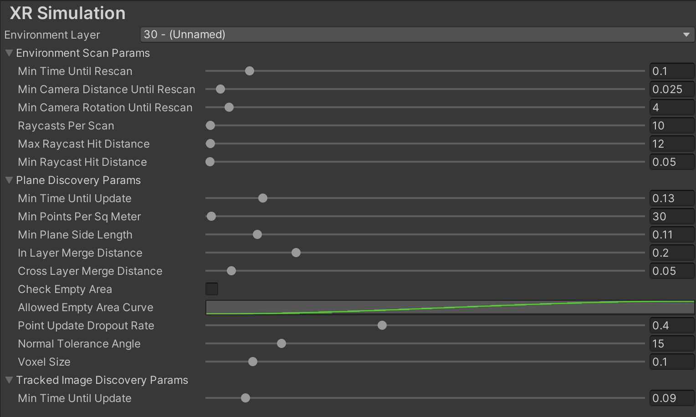

# XR Simulation

XR Simulation lets you test your AR app in the Editor, simulating the behavior of an XR device as it moves through specially configured scenes called *XR Simulation environments*. With XR Simulation enabled, you can quickly test your AR app in a variety of environments without needing to build your app or physically move to a different location.

 *XR Simulation runs the [Simple AR sample](https://github.com/Unity-Technologies/arfoundation-samples#simplear), demonstrating plane detection in a living room environment*

See the following topics to learn more about testing your app with XR Simulation:

|**Topic**|**Description**|
|:--------|:--------------|
| [Overview](#overview) | Understand how XR Simulation works and which AR features it supports. |
| [Getting started](#getting-started) | Enable and run your app in a simulated environment.|
| [XR Environment view](#xr-environment-view) | Understand how to use the XR Environment view. |
| [Install the sample environments](#install-the-sample-environments) | Install the XR Simulation sample environments. |
| [XR Simulation project settings](#xr-simulation-project-settings) | Tune the performance of XR Simulation in your project. |
| [XR Simulation preferences](#xr-simulation-preferences) | Configure your XR Simulation preferences. |
| [XR Simulation environments](#xr-simulation-environments) | Create and edit XR Simulation environments. |

## Overview

When you enter Play Mode with XR Simulation enabled, AR Foundation loads your XR Simulation environment into the scene with keyboard and mouse navigation controls. As you navigate the environment, AR Foundation detects [trackables](xref:arfoundation-trackable-managers#trackables-and-trackable-managers) such as planes, images, and point clouds as if you were moving around in a real space.

AR Foundation includes a variety of preconfigured sample environments that you can optionally install and use, and you can also create your own environments.

You can currently test the following AR features using XR Simulation:

|**AR feature**             |   |
|---------------------------|:-:|
|Device tracking            | ✓ |
|Plane tracking             | ✓ |
|Point clouds               | ✓ |
|Anchors                    |   |
|Light estimation           |   |
|Environment probes         |   |
|Face tracking              |   |
|2D Image tracking          | ✓ |
|3D Object tracking         |   |
|Meshing                    | ✓ |
|2D & 3D body tracking      |   |
|Collaborative participants |   |
|Human segmentation         |   |
|Raycast                    | ✓ |
|Pass-through video         |   |
|Session management         | ✓ |
|Occlusion                  |   |

### Architecture

AR Foundation defines its AR features using [subsystems](xref:arsubsystems-manual). Subsystem implementations are called *providers*. XR Simulation includes Editor-only providers for certain subsystems as shown above, allowing you test your app in Play Mode with no changes necessary to your scene or build settings.

> [!NOTE]
> AR Foundation only uses the XR Simulation providers when you run your app in the Editor. The appropriate platform provider, such as the [Google ARCore XR Plug-in](https://docs.unity3d.com/Packages/com.unity.xr.arcore@5.0/manual/index.html) on Android and the [Apple ARKit XR Plug-in](https://docs.unity3d.com/Packages/com.unity.xr.arkit@5.0/manual/index.html) on iOS, is always used when you build and run on a device.

### Limitations

XR Simulation has limitations you should consider when testing your app. Most importantly, while XR Simulation is designed to approximate the behavior of an XR device in various environments, simulations cannot exactly replicate device behavior and should not be considered a replacement for on-device testing. Unity recommends that you fully test your app on devices you intend to support, while XR Simulation allows you to more quickly iterate on some features without requiring a new build for each iteration.

The following AR features also have limitations in XR Simulation:

* **Plane Detection:** Planes are only detectable on axis-aligned surfaces.
* **Meshing:** Meshes are all detected immediately on entering Play Mode.

## Getting started

You can test your AR scenes in XR Simulation with no scene changes necessary.

To run your app in a simulated environment:

1. Enable XR Simulation:

   1. Go to **Edit** > **Project Settings** to open the **Project Settings** window.
   2. In the **Project Settings** window, select **XR Plug-in Management**.
   3. Under **Plug-in Providers**, enable **XR Simulation (Experimental)**.

2. Select an XR Simulation environment:
   
   1. Go to **Window** > **XR** > **AR Foundation** > **XR Environment** to open the XR Environment view.
   2. Select a simulation environment using the Environment dropdown in the center of the XR Environment overlay. (See [Install the sample environments](#install-the-sample-environments) to add additional environments to your project.)

   

3. Open an AR scene, then press the **Play** button to enter Play Mode and begin simulation.

> [!NOTE]
> As with all AR scenes, your scene must contain both an [AR Session](xref:arfoundation-manual#ar-session) and an [XR Origin](xref:arfoundation-manual#xr-origin) for AR to function properly. See [Scene setup](xref:arfoundation-manual#scene-setup) for more information.

### Navigation controls

You can navigate around the XR Simulation environment in the Game view using the same controls as you would in the Scene view's [Flythrough mode](https://docs.unity3d.com/2019.1/Documentation/Manual/SceneViewNavigation.html):

* Click and hold the right mouse button.
* Move the view around using the mouse, the **WASD** keys to move left/right/forward/backward, and the **Q** and **E** keys to move up and down.
* Hold down **Shift** to move faster.

## XR Environment view

Go to **Window** > **XR** > **AR Foundation** > **XR Environment** to open the XR Environment view. The XR Environment view lets you create and edit XR Simulation environments, as well as select and preview the currently active environment. When you enter Play Mode, XR Simulation runs your app in the active environment as if that environment were a physical space.

 *The XR Environment view*

<table>
  <tr>
   <td><strong>Label</strong></td>
   <td colspan="2" ><strong>Element</strong></td>
   <td><strong>Description</strong></td>
  </tr>
   <td><strong>A</strong></td>
   <td colspan="2" ><strong>Environment dropdown:</strong></td>
   <td>Displays the currently selected simulation environment. Click to reveal the controls listed below for selecting different environments.</td>
  </tr>
  <tr>
   <td></td>
   <td></td>
   <td><strong>Environment list</strong></td>
   <td>Lists all environment Prefabs found in the Assets folder. Click on an environment to select it, making it the active environment. Refresh the list by going to <strong>Assets</strong> &gt; <strong>Refresh XR Environment List</strong>.</td>
  </tr>
  <tr>
   <td></td>
   <td></td>
   <td><strong>Install sample environments</strong></td>
   <td>Installs the sample environment assets to your project. See <a href="#install-the-sample-environments">Install the sample environments</a>.</td>
  </tr>
  <tr>
   <td><strong>B</strong></td>
   <td colspan="2" ><strong>Previous environment</strong></td>
   <td>Select the previous environment in the Environments list.</td>
  </tr>
  <tr>
   <td><strong>C</strong></td>
   <td colspan="2" ><strong>Next environment</strong></td>
   <td>Select the next environment in the Environments list.</td>
  </tr>
   <td><strong>D</strong></td>
   <td colspan="2" ><strong>Create/edit environment dropdown:</strong></td>
   <td>Click to reveal the controls listed below for creating and editing environments.</td>
  </tr>
  <tr>
   <td></td>
   <td></td>
   <td><strong>Create environment</strong></td>
   <td>Create and save a new environment using the default XR Simulation environment as a template.</td>
  </tr>
  <tr>
   <td></td>
   <td></td>
   <td><strong>Duplicate environment</strong></td>
   <td>Create and save a copy of the active environment.</td>
  </tr>
  <tr>
   <td></td>
   <td></td>
   <td><strong>Edit environment</strong></td>
   <td>Open the active environment for editing in <a href="https://docs.unity3d.com/Manual/EditingInPrefabMode.html">Prefab Mode</a>.</td>
  </tr>
  <tr>
   <td><strong>E</strong></td>
   <td colspan="2" ><strong>Camera starting pose</strong></td>
   <td>Visualizes the initial position and rotation of the Camera in the environment when you enter Play Mode. See <a href="#simulation-environment-component">Simulation Environment component</a> for more information about setting these values.</td>
  </tr>
</table>

Any Prefab under your Assets folder with a `SimulationEnvironment` component on the root GameObject is considered to be a simulation environment and can appear in the Environment list. This list is cached and can be refreshed by going to **Assets** > **Refresh XR Environment List**. See [Install the sample environments](#install-the-sample-environments) to install the sample environments, or [Create and edit XR Simulation environments](#create-and-edit-xr-simulation-environments) to create and modify environments.

### XR Environment overlay

The XR Environment overlay is a toolbar [overlay](https://docs.unity3d.com/Manual/overlays.html) that controls the behavior of the XR Environment view.

 *XR Environment overlay*

When you first open the XR Environment view, the XR Environment overlay and several other overlays are displayed by default, but you can customize which overlays you wish to display or hide. Only the XR Environment overlay is required to use the XR Environment view, and you can display or hide any additional overlays according to your preferences. You can also position and dock an overlay by clicking and dragging its handle (**=**).

To display or hide an overlay, follow the steps below:

1. Click the **⋮** icon in the top right corner of the XR Environment view.
2. Click **Overlay Menu** to open the Overlay menu.

   

3. Toggle the visibility of overlays using the controls in the Overlay menu.

   

## Install the sample environments

AR Foundation includes a variety of sample XR Simulation environments that you can optionally install to test your app. The XR Simulation sample environments include various scenes including interior rooms in homes and workplaces as well as exterior city and park settings.

To install the XR Simulation sample environments into your project:

1. Go to **Window** > **XR** > **AR Foundation** > **XR Environment** to open the **XR Environment** view.
2. Click on Environment dropdown to display the list of environments in your project. A new project will only contain one environment, named "DefaultSimulationEnvironment".

   

3. At the bottom of the list, click **Install sample environments**.

   The sample environments are provided in a standard Unity [Asset package](https://docs.unity3d.com/Manual/AssetPackages.html). When you click **Install sample environments**, Unity automatically downloads the package and opens the **Import Unity Package** window.

4. Select the environment Assets that you want to add to your project.
5. Click **Import**.

AR Foundation installs the environments to your Assets folder under `UnityXRContent/ARFoundation`.

> [!NOTE]
> If you have already installed the sample environments, you can re-import them following the same process as above. In this case, the environment list provides an **Import simulation environments** option rather than **Install simulation environments**. 

## XR Simulation project settings

Go to **Edit** > **Project Settings** > **XR Plug-in Management** > **XR Simulation** to tune the performance of XR Simulation according to your project's needs. XR Simulation project settings are saved under your Assets folder at `XR/Resources/XRSimulationRuntimeSettings.asset`.

 *XR Simulation project settings*

<table>
  <tr>
   <td colspan="2" ><strong>Setting</strong></td>
   <td><strong>Description</strong></td>
  </tr>
  <tr>
   <td colspan="2" ><strong>Environment Layer</strong></td>
   <td>XR Simulation requires a dedicated <a href="https://docs.unity3d.com/Manual/Layers.html">layer</a> to render the XR Simulation environment separately from your scene. That layer is specified here, and by default is layer 30.</td>
  </tr>
  <tr>
   <td colspan="2" ><strong>Environment Scan Params</strong></td>
   <td>XR Simulation scans for point clouds and planes in the environment by raycasting against its meshes. These settings control that process.</td>
  </tr>
  <tr>
   <td></td>
   <td><strong>Minimum Rescan Time</strong></td>
   <td>The minimum time in seconds between two environment scans.</td>
  </tr>
  <tr>
   <td></td>
   <td><strong>Delta Camera Distance To Rescan</strong></td>
   <td>The minimum distance in meters a camera should move before the next environment scan.</td>
  </tr>
  <tr>
   <td></td>
   <td><strong>Delta Camera Angle To Rescan</strong></td>
   <td>The minimum change of angle in degrees of the camera's rotation before the next environment scan.</td>
  </tr>
  <tr>
   <td></td>
   <td><strong>Rays Per Cast</strong></td>
   <td>Total number of rays to project per scan.</td>
  </tr>
  <tr>
   <td></td>
   <td><strong>Maximum Hit Distance</strong></td>
   <td>Maximum distance in meters from the camera after which the points will not be detected.</td>
  </tr>
  <tr>
   <td></td>
   <td><strong>Minimum Hit Distance</strong></td>
   <td>Points will not be detected within this distance from the camera in meters.</td>
  </tr>
  <tr>
   <td colspan="2" ><strong>Tracked Image Discovery Params</strong></td>
   <td>Performance tuning options for image tracking.</td>
  </tr>
  <tr>
   <td></td>
   <td><strong>Tracking Update Interval</strong></td>
   <td>The time in seconds between two image tracking updates.</td>
  </tr>
  <tr>
   <td colspan="2" ><strong>Plane Finding Params</strong></td>
   <td>Performance tuning options for plane detection.</td>
  </tr>
  <tr>
   <td></td>
   <td><strong>Minimum Plane Update Time</strong></td>
   <td>Minimum time in seconds between plane updates.</td>
  </tr>
  <tr>
   <td></td>
   <td><strong>Min Points Per Sq Meter</strong></td>
   <td>Voxel point density threshold that is independent of voxel size.</td>
  </tr>
  <tr>
   <td></td>
   <td><strong>Min Side Length</strong></td>
   <td>A plane with any side of length less than this value will be ignored.</td>
  </tr>
  <tr>
   <td></td>
   <td><strong>In Layer Merge Distance</strong></td>
   <td>Planes within the same layer that are at most this distance from each other in meters will be merged.</td>
  </tr>
  <tr>
   <td></td>
   <td><strong>Cross Layer Merge Distance</strong></td>
   <td>Planes in adjacent layers with an elevation difference of at most this value in meters will be merged.</td>
  </tr>
  <tr>
   <td></td>
   <td><strong>Check Empty Area</strong></td>
   <td>When enabled, planes will only be created if they do not contain too much empty area.</td>
  </tr>
  <tr>
   <td></td>
   <td><strong>Allowed Empty Area Curve</strong></td>
   <td>Curve that maps the area of a plane to the ratio of area that is allowed to be empty.</td>
  </tr>
  <tr>
   <td></td>
   <td><strong>Point Update Dropout Rate</strong></td>
   <td>Probability for dropping per-plane updates. If a random number between 0 and 1 is below this number, the update is dropped.</td>
  </tr>
  <tr>
   <td></td>
   <td><strong>Normal Tolerance Angle</strong></td>
   <td>If the angle between a point's normal and a voxel grid direction is within this range, the point is added to the grid.</td>
  </tr>
  <tr>
   <td></td>
   <td><strong>Voxel Size</strong></td>
   <td>Side length of each voxel in the plane voxel grid.</td>
  </tr>
</table>

## XR Simulation preferences

Go to menu **Edit** > **Preferences** > **XR Simulation** (Windows) or **Unity** > **Preferences** > **XR Simulation** (Mac) to set your preferences for XR Simulation. Preferences are saved under your Assets folder at `XR/UserSimulationSettings/Resources/XRSimulationPreferences.asset`.

 *XR Simulation preferences*

| **Setting** | **Description** |
| :---------- | :---------- |
| **Environment Prefab** | Stores the Prefab asset for the active XR Simulation environment. Note that it is easier to set this in the [XR Environment view](#xr-environment-view) because the view's Environment list only includes environment Prefabs rather than every Prefab in the project. |
| **Enable Navigation** | Enables or disables the navigation controls that XR simulation adds to the Game view (using the **WASD**, **Q**, **E**, and **Shift** keys and the mouse). You can disable these navigation controls if they interfere with your own input handling. |

## XR Simulation environments

XR Simulation environments are Prefabs that contain the geomtery of the environment as well as preconfigured components that control the simulation behavior. AR Foundation detects [trackables](xref:arfoundation-trackable-managers#trackables-and-trackable-managers) in XR Simulation environments such as planes, images, and point clouds as if the environment were a physical space.

XR Simulation provides the following tools to use when creating XR Simulation environments:

<table>
  <tr>
   <td colspan="2" ><strong>Tool</strong></td>
   <td><strong>Description</strong></td>
  </tr>
  <tr>
   <td colspan="2" ><a href="#simulation-environment-component">Simulation Environment component</a></td>
   <td>Add to the root GameObject of a Prefab to designate it as an XR Simulation environment. XR Simulation automatically finds environment Prefabs and adds them to the Environment list in the <a href="#xr-environment-view">XR Environment view</a>.</td>
  </tr>
  <tr>
   <td colspan="2" ><a href="#simulated-tracked-image-component">Simulated Tracked Image component</a></td>
   <td>Add to a GameObject in an XR Simulation environment to designate it as a simulated tracked image for image tracking purposes.</td>
  </tr>
  <tr>
   <td colspan="2" ><a href="#simulated-mesh-classification-component">Simulated Mesh Classification component</a></td>
   <td>Add to a GameObject in an XR Simulation environment that represents a 3D element such as a wall, seat, or table that you want to detect and classify in the scene. (XR Simulation meshing detects all meshes in an environment, but does not classify them without this component.)</td>
  </tr>
  <tr>
   <td colspan="2" ><a href="#x-ray-rendering">X-ray rendering</a></td>
   <td>Add the X Ray Region component and x-ray shaders to an XR Simulation environment to make it easier to prevent the camera from being obstructed by exterior walls.</td>
  </tr>
  <tr>
   <td></td>
   <td><a href="#x-ray-region-component">X Ray Region component</a></td>
   <td>Defines the active area for any x-ray shaders in the scene.</td>
  </tr>
  <tr>
   <td></td>
   <td><a href="#x-ray-shaders">X-ray shaders</a></td>
   <td>Shaders that clip exterior surfaces, allowing the Camera to easily see into interior rooms from outside the walls.</td>
  </tr>
</table>

<!-- uncomment and add to table above when documentation is added | [Simulated Bounded Plane component](#simulated-bounded-plane-component) || | -->

### Create and edit XR Simulation environments

You can create, duplicate, or edit an XR Simulation environment Prefab using the [XR Environment view](#xr-environment-view).

 *Create/edit environment dropdown in the XR Environment view*

#### Create or edit an environment Prefab

1. Go to **Window** > **XR** > **AR Foundation** > **XR Environment** to open the XR Environment view.
2. Optionally select an environment from the Environment dropdown if you wish to duplicate or edit that environment.
3. Click the Create/edit environment dropdown on the far right of the XR Environment overlay.
4. Click one of the following options:
   - **Create environment**: Create and save a new environment using the default XR Simulation environment as a template.
   - **Duplicate environment**: Create and save a copy of the active environment.
   - **Edit environment**: Open the active environment for editing in [Prefab Mode](https://docs.unity3d.com/Manual/EditingInPrefabMode.html).

#### Convert an existing Prefab into an environment

1. Open any Prefab for editing in [Prefab Mode](https://docs.unity3d.com/Manual/EditingInPrefabMode.html).
2. Add a [Simulation Environment component](#simulation-environment-component) to the root GameObject of the Prefab. XR Simulation requires that the Prefab only have one root GameObject.
3. You can optionally add additional XR Simulation components, such as a [Simulated Tracked Image component](#simulated-tracked-image-component) or [Simulated Mesh Classification component](#simulated-mesh-classification-component), as needed to test your app's features.
4. Save the Prefab.
5. Refresh the Environment list in the XR Environment view by going to **Assets** > **Refresh XR Environment List**.

> [!TIP]
> Since XR Simulation environments are Prefabs, you can use any of the standard tools in the Unity Editor to create and edit them. The only requirement for a Prefab to be considered an XR Simulation environment is for its root GameObject to have a [Simulation Environment component](#simulation-environment-component) attached.

### Simulation Environment component

Add a Simulation Environment component to the root GameObject of a Prefab to designate it as an XR Simulation environment. You can view and edit its properties in the Inspector window as shown below:

 *Simulation Environment component*

| **Property** | **Description** |
| :----------- | :---------- |
| **Camera Starting Pose** | The position and rotation to spawn the camera in the environment when you enter Play Mode. This pose is illustrated in the XR Environment view with a blue camera line drawing. |
| **Camera Movement Bounds** | The navigable area within the environment.| 
| **Default View Pose** | The default scene camera position and orientation when previewing the environment in the XR Environment view.
| **Default View Pivot** | The default pivot location of the scene camera when previewing the environment in the XR Environment view. |
| **Default View Size** | The default scene camera orbit radius when previewing the environment in the XR Environment view. |
| **Render Settings** | The [RenderSettings](xref:UnityEngine.RenderSettings) object for rendering the environment. |
| **Exclude from Selection UI** | Hides the environment from the Environment dropdown menu in the [XR Environment view](#xr-environment-view).  |

> [!TIP]
> If you have a base Prefab in your project that serves as the basis for other environments, but should not be used itself, set **Exclude from Selection UI** to `true`. When this option is enabled, the Prefab is hidden from the Environment dropdown in the XR Environment view.

### Simulated Tracked Image component

Add a Simulated Tracked Image component to a GameObject in your XR Simulation environment to designate it as a *simulated tracked image*. Simulated tracked images simulate AR Foundation's [image tracking](xref:arfoundation-tracked-image-manager) feature, and you can [respond to detected images](xref:arfoundation-tracked-image-manager#responding-to-detected-images) in XR Simulation environments the same way that you would on device.

 *Simulated Tracked Image component*

XR Simulation can detect and track all simulated tracked images in an environment, even if you have not included their textures in your [reference image library](xref:arfoundation-tracked-image-manager#reference-image-library). To optionally bind a simulated tracked image to your reference image library, set the **Image** field of its Simulated Tracked Image component to reference a texture asset that is also used in the reference image library.

When XR Simulation detects images that are not part of the reference image library, the corresponding [ARTrackedImage](xref:UnityEngine.XR.ARFoundation.ARTrackedImage) trackables will not contain a fully initialized [referenceImage](xref:UnityEngine.XR.ARFoundation.ARTrackedImage.referenceImage). Instead, the `guid` property of the [referenceImage](xref:UnityEngine.XR.ARFoundation.ARTrackedImage.referenceImage) is set to zero, and its `texture` is set to `null`. See [AR tracked image manager](xref:arfoundation-tracked-image-manager) for more information about image tracking.

| **Property** | **Purpose** |
| :----------- | :---------- |
| **Image** | A reference to the [Texture2D](xref:UnityEngine.Texture2D) asset of the image. Optionally, this can also match a texture asset in your [reference image library](xref:arfoundation-tracked-image-manager#reference-image-library). |
| **Image Physical Size Meters** | The size in meters of the image in the environment. This influences the distance at which an image can be detected by the simulated device. Set this value to the expected size of the image in the real world. |

#### Simulated Tracked Image setup

For XR Simulation to track images properly, a simulated tracked image's transform must be orientated such that its local y-axis (the green arrow) points in the same direction as the image surface normal: perpendicular to the image plane with its positive direction pointing forward from the image. Likewise, a tracked image's z-axis (the blue arrow) must point upward to the top of the image. See the example simulated tracked image below as a reference:

 *An example simulated tracked image with green arrow pointing forward and blue arrow pointing up*

To visualize a simulated tracked image in your environment, Unity recommends creating a Quad as a child GameObject of the simulated tracked image. Rotate the Quad 90 degrees along its x-axis, and set its scale to match the Simulated Tracked Image component's **Image Physical Size Meters** property. You can see this GameObject hiearchy used in the example simulated tracked image above.

> [!NOTE]
> Visually representing a simulated tracked image in an XR Simulation environment is optional. XR Simulation only uses the Simulated Tracked Image component to detect and track images. It does not use textured meshes rendered in the environment for this purpose.

### Simulated Mesh Classification component

XR Simulation environments can provide a snapshot of mesh data, which is generated by combining meshes from all [Mesh Filters](https://docs.unity3d.com/Manual/class-MeshFilter.html) in the environment. Normally, XR Simulation reports mesh data without classification information. Add a Simulated Mesh Classification component to define a mesh classification type for a GameObject and its child GameObjects.  

 *Simulated Mesh Classification component*

The Simulated Mesh Classification component has a single property, **Classification Type**. Set this property to a string, such as "table", "wall", "seat", or "floor". In Play Mode, the XR Simulation [meshing](xref:arfoundation-mesh-manager) feature uses this value to classify all meshes referenced by Mesh Filter components on this GameObject and its child GameObjects.

<!-- Uncomment when documentation is available...

### Simulated Bounded Plane component
-->

### X-ray rendering

XR Simulation provides specialized x-ray shaders that allow the camera to see through exterior walls as you navigate around the environment. This x-ray perspective can make it easier to test your app by preventing your camera view from being obstructed as you move around.

 *Bedroom environment with x-ray shader*

To enable x-ray rendering, use the `Simulation/Room X-Ray` shader on your exterior walls, ceiling and floor. You must also add an [X Ray Region component](#x-ray-region-component) component to a GameObject in your environment.

#### X-ray shaders

Add the `Simulation/Room X-Ray` shader to the walls and ceilings of enclosed environments, such as rooms, to clip exterior walls in the AR Environment view. Find the **Room X-Ray** shader under **Simulation** in the Shader menu of a Material asset. 

 *Simulation shader menu*

> [!NOTE]
> You do not need to select the Legacy or URP versions of the shader directly. The `Simulation/Room X-Ray` shader falls back to the URP or legacy built-in versions as needed.

The XR Simulation sample environments include Materials that use the X-ray shaders. If you have [installed the sample environments](#install-the-sample-environments), you can use these Materials, which are located in the Assets folder under `UnityXRContent/ARFoundation/SimulationEnvironments/Common/Materials`.

#### X Ray Region component

The X Ray Region component defines information used by the X-ray shaders.

 *X Ray Region component*

| **Property**       | **Description**                      |
| :----------------  | :----------------------------------- |
| **Floor Height**   | The floor in local coordinates. |
| **Ceiling Height** | The ceiling in local coordinates. |
| **Clip Offset**    | How much the camera clipping plane moves forward from the center of this region. |
| **View Bounds**    | The size of the x-ray clipping region. |

> [!TIP]
> In the sample environments, the GameObjects with **X-Ray Region** components attached are named "ClippingRegion". 
