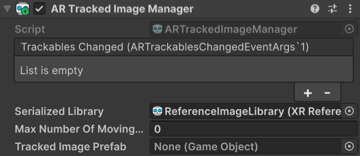

# Trackables and trackable managers

In AR Foundation, a **trackable** is a special component that represents anything that can be detected and tracked in the real world. Planes, point clouds, anchors, environment probes, faces, images, and 3D objects are all examples of objects with corresponding trackable components.

Each type of trackable is created and maintained by a **trackable manager** of a matching type. A trackable manager (or simply, manager) is a `MonoBehaviour` which wraps a **tracking subsystem** and uses its data to manage trackables and their GameObjects. For example, the `ARPlaneManager` generates `ARPlane` trackables using data from the `XRPlaneSubsystem`.

Each Scene in your project should contain at most one enabled manager of each type for AR to function properly. All managers in a Scene must be added to the same GameObject as the XR Origin, except the [mesh manager](mesh-manager.md) which is a special case. Managers share a GameObject with the XR Origin because the positions, rotatations, and scales of all trackables are defined relative to those of the XR Origin. Managers also use the XR Origin GameObject as a reference point when adding new trackable GameObjects to the Scene Hierarchy.

<br/>*XR Origin with various trackable managers*

This table summarizes the trackable managers and their trackable types.

| **Trackable Manager** | **Trackable** | **Purpose** |
|-|-|-|
| [`ARPlaneManager`](plane-manager.md)                        | `ARPlane`            | Detects flat surfaces. |
| [`ARPointCloudManager`](point-cloud-manager.md)             | `ARPointCloud`       | Detects feature points. |
| [`ARAnchorManager`](anchor-manager.md)                      | `ARAnchor`           | Manages anchors. You can manually add and remove them with `ARAnchorManager.AddAnchor` and `ARAnchorManager.RemoveAnchor`. |
| [`ARRaycastManager`](raycast-manager.md)                    | `ARRaycast`          | Repeats and updates a raycast automatically. |
| [`ARTrackedImageManager`](tracked-image-manager.md)         | `ARTrackedImage`     | Detects and tracks 2D images. |
| [`AREnvironmentProbeManager`](environment-probe-manager.md) | `AREnvironmentProbe` | Creates cubemaps that represent the environment. |
| [`ARFaceManager`](face-manager.md)                          | `ARFace`             | Detects and tracks human faces. |
| [`ARTrackedObjectManager`](tracked-object-manager.md)       | `ARTrackedObject`    | Detects 3D objects. |
| [`ARParticipantManager`](participant-manager.md)            | `ARParticipant`      | Tracks other users in a multi-user collaborative session. |

## Enabling and disabling managers

AR Foundation features can be enabled or disabled by enabling or disabling the relevant trackable manager. For example, you can toggle plane detection on and off by enabling or disabling the `ARPlaneManager` component. While enabled, managers can cause the device to consume more power, so it's best to disable managers when your application isn't using them.

A manager responds to being enabled or disabled by calling corresponding life cycle methods on its subsystem:

* `OnEnable`: Invokes subsystem `Start`
* `OnDisable`: Invokes subsystem `Stop`

For more information about subsystems, see the [subsystems documentation](arsubsystems/arsubsystems.md).

## Enumerating trackables

Trackables can be enumerated via their manager's `trackables` property. For example:

```csharp
var planeManager = GetComponent<ARPlaneManager>();
foreach (ARPlane plane in planeManager.trackables)
{
    // Do something with the ARPlane
}
```

The `trackables` property returns a `TrackableCollection`, which can be enumerated in a `foreach` statement as in the above example. You can also query for a particular trackable with the `TryGetTrackable` method.

## Trackable life cycle

A trackable can be added, updated, and removed. A trackable is always added before it is updated or removed, and a trackable cannot be updated once removed. Each frame, managers query their subsystems for the set of changes to their trackables since the previous frame. Each manager has an event to which you can subscribe to be notified of these changes as shown below:

| **Trackable Manager** | **Event** |
|-|-|
| `ARPlaneManager`              | `planesChanged`|
| `ARPointCloudManager`         | `pointCloudsChanged`|
| `ARAnchorManager`             | `anchorsChanged`|
| `ARTrackedImageManager`       | `trackedImagesChanged`    |
| `AREnvironmentProbeManager`   | `environmentProbesChanged` |
| `ARFaceManager`               | `facesChanged` |
| `ARTrackedObjectManager`      | `trackedObjectsChanged` |
| `ARParticipantManager`        | `participantsChanged` |

See each manager's documentation for more information about responding to these events.

### Adding trackables

Some trackables, like anchors and environment probes, can be added and removed manually. Other trackables, like planes, images, objects, and points clouds, are automatically added and removed by their manager. Some trackables can be added either manually or automatically. Where supported, trackable managers provide methods for manual addition and removal.

When you manually add a trackable, the underlying subsystem might not track it immediately. You won't receive an `added` event for that trackable until the subsystem reports that it has been added (typically on the next frame). During the time between manual addition and the `added` event, the trackable is in a pending state. You can check this with the `pending` property on every trackable.

For example, if you add an anchor, it will likely be pending until the next frame.

```csharp
var anchor = AnchorManager.AddAnchor(new Pose(position, rotation));
Debug.Log(anchor.pending); // "true"

// -- next frame --
void OnAnchorsChanged(ARAnchorsChangedEventArgs eventArgs)
{
    foreach (var anchor in eventArgs.added)
    {
        // anchor added above now appears in this list.
    }
}
```

The exact amount of time a trackable spends in the pending state depends on the underlying implementation.

### Removing trackables

With the exception of anchors, you should never `Destroy` a trackable component or its GameObject. Trackables are representations of data surfaced by a trackable subsystem, and destroying them in C# generally has no affect on their native representation. If a trackable supports manual removal, its manager generally provides a method to remove it. For example, you can remove a persistent raycast by calling `ARRaycastManager.RemoveRaycast(ARRaycast)`.

Anchors are an exception to this rule; you can safely remove an anchor by destroying its GameObject. For more information about adding and removing anchors, see the [anchor manager documentation](anchor-manager.md#adding-and-removing-anchors).

Many trackables, such as planes, images, objects, and point clouds, do not support any form of manual removal. These trackables can only be removed by their manager, which will automatically remove them when it receives a removal notification from the underlying subsystem. When a manager removes a trackable this way, it will `Destroy` the trackable's GameObject unless `destroyOnRemoval` is `false`.

<br/>*AR Plane Destroy on Removal field*

Your application can respond to the removal of any trackable by subscribing to the relevant event of that trackable's manager. For example, when an `ARPlane` is removed, the `ARPlaneManager` will invoke its `planesChanged` event with an `ARPlanesChangedEventArgs` struct containing that plane in its list of `removed` planes. See each trackable manager's documentation for more information about its trackable life cycle events.

#### Monitoring tracking state

In cases where tracking quality changes, such as if a trackable manager is disabled or a tracked object moves out of frame of the AR device's camera, the relevant subsystem may not remove any trackables. Instead, it may change those trackables' [trackingState](xref:UnityEngine.XR.ARSubsystems.ITrackable.trackingState) value. Your application can respond to tracking state changes by reading the `trackingState` property of trackables as they are added or updated.

### Deactivating trackables

Sometimes, you might want to stop performing behavior associated with a trackable without disabling its manager. For example, you might wish to stop rendering detected planes without stopping plane detection.

To do this, deactivate each trackable's GameObject:

```csharp
var planeManager = GetComponent<ARPlaneManager>();
foreach (var plane in planeManager.trackables)
{
    plane.gameObject.SetActive(false);
}
```

## Configuring a trackable's GameObject

When a new trackable is detected, its manager instantiates either a copy of the **Tracked Image Prefab** specified in the Inspector or an empty GameObject if the Prefab is `null`.

<br/>*AR Tracked Image Manager with Tracked Image Prefab field*

The instantiated GameObject must have an `ARTrackable` component for that type of trackable, so if the **Tracked Image Prefab** is `null`, the manager creates an empty GameObject and adds only the relevant `ARTrackable` component. Likewise, if a non-null Prefab does not have the relevant `ARTrackable` component, the manager adds one.
