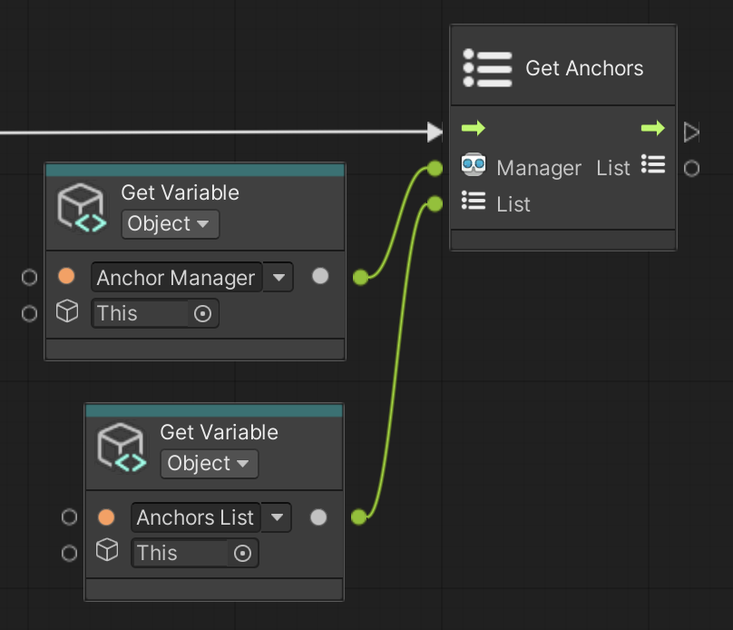

# Get Anchors

Save all AR Anchors to the input List.

 *Get Anchors node, shown with Get Variable*

## Input Data Ports

| Port | Data type | Description |
| :--- | :-------- | :---------- |
| **Manager** | [ARAnchorManager](xref:UnityEngine.XR.ARFoundation.ARAnchorManager) | An active and enabled `ARAnchorManager`. If you do not connect this port, this node searches for an enabled AR Anchor Manager component in the scene instead, and throws an exception if none is found. |
| **List** | [List](xref:System.Collections.Generic.List`1) of [ARAnchor](xref:UnityEngine.XR.ARFoundation.ARAnchor) | Where to save the AR Anchors. This node clears the list, then adds the anchors. If you do not connect this port, this node allocates a new list instead. |

[!include]

## Output Data Ports

| Port | Data type | Description |
| :--- | :-------- | :---------- |
| **List** | [List](xref:System.Collections.Generic.List`1) of [ARAnchor](xref:UnityEngine.XR.ARFoundation.ARAnchor) | The same List you connected to the Input port, now containing all AR Anchors. |
