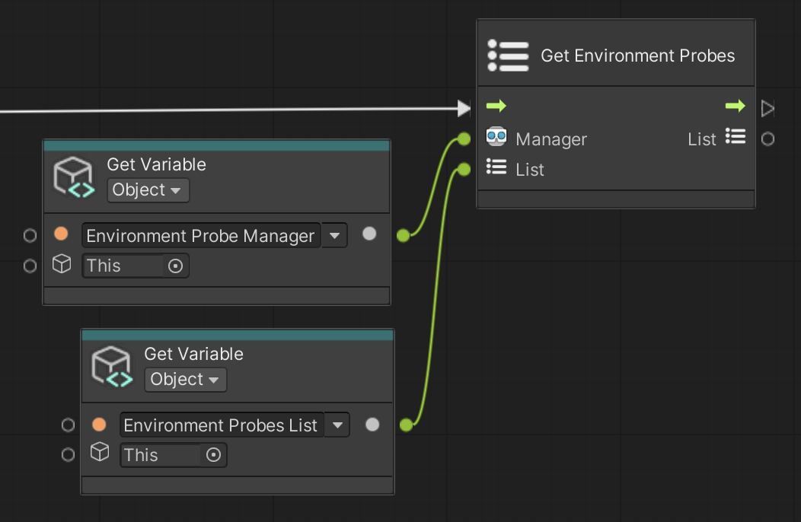

# Get Environment Probes

Save all AR Environment Probes to the input List.

 *Get Environment Probes node, shown with Get Variable*

## Input Data Ports

| Port | Data type | Description |
| :--- | :-------- | :---------- |
| **Manager** | [AREnvironmentProbeManager](xref:UnityEngine.XR.ARFoundation.AREnvironmentProbeManager) | An active and enabled `AREnvironmentProbeManager`. If you do not connect this port, this node searches for an enabled AR Environment Probe Manager component in the scene instead, and throws an exception if none is found. |
| **List** | [List](xref:System.Collections.Generic.List`1) of [AREnvironmentProbe](xref:UnityEngine.XR.ARFoundation.AREnvironmentProbe) | Where to save the AR Environment Probes. This node clears the list, then adds the environment probes. If you do not connect this port, this node allocates a new list instead. |

[!include]

## Output Data Ports

| Port | Data type | Description |
| :--- | :-------- | :---------- |
| **List** | [List](xref:System.Collections.Generic.List`1) of [AREnvironmentProbe](xref:UnityEngine.XR.ARFoundation.AREnvironmentProbe) | The same List you connected to the Input port, now containing all AR Environment Probes. |
