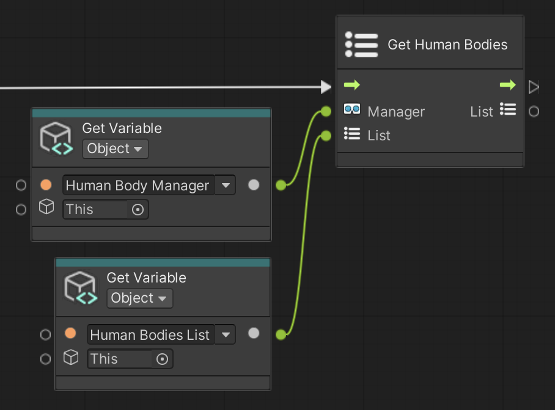

# Get Human Bodies

Save all AR Human Bodies to the input List.

 *Get Human Bodies node, shown with Get Variable*

## Input Data Ports

| Port | Data type | Description |
| :--- | :-------- | :---------- |
| **Manager** | [ARHumanBodyManager](xref:UnityEngine.XR.ARFoundation.ARHumanBodyManager) | An active and enabled `ARHumanBodyManager`. If you do not connect this port, this node searches for an enabled AR Human Body Manager component in the scene instead, and throws an exception if none is found. |
| **List** | [List](xref:System.Collections.Generic.List`1) of [ARHumanBody](xref:UnityEngine.XR.ARFoundation.ARHumanBody) | Where to save the AR Human Bodies. This node clears the list, then adds the human bodies. If you do not connect this port, this node allocates a new list instead. |

[!include]

## Output Data Ports

| Port | Data type | Description |
| :--- | :-------- | :---------- |
| **List** | [List](xref:System.Collections.Generic.List`1) of [ARHumanBody](xref:UnityEngine.XR.ARFoundation.ARHumanBody) | The same List you connected to the Input port, now containing all AR Human Bodies. |
