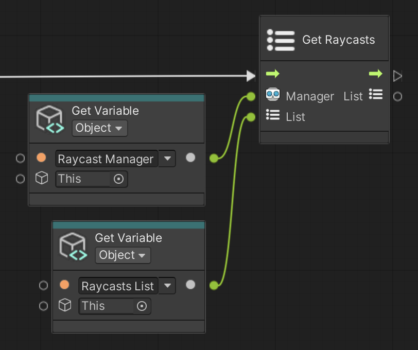

# Get Raycasts

Save all AR Raycasts to the input List.

 *Get Raycasts node, shown with Get Variable*

## Input Data Ports

| Port | Data type | Description |
| :--- | :-------- | :---------- |
| **Manager** | [ARRaycastManager](xref:UnityEngine.XR.ARFoundation.ARRaycastManager) | An active and enabled `ARRaycastManager`. If you do not connect this port, this node searches for an enabled AR Raycast Manager component in the scene instead, and throws an exception if none is found. |
| **List** | [List](xref:System.Collections.Generic.List`1) of [ARRaycast](xref:UnityEngine.XR.ARFoundation.ARRaycast) | Where to save the AR Raycasts. This node clears the list, then adds the raycasts. If you do not connect this port, this node allocates a new list instead. |

[!include]

## Output Data Ports

| Port | Data type | Description |
| :--- | :-------- | :---------- |
| **List** | [List](xref:System.Collections.Generic.List`1) of [ARRaycast](xref:UnityEngine.XR.ARFoundation.ARRaycast) | The same List you connected to the Input port, now containing all AR Raycasts. |
