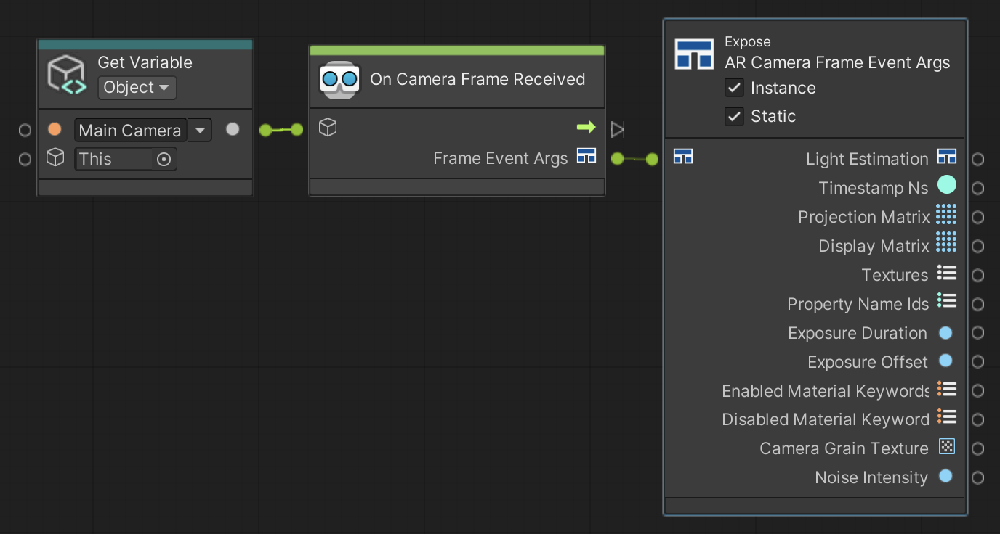

# On Camera Frame Received

Triggers every frame when Unity receives a new image from the device camera.

 *On Camera Frame Received node, shown with Get Variable and Expose*

## Input Data Ports

| Port | Data type | Description |
| :--- | :-------- | :---------- |
| **Target** | [GameObject](xref:UnityEngine.GameObject) | Target GameObject should have an enabled [ARCameraManager](xref:arfoundation-camera-components#ar-camera-manager-component) component. If you do not connect this port, this node searches for an enabled AR Camera Manager component in the scene instead, and throws an exception if none is found. |

> [!TIP]
> If your [Script Machine](https://docs.unity3d.com/Packages/com.unity.visualscripting@1.8/manual/vs-create-graph-on-machine.html#create-a-new-graph-file-from-a-script-machine-or-state-machine) **Source** is set to **Graph**, your graph asset cannot directly reference GameObjects in the scene. Use a Get Variable node to reference instantiated GameObjects.

## Output Data Ports

| Port | Data type | Description |
| :--- | :-------- | :---------- |
| **Frame Event Args** | [ARCameraFrameEventArgs](xref:UnityEngine.XR.ARFoundation.ARCameraFrameEventArgs) | The output `ARCameraFrameEventArgs`. You can connect this to an Expose node to access its contents. |
