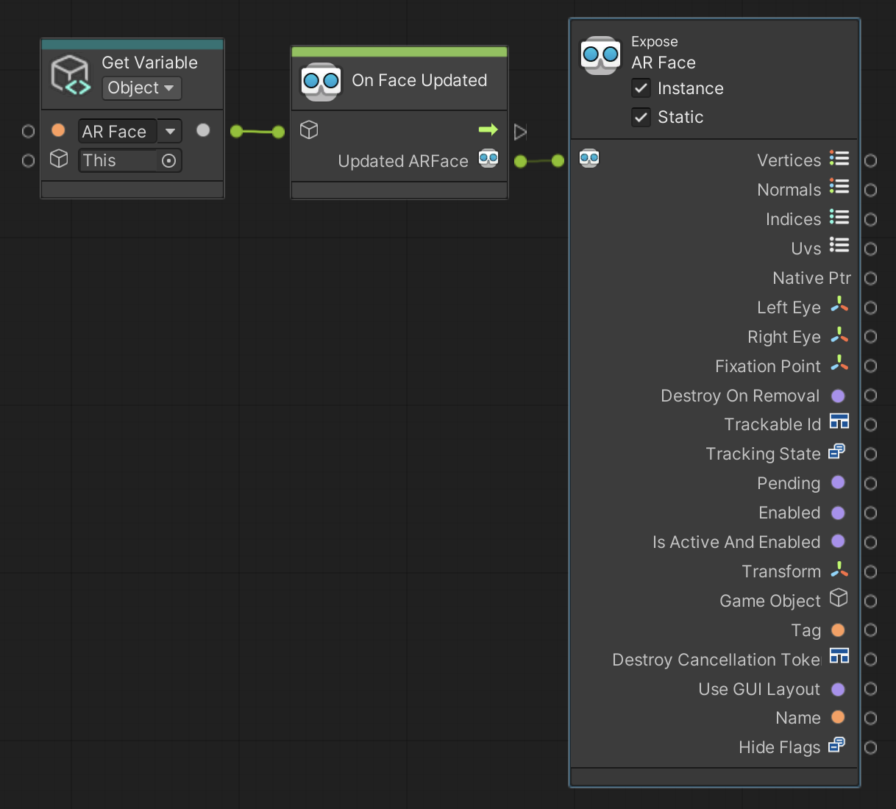

# On Face Updated

Triggers when the `ARFace` component on the input GameObject is updated. AR Faces can be updated every frame if there is an enabled [ARFaceManager](xref:UnityEngine.XR.ARFoundation.ARFaceManager) in the scene.

 *On Face Updated node, shown with Get Variable and Expose*

## Input Data Ports

| Port | Data type | Description |
| :--- | :-------- | :---------- |
| **Target** | [GameObject](xref:UnityEngine.GameObject) | Target GameObject must have an enabled [ARFace](xref:UnityEngine.XR.ARFoundation.ARFace) component, otherwise this node throws an exception. |

[!include]

## Output Data Port

| Port | Data type | Description |
| :--- | :-------- | :---------- |
| **Updated ARFace** | [ARFace](xref:UnityEngine.XR.ARFoundation.ARFace) | The updated `ARFace`. You can connect this to an Expose node to access its contents. |
