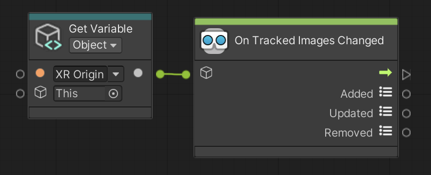

# On Tracked Images Changed

Triggers when AR Tracked Images have changed. AR Tracked Images can be added, updated, and/or removed every frame if there is an enabled AR Tracked Image Manager in the scene.

 *On Tracked Images Changed node, shown with Get Variable*

## Input Data Ports

| Port | Data type | Description |
| :--- | :-------- | :---------- |
| **Target** | [GameObject](xref:UnityEngine.GameObject) | Target GameObject should have an enabled [ARTrackedImageManager](xref:arfoundation-image-tracking#ar-tracked-image-manager-component) component. If you do not connect this port, this node searches for an enabled AR Tracked Image Manager component in the scene instead, and throws an exception if none is found. |

[!include]

## Output Data Ports

| Port | Data type | Description |
| :--- | :-------- | :---------- |
| **Added** | [ReadOnlyList](xref:Unity.XR.CoreUtils.Collections.ReadOnlyList`1) of [ARTrackedImage](xref:UnityEngine.XR.ARFoundation.ARTrackedImage) | AR Tracked Images that have been added. |
| **Updated** | [ReadOnlyList](xref:Unity.XR.CoreUtils.Collections.ReadOnlyList`1) of [ARTrackedImage](xref:UnityEngine.XR.ARFoundation.ARTrackedImage) | AR Tracked Images that have been updated. |
| **Removed** | [ReadOnlyList](xref:Unity.XR.CoreUtils.Collections.ReadOnlyList`1) of `KeyValuePair<TrackableId, ARTrackedImage>` | AR Tracked Images that have been removed. |
