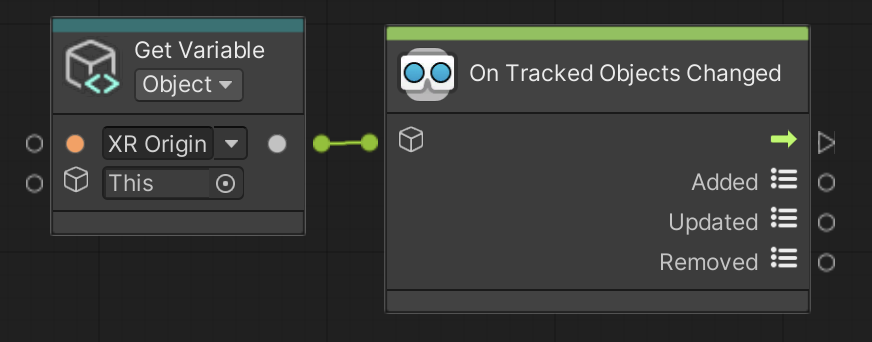

# On Tracked Objects Changed

Triggers when AR Tracked Objects have changed. AR Tracked Objects can be added, updated, and/or removed every frame if there is an enabled AR Tracked Object Manager in the scene.

 *On Tracked Objects Change node, shown with Get Variable*

## Input Data Ports

| Port | Data type | Description |
| :--- | :-------- | :---------- |
| **Target** | [GameObject](xref:UnityEngine.GameObject) | Target GameObject should have an enabled [ARTrackedObjectManager](xref:arfoundation-object-tracking#ar-tracked-object-manager-component) component. If you do not connect this port, this node searches for an enabled AR Tracked Object Manager component in the scene instead, and throws an exception if none is found. |

[!include]

## Output Data Ports

| Port | Data type | Description |
| :--- | :-------- | :---------- |
| **Added** | [List](xref:System.Collections.Generic.List`1) of [ARTrackedObject](xref:UnityEngine.XR.ARFoundation.ARTrackedObject) | List of AR Tracked Objects that have been added. |
| **Updated** | [List](xref:System.Collections.Generic.List`1) of [ARTrackedObject](xref:UnityEngine.XR.ARFoundation.ARTrackedObject) | List of AR Tracked Objects that have been updated. |
| **Removed** | [List](xref:System.Collections.Generic.List`1) of [ARTrackedObject](xref:UnityEngine.XR.ARFoundation.ARTrackedObject) | List of AR Tracked Objects that have been removed. |
