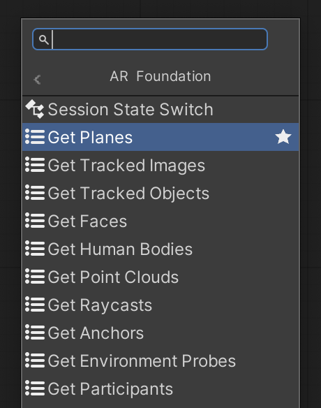

# Visual Scripting Node Reference

This package includes a set of custom visual scripting nodes designed to help you use AR Foundation in visual scripting projects.

 *AR Foundation custom nodes shown in the fuzzy finder*

## Get trackables

[!include] You can get all trackables of each type using the nodes below.

These nodes appear in the fuzzy finder in the **AR Foundation** category:

| Node | Input manager type | Output trackable type |
| :--- | :----------------- | :-------------------- |
| [Get Planes](xref:arfoundation-vs-node-get-planes) | [ARPlaneManager](xref:arfoundation-plane-detection#ar-plane-manager-component) | [ARPlane](xref:UnityEngine.XR.ARFoundation.ARPlane) |
| [Get Tracked Images](xref:arfoundation-vs-node-get-tracked-images) | [ARTrackedImageManager](xref:arfoundation-image-tracking#ar-tracked-image-manager-component) | [ARTrackedImage](xref:UnityEngine.XR.ARFoundation.ARTrackedImage) |
| [Get Tracked Objects](xref:arfoundation-vs-node-get-tracked-objects) | [ARTrackedObjectManager](xref:arfoundation-object-tracking#ar-tracked-object-manager-component) | [ARTrackedObject](xref:UnityEngine.XR.ARFoundation.ARTrackedObject) |
| [Get Faces](xref:arfoundation-vs-node-get-faces) | [ARFaceManager](xref:arfoundation-face-tracking#ar-face-manager-component) | [ARFace](xref:UnityEngine.XR.ARFoundation.ARFace) |
| [Get Human Bodies](xref:arfoundation-vs-node-get-human-bodies) | [ARHumanBodyManager](xref:arfoundation-body-tracking#ar-human-body-manager-component) | [ARHumanBody](xref:UnityEngine.XR.ARFoundation.ARHumanBody) |
| [Get Point Clouds](xref:arfoundation-vs-node-get-point-clouds) | [ARPointCloudManager](xref:arfoundation-point-clouds#ar-point-cloud-manager-component) | [ARPointCloud](xref:UnityEngine.XR.ARFoundation.ARPointCloud) |
| [Get Raycasts](xref:arfoundation-vs-node-get-raycasts) | [ARRaycastManager](xref:arfoundation-raycasts#ar-raycast-manager-component) | [ARRaycast](xref:UnityEngine.XR.ARFoundation.ARRaycast) |
| [Get Anchors](xref:arfoundation-vs-node-get-anchors) | [ARAnchorManager](xref:arfoundation-anchors#ar-anchor-manager-component) | [ARAnchor](xref:UnityEngine.XR.ARFoundation.ARAnchor) |
| [Get Environment Probes](xref:arfoundation-vs-node-get-environment-probes) | [AREnvironmentProbeManager](xref:arfoundation-environment-probes#ar-environment-probe-manager-component) | [AREnvironmentProbe](xref:UnityEngine.XR.ARFoundation.AREnvironmentProbe) |
| [Get Participants](xref:arfoundation-vs-node-get-participants) | [ARParticipantManager](xref:arfoundation-participant-tracking#ar-participant-manager-component) | [ARParticipant](xref:UnityEngine.XR.ARFoundation.ARParticipant) |

## On trackables changed

A trackable's life cycle has three phases: added, updated, and removed. Each frame, managers trigger an event that includes all trackables that have been added, updated, or removed in the current frame. You can subscribe to these events using the nodes below.

These nodes appear in the fuzzy finder in the **Events** > **AR Foundation** category:

| Node | Input manager type | Trackables-changed event |
| :--- | :----------------- | :----------------------- |
| [On Planes Changed](xref:arfoundation-vs-node-on-planes-changed) | [ARPlaneManager](xref:arfoundation-plane-detection#ar-plane-manager-component) | [planesChanged](xref:UnityEngine.XR.ARFoundation.ARPlaneManager.planesChanged) |
| [On Tracked Images Changed](xref:arfoundation-vs-node-on-tracked-images-changed) | [ARTrackedImageManager](xref:arfoundation-image-tracking#ar-tracked-image-manager-component) | [trackedImagesChanged](xref:UnityEngine.XR.ARFoundation.ARTrackedImageManager.trackedImagesChanged) |
| [On Tracked Objects Changed](xref:arfoundation-vs-node-on-tracked-objects-changed) | [ARTrackedObjectManager](xref:arfoundation-object-tracking#ar-tracked-object-manager-component) | [trackedObjectsChanged](xref:UnityEngine.XR.ARFoundation.ARTrackedObjectManager.trackedObjectsChanged) |
| [On Faces Changed](xref:arfoundation-vs-node-on-faces-changed) | [ARFaceManager](xref:arfoundation-face-tracking#ar-face-manager-component) | [facesChanged](xref:UnityEngine.XR.ARFoundation.ARFaceManager.facesChanged) |
| [On Human Bodies Changed](xref:arfoundation-vs-node-on-human-bodies-changed) | [ARHumanBodyManager](xref:arfoundation-body-tracking#ar-human-body-manager-component) | [humanBodiesChanged](xref:UnityEngine.XR.ARFoundation.ARHumanBodyManager.humanBodiesChanged) |
| [On Point Clouds Changed](xref:arfoundation-vs-node-on-point-clouds-changed) | [ARPointCloudManager](xref:arfoundation-point-clouds#ar-point-cloud-manager-component) | [pointCloudChanged](xref:UnityEngine.XR.ARFoundation.ARPointCloudManager.pointCloudsChanged) |
| [On Anchors Changed](xref:arfoundation-vs-node-on-anchors-changed) | [ARAnchorManager](xref:arfoundation-anchors#ar-anchor-manager-component) | [anchorsChanged](xref:UnityEngine.XR.ARFoundation.ARAnchorManager.anchorsChanged) |
| [On Environment Probes Changed](xref:arfoundation-vs-node-on-environment-probes-changed) | [AREnvironmentProbeManager](xref:arfoundation-environment-probes#ar-environment-probe-manager-component) | [environmentProbesChanged](xref:UnityEngine.XR.ARFoundation.AREnvironmentProbeManager.environmentProbesChanged) |
| [On Participants Changed](xref:arfoundation-vs-node-on-participants-changed) | [ARParticipantManager](xref:arfoundation-participant-tracking#ar-participant-manager-component) | [participantsChanged](xref:UnityEngine.XR.ARFoundation.ARParticipantManager.participantsChanged) |

> [!NOTE]
> If you wish to receive update events from a single AR Face component, ignoring the added, updated, and removed events from other faces, you can use the [On Face Updated](xref:arfoundation-vs-node-on-face-updated) node.

## Other events

These nodes appear in the fuzzy finder in the **Events** > **AR Foundation** category:

| Node | Description |
| :--- | :---------- |
| [On Session State Changed](xref:arfoundation-vs-node-on-session-state-changed) | Triggers whenever the AR [session state](xref:arfoundation-session#session-state) changes. |
| [On Camera Frame Received](xref:arfoundation-vs-node-on-camera-frame-received) | Triggers every frame when Unity receives a new image from the device camera. |