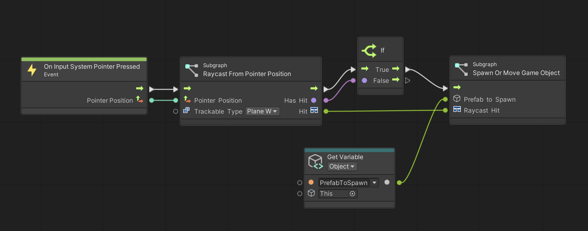

# Visual scripting overview

Visual scripting empowers you to develop gameplay mechanics or interaction logic using a visual, graph-based system instead of writing lines of traditional code.

 *The Simple AR sample scene, implemented as a visual scripting graph*

## Getting started with visual scripting

AR Foundation visual scripting assumes that you have some familiarity with the [Visual Scripting](https://docs.unity3d.com/Packages/com.unity.visualscripting@1.8/manual/index.html) package. This package is automatically available within the Editor as of Unity 2021.

If you are new to visual scripting, Unity Learn has a recommended [Visual Scripting application](https://learn.unity.com/project/visual-scripting-application-clive-the-cat-s-visual-crypting) course suitable for programmers and non-programmers alike. It will be helpful to familiarize yourself with visual scripting in general before you begin working with the AR Foundation custom nodes.

## AR Foundation custom nodes

This package includes a set of custom visual scripting nodes designed to help you use AR Foundation in visual scripting projects. These nodes are conditionally compiled, meaning that if Visual Scripting 1.8.0 or newer is not present in your project, they have no effect on your project. You can still use AR Foundation in projects that don't use the Visual Scripting package; the Visual Scripting package is an optional dependency.

If you do choose to use visual scripting, the custom nodes in this package will be useful to you. Refer to the [node reference](xref:arfoundation-vs-node-reference) to learn more.

## Additional custom nodes

The [AR Foundation Samples](https://github.com/Unity-Technologies/arfoundation-samples) GitHub repository contains an optional assembly that you can copy into your project if you wish. This assembly contains additional custom nodes that are outside the scope of the AR Foundation package, but might be useful in your project. Refer to [visual scripting samples](xref:arfoundation-vs-samples#additional-custom-nodes) to learn more about these nodes.

## Limitations

Visual Scripting has performance drawbacks compared to traditional C# scripting. Visual scripting performs [boxing](https://learn.microsoft.com/en-us/dotnet/csharp/programming-guide/types/boxing-and-unboxing) allocations of value types when they are passed between nodes, which can take [up to 20 times longer](https://learn.microsoft.com/en-us/dotnet/framework/performance/performance-tips#boxing-and-unboxing) than simple reference assignments.

You should evaluate the impact of visual scripting in your project with a [profiler](https://docs.unity3d.com/Manual/Profiler.html) before you commit to a visual scripting implementation in production. Depending on the needs of your project, the performance impact of visual scripting may or may not be acceptable to you.
