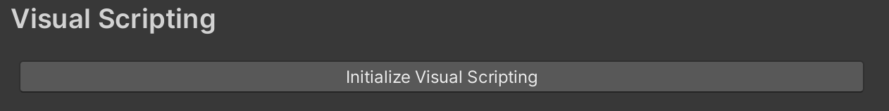
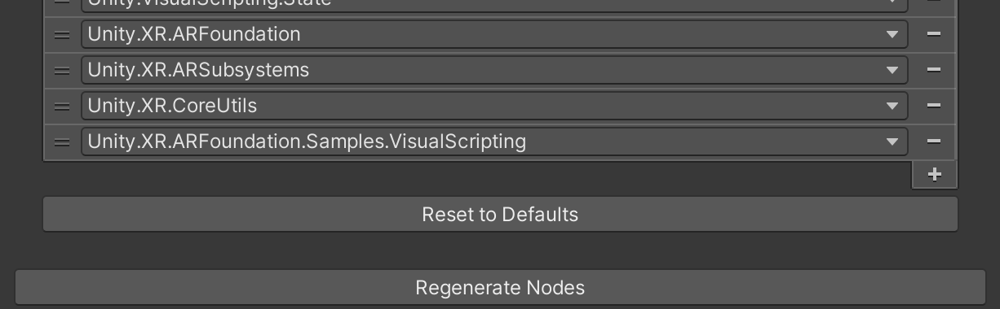
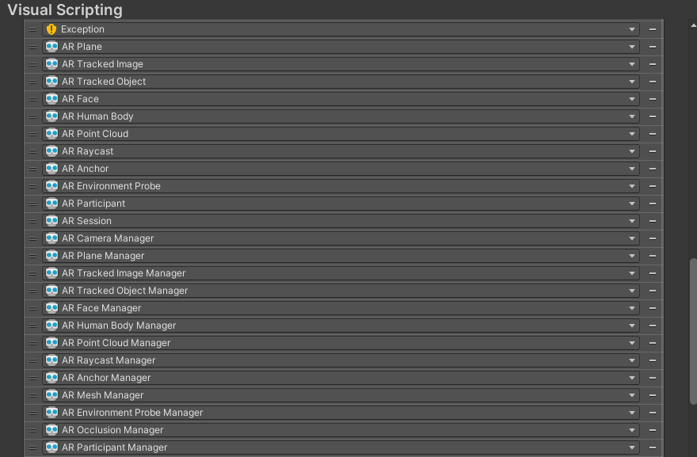

# Visual scripting project setup

## Requirements

To use AR Foundation's built-in visual scripting support, your project must meet the following requirements:

* AR Foundation 5.1 or newer
* Unity 2021.2 or newer
* Visual Scripting 1.8.0 or newer

> [!IMPORTANT]
> Check your Visual Scripting version in the [Package Manager](https://learn.unity.com/tutorial/the-package-manager). If you don't see the option to upgrade to Visual Scripting 1.8.0, this is because this package version was released some time after your project's Editor version. You can [edit your project manifest](xref:arfoundation-edit-your-project-manifest#edit-your-project-manifest) to access newer versions of packages.

## Version control

The Visual Scripting package generates some large binary files as part of its setup process. If your project uses version control, you should ignore these files. Refer to the Visual Scripting package's [Version control systems](https://docs.unity3d.com/Packages/com.unity.visualscripting@1.8/manual/vs-version-control.html) documentation for an example `.gitignore` template. 

## Project settings

Go to **Project Settings** > **Visual Scripting**.

 *Initialize Visual Scripting*

If this is your first time using Visual Scripting in this project, click **Initialize Visual Scripting** to begin setup. After Visual Scripting is initialized, you are able to proceed to the following steps.

### Node Library

Use the **Node Library** list to add or remove nodes and their assemblies from Visual Scripting. The Node Library comes pre-populated with a default set of assemblies. You must add the AR Foundation assemblies to be able to use the AR Foundation custom nodes.

 *Node Library, shown with AR Foundation assemblies*

Add the following assemblies to the Node Library:

| Assembly | Description |
| :------- | :---------- |
| `Unity.XR.ARFoundation` | Contains all AR Foundation [managers](xref:arfoundation-managers), trackables, and essential types. |
| `Unity.XR.ARSubsystems` | Contains all AR Foundation [subsystems](xref:arfoundation-subsystems) and types necessary to perform certain actions such as raycasting. |
| `Unity.XR.CoreUtils` | Contains the [XROrigin](xref:Unity.XR.CoreUtils.XROrigin) type and various utilities. |
| (optional) `Unity.XR.ARFoundation.Samples.VisualScripting` | The [AR Foundation Samples](https://github.com/Unity-Technologies/arfoundation-samples) GitHub repository contains an optional assembly that you can copy into your project. This assembly contains additional custom nodes that are outside the scope of the AR Foundation package, but might be useful in your project. Refer to [visual scripting samples](xref:arfoundation-vs-samples#additional-custom-nodes) to learn more about these nodes. |

Click **Regenerate Nodes**.

### Type Options

**Type Options** determine which types you can use as Input Ports, Output Ports, and Variables in your visual scripting graphs. Type Options similarly come pre-populated with a default set of types, and you must add the AR Foundation types to be able to use the AR Foundation custom nodes.

 *Type Options, partially shown with AR Foundation types*

For the best experience using AR Foundation with visual scripting, it is recommended that you add the following Type Options. None of these Type Options are strictly required, but you will be unable to use custom nodes related to these types if you do not add them as Type Options.

**Trackable Types**

* `AR Plane`
* `AR Tracked Image`
* `AR Tracked Object`
* `AR Face`
* `AR Human Body`
* `AR Point Cloud`
* `AR Raycast`
* `AR Anchor`
* `AR Environment Probe`
* `AR Participant`

**Manager types**

* `AR Session`
* `AR Camera Manager`
* `AR Plane Manager`
* `AR Tracked Image Manager`
* `AR Tracked Object Manager`
* `AR Face Manager`
* `AR Human Body Manager`
* `AR Point Cloud Manager`
* `AR Raycast Manager`
* `AR Anchor Manager`
* `AR Mesh Manager`
* `AR Environment Probe Manager`
* `AR Occlusion Manager`
* `AR Participant Manager`

**Other useful types**

* `AR Session State`
* `XR Origin`
* `AR Camera Frame Event Args`
* `AR Light Estimation Data`
* `Plane Classification`
* `XR Reference Image`
* `XR Reference Object`
* `AR Raycast Hit`
* `Trackable Type`
* `Pose`
* `Trackable Id`
* `Tracking State`

**Collections**

* `List of AR Plane`
* `List of AR Tracked Image`
* `List of AR Tracked Object`
* `List of AR Face`
* `List of AR Human Body`
* `List of AR Point Cloud`
* `List of AR Raycast`
* `List of AR Raycast Hit`
* `List of AR Anchor`
* `List of AR Environment Probe`
* `List of AR Participant`

After adding the recommended Type Options, click **Regenerate Nodes** again.

> [!NOTE]
> You may need more Type Options depending on the scope of your project. If you are unable to access the **Expose** or **Literal** nodes for a type, or you can't use a certain type as a Variable, you likely do not have that type added as a Type Option. Fix this by adding the Type Option and clicking **Regenerate Nodes**.
