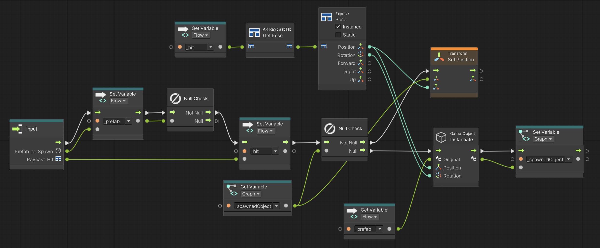

# Visual scripting samples

The [AR Foundation Samples](https://github.com/Unity-Technologies/arfoundation-samples) GitHub repository contains sample scenes that you can use to jump straight into practice with the AR Foundation custom visual scripting units.

 *The Simple AR sample scene, implemented as a visual scripting graph*

These sample scenes are composed of modular pieces, including subgraphs and additional custom units, that you can re-use in your projects. For example, the Simple AR visual scripting sample scene contains a subgraph called **Spawn or Move GameObject** that you can re-use in your own scenes:

 *The <strong>Spawn or Move GameObject</strong> subgraph*

To learn more about working with subgraphs, see [Subgraphs and State Units](https://docs.unity3d.com/Packages/com.unity.visualscripting@1.8/manual/vs-nesting-subgraphs-state-units.html) in the Visual Scripting package documentation.

## Additional custom nodes

The AR Foundation Samples repository contains an assembly, `Unity.XR.ARFoundation.Samples.VisualScripting`, that you can optionally copy into your project. This assembly contains additional custom nodes that are outside the scope of the AR Foundation package, but might be useful in your project. You can find their source code in `Assets/Scripts/Runtime/VisualScripting`.

These nodes appear in the fuzzy finder in the **Events** / **AR Foundation** / **Samples** category:

| Node | Description |
| :--- | :---------- |
| **On Input System Pointer Pressed** | Triggers when the Input System [Pointer](https://docs.unity3d.com/Packages/com.unity.inputsystem@1.0/manual/Pointers.html) is pressed and returns the screen-space coordinates. `Pointer` is triggered by a mouse click in the Editor Game view and a touch on mobile devices. |
| **On Event Asset Raised** | Triggers when the input `EventAsset` is raised. (An `EventAsset` is a type of ScriptableObject in the AR Foundation Samples project that represents a serializable reference to an event). |
