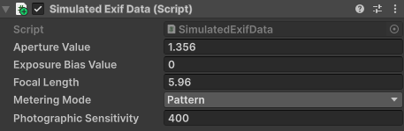

# Camera

This page is a supplement to the AR Foundation [Camera](xref:arfoundation-camera) manual. The following sections only contain information about APIs where XR Simulation exhibits unique platform-specific behavior.

[!include]

## Optional feature support

XR Simulation implements the following optional features of AR Foundation's [XRCameraSubsystem](xref:UnityEngine.XR.ARSubsystems.XRCameraSubsystem):

| Feature | Descriptor Property | Supported |
| :------ | :--------------- | :----------: |
| **Brightness** | [supportsAverageBrightness](xref:UnityEngine.XR.ARSubsystems.XRCameraSubsystemDescriptor.supportsAverageBrightness) | Yes |
| **Color temperature** | [supportsAverageColorTemperature](xref:UnityEngine.XR.ARSubsystems.XRCameraSubsystemDescriptor.supportsAverageColorTemperature) | Yes |
| **Color correction** | [supportsColorCorrection](xref:UnityEngine.XR.ARSubsystems.XRCameraSubsystemDescriptor.supportsColorCorrection) | Yes |
| **Display matrix** | [supportsDisplayMatrix](xref:UnityEngine.XR.ARSubsystems.XRCameraSubsystemDescriptor.supportsDisplayMatrix) | |
| **Projection matrix** | [supportsProjectionMatrix](xref:UnityEngine.XR.ARSubsystems.XRCameraSubsystemDescriptor.supportsProjectionMatrix) | |
| **Timestamp** | [supportsTimestamp](xref:UnityEngine.XR.ARSubsystems.XRCameraSubsystemDescriptor.supportsTimestamp) | |
| **Camera configuration** | [supportsCameraConfigurations](xref:UnityEngine.XR.ARSubsystems.XRCameraSubsystemDescriptor.supportsCameraConfigurations) | Yes |
| **Camera image** | [supportsCameraImage](xref:UnityEngine.XR.ARSubsystems.XRCameraSubsystemDescriptor.supportsCameraImage) | Yes |
| **Average intensity in lumens** | [supportsAverageIntensityInLumens](xref:UnityEngine.XR.ARSubsystems.XRCameraSubsystemDescriptor.supportsAverageIntensityInLumens) | Yes |
| **Focus modes** | [supportsFocusModes](xref:UnityEngine.XR.ARSubsystems.XRCameraSubsystemDescriptor.supportsFocusModes) | |
| **Face tracking ambient intensity light estimation** | [supportsFaceTrackingAmbientIntensityLightEstimation](xref:UnityEngine.XR.ARSubsystems.XRCameraSubsystemDescriptor.supportsFaceTrackingAmbientIntensityLightEstimation) | |
| **Face tracking HDR light estimation** | [supportsFaceTrackingHDRLightEstimation](xref:UnityEngine.XR.ARSubsystems.XRCameraSubsystemDescriptor.supportsFaceTrackingHDRLightEstimation) | |
| **World tracking ambient intensity light estimation** | [supportsWorldTrackingAmbientIntensityLightEstimation](xref:UnityEngine.XR.ARSubsystems.XRCameraSubsystemDescriptor.supportsWorldTrackingAmbientIntensityLightEstimation) | |
| **World tracking HDR light estimation** | [supportsWorldTrackingHDRLightEstimation](xref:UnityEngine.XR.ARSubsystems.XRCameraSubsystemDescriptor.supportsWorldTrackingHDRLightEstimation) | |
| **Camera grain** | [supportsCameraGrain](xref:UnityEngine.XR.ARSubsystems.XRCameraSubsystemDescriptor.supportsCameraGrain) | |
| **Image stabilization** | [supportsImageStabilization](xref:UnityEngine.XR.ARSubsystems.XRCameraSubsystemDescriptor.supportsImageStabilization) | |
| **Exif data** | [supportsExifData](xref:UnityEngine.XR.ARSubsystems.XRCameraSubsystemDescriptor.supportsExifData) | Yes |
| **Camera torch mode** | [supportsCameraTorchMode](xref:UnityEngine.XR.ARSubsystems.XRCameraSubsystemDescriptor.supportsCameraTorchMode) | Yes |

> [!NOTE]
> Refer to AR Foundation [Camera platform support](xref:arfoundation-camera-platform-support) for more information
> on the optional features of the camera subsystem.

## EXIF data

In XR Simulation, a Simulated Exif Data component is added to the simulated camera GameObject to simulate AR Foundation's [EXIF data](xref:arfoundation-exif-data) feature.

 *Simulated EXIF data component*

| Property                     | Description                           |
| :--------------------------- | :------------------------------------ |
| **Aperture Value**           | The lens aperture.                    |
| **Exposure Bias Value**      | The exposure bias.                    |
| **Focal Length**             | The lens focal length in millimeters. |
| **Metering Mode**            | The metering mode.                    |
| **Photographic Sensitivity** | The photographic sensitivity (ISO).   |

XR Simulation uses the provided values as the simulated camera’s physical specifications and calculates corresponding EXIF tag values.
