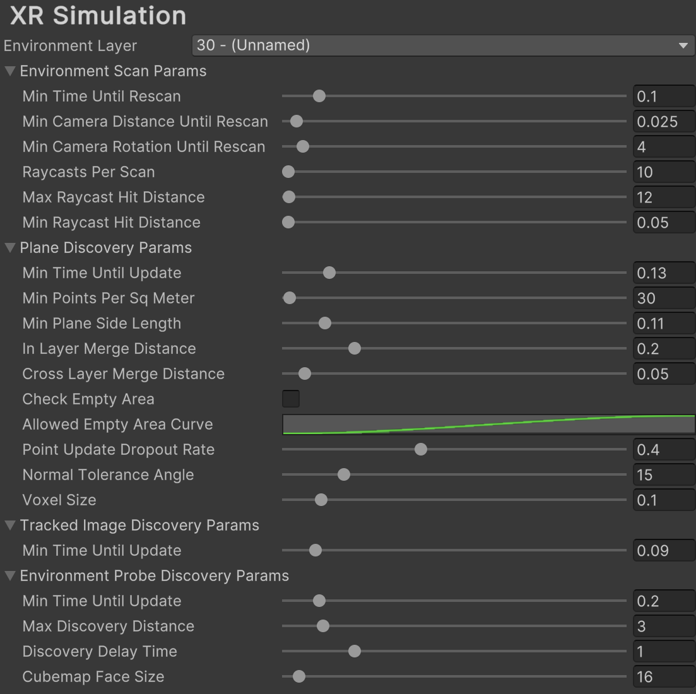
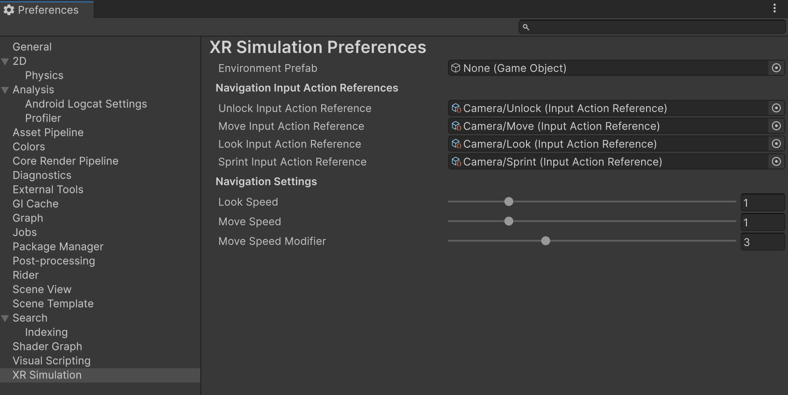

# XR Simulation project settings

Understand the project settings and XR Simulation settings you can configure.

The following sections outline the [Project settings](#project-settings) and [XR Simulation settings](#simulation-settings) you can configure in your XR Simulation project.

## Project settings reference

Go to **Edit** > **Project Settings** > **XR Plug-in Management** > **XR Simulation** to tune the performance of XR Simulation according to your project's needs. XR Simulation project settings are saved under your Assets folder at `XR/Resources/XRSimulationRuntimeSettings.asset`.

 *XR Simulation project settings.*

### Environment Layer

|  **Setting** | **Description** |
| :----------- | :-------------- |
| **Environment Layer** |  XR Simulation requires a dedicated [layer](https://docs.unity3d.com/Manual/Layers.html) to render the XR Simulation environment separately from your scene. That layer is specified here, and by default is layer 30. |

### Environment Scan Params

XR Simulation scans for point clouds and planes in the environment by raycasting against its meshes. The following  **Setting**s control that process:

|  **Setting** | **Description** |
| :------------| :-------------- |
| **Min Time Until Rescan** | Minimum time in seconds that must elapse between environment scans. |
| **Min Camera Distance Until Rescan** | Minimum distance in meters the camera must move before the next environment scan. The next environment scan will trigger on the first Update after **Min Time Until Rescan** has elapsed where the camera has either moved at least **Min Camera Distance** or rotated at least **Min Camera Rotation**. |
| **Min Camera Rotation Until Rescan** | Minimum angle change in degrees the camera must rotate before the next environment scan. The next environment scan will trigger on the first Update after **Min Time Until Rescan** has elapsed where the camera has either moved at least **Min Camera Distance** or rotated at least **Min Camera Rotation**. |
| **Raycasts Per Scan** | Total number of rays to cast in each environment scan. Higher values may impact system performance. |
| **Max Raycast Hit Distance** | Distance in meters from the camera beyond which feature points will not be detected. |
| **Min Raycast Hit Distance** | Distance in meters from the camera within which feature points will not be detected. |

### Plane Discovery Params

Performance tuning options for plane detection:

|  **Setting** | **Description** |
| :----------- | :-------------- |
| **Min Time Until Update** | Minimum time in seconds that must elapse between plane discovery updates. |
| **Min Points Per Sq Meter** | Voxel point density, independent of voxel size. |
| **Min Plane Side Length** | A plane with x or y size less than this value in meters will be ignored. |
| **In Layer Merge Distance** | Planes within the same layer that are at most this distance in meters from each other will be merged. |
| **Cross Layer Merge Distance** | Planes in adjacent layers with an elevation difference of at most this distance in meters will be merged. |
| **Check Empty Area** | When enabled, planes will only be created if they do not contain too much empty area. |
| **Allowed Empty Area Curve** | Curve that maps the area of a plane to the ratio of area that is allowed to be empty. |
| **Point Update Dropout Rate** | Probability of dropping per-plane updates. If a random number between 0 and 1 is below this number, the update is dropped. |
| **Normal Tolerance Angle** | If the angle between a point's normal and a voxel grid direction is within this range, the point is added to the grid. |
| **Voxel Size** | Side length of each voxel in the plane voxel grid. |

### Tracked Image Discovery Params

Performance tuning options for image tracking:

|  **Setting** | **Description** |
| :----------- | :-------------- |
| **Min Time Until Update** | Minimum time in seconds that must elapse between image tracking updates. |

### Environment Probe Discovery Params

Performance tuning options for discovery of automatically placed environment probes:

|  **Setting** | **Description** |
| :----------- | :-------------- |
| **Min Time Until Update** | Minimum time in seconds between environment probe discovery updates. |
| **Max Discovery Distance** | Maximum distance in meters from the camera at which automatically placed environment probes can be discovered. |
| **Discovery Delay Time** | Time in seconds after an environment probe is discovered before it is added as a trackable. |
| **Cubemap Face Size** | Width and height in pixels of each face of each environment probe's Cubemap. |

### Anchor Discovery Params

Performance tuning options for discovery of automatically placed anchors:

|  **Setting** | **Description** |
| :----------- | :-------------- |
| **Min Time Until Update** | Minimum time in seconds between anchor discovery updates. |

## XR Simulation Preferences reference

Go to menu **Edit** > **Preferences** > **XR Simulation** (Windows) or **Unity** > **Preferences** > **XR Simulation** (Mac) to set your preferences for XR Simulation. Preferences are saved under your Assets folder at `XR/UserSimulationSettings/Resources/XRSimulationPreferences.asset`.

 *XR Simulation preferences.*

| **Setting** | **Description** |
| :---------- | :-------------- |
| **Environment Prefab** | Stores the Prefab asset for the active XR Simulation environment. Note that it is easier to set this in the [XR Environment view](https://docs.unity3d.com/Packages/com.unity.xr.arfoundation@6.1/manual/xr-simulation/simulation-xr-environment-view.html) because the view's Environment list only includes environment Prefabs rather than every Prefab in the project. |

### Navigation Input Action References

Sets input bindings that will be used for navigation controls in XR Simulation (**WASD**, **Q**, **E**, and **Shift** keys and the mouse by default). Refer to [Navigation controls](https://docs.unity3d.com/Packages/com.unity.xr.arfoundation@6.1/manual/xr-simulation/simulation-getting-started.html#navigation-controls) for information about using the default controls or the [Input System Manual](https://docs.unity3d.com/Packages/com.unity.inputsystem@latest?subfolder=/manual/index.html) to learn how to create your own custom input actions.

You can configure the following settings:

| **Setting** | **Description** |
| :---------- | :-------------- |
| **Unlock Input Action Reference** | **Button** type action that toggles navigation actions on/off. If not set, actions will be active by default. |
| **Move Input Action Reference** | **Value (Vector 3\)** type action that controls movement. |
| **Look Input Action Reference** | **Value (Delta/Vector 2\)** type action that controls rotation. |
| **Sprint Input Action Reference** | **Button** type action that activates fast movement. |

### Navigation Settings

Other navigation settings for configuring speed during XR Simulation:

| **Setting** | **Description** |
| :---------- | :-------------- |
| **Look Speed** | Controls the simulation camera's rotation speed. |
| **Move Speed** | Controls the simulation camera's base movement speed. |
| **Move Speed Modifier** | Modifies the simulation camera's base movement speed for faster movement. |
